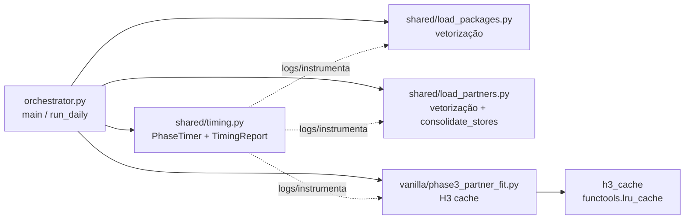

# Design Document — backend-performance

## Overview

Este documento define a arquitetura das quatro otimizações aprovadas em `requirements.md` da spec `backend-performance`. A estratégia central é **instrumentar antes de otimizar** (Requirement 1 → Task 1), de modo que cada otimização subsequente possa ser validada contra um baseline objetivo de tempo por fase.

As otimizações são **não invasivas**: alteram implementação, não contratos. Os outputs de `run_daily` (DataFrames, JSONs, GeoJSONs) permanecem idênticos — verificados por testes de propriedade (PBT) que comparam a versão `Reference_Pipeline` (pré-otimização, preservada via git tag ou fixtures) com a versão `Optimized_Pipeline`.

Nenhuma nova dependência é introduzida. Tudo é construído sobre o stack já instalado (`pandas`, `h3`, `hypothesis`, `logging` da biblioteca padrão, `functools.lru_cache`).

## Architecture

### Camadas afetadas



### Princípios de design

1. **Timing é transversal, não invasivo**: um único context manager (`PhaseTimer`) chamado em `run_daily` em torno de cada bloco. Não altera assinaturas.
2. **Cache H3 é local à Phase 3**: instanciado no início de `run_phase3`, descartado ao fim. Sem estado global entre execuções.
3. **Vetorização preserva semântica**: cada substituição de `iterrows()` é acompanhada de teste de equivalência via Hypothesis.
4. **`_consolidate_stores` é refatorado em uma única passagem**: o dicionário de substituição é fechado transitivamente em tempo de setup.
5. **Monotonicidade de tempo é verificada em CI**: comparação contra baseline salvo em disco, falha explícita em regressão.

## Components and Interfaces

### 1. `shared/timing.py` (novo módulo)

Módulo auto-contido com context manager, agregador e serialização.

```python
# shared/timing.py
from __future__ import annotations
import json
import logging
import time
from contextlib import contextmanager
from dataclasses import dataclass, field
from pathlib import Path
from typing import Dict, Iterator, List, Optional

log = logging.getLogger(__name__)


@dataclass
class PhaseTiming:
    """Métricas de uma única fase."""
    name: str
    duration_s: float
    started_at: float
    ended_at: float
    error: Optional[str] = None


@dataclass
class TimingReport:
    """Relatório agregado de uma execução do pipeline."""
    pipeline: str                     # 'daily' ou 'setup'
    phases: List[PhaseTiming] = field(default_factory=list)
    total_s: float = 0.0
    started_at: float = 0.0
    ended_at: float = 0.0

    def phase(self, name: str) -> Optional[PhaseTiming]:
        return next((p for p in self.phases if p.name == name), None)

    def to_dict(self) -> dict:
        return {
            "pipeline": self.pipeline,
            "total_s": round(self.total_s, 3),
            "started_at": self.started_at,
            "ended_at": self.ended_at,
            "phases": [
                {"name": p.name, "duration_s": round(p.duration_s, 3),
                 "error": p.error}
                for p in self.phases
            ],
        }

    def save(self, path: Path) -> None:
        path.parent.mkdir(parents=True, exist_ok=True)
        path.write_text(json.dumps(self.to_dict(), indent=2), encoding="utf-8")

    def log_summary(self) -> None:
        log.info("─" * 60)
        log.info(f"  TIMING REPORT — pipeline={self.pipeline}")
        for p in self.phases:
            status = f" [FAIL: {p.error}]" if p.error else ""
            log.info(f"    {p.name:30s}  {p.duration_s:8.2f}s{status}")
        log.info(f"    {'TOTAL':30s}  {self.total_s:8.2f}s")
        log.info("─" * 60)


class PhaseTimer:
    """
    Context manager reutilizável que acumula tempos em um TimingReport.

    Uso:
        report = TimingReport(pipeline='daily')
        timer = PhaseTimer(report)
        with timer.phase('Phase 3'):
            run_phase3(...)
    """

    def __init__(self, report: TimingReport) -> None:
        self.report = report
        self._pipeline_started = False

    def start_pipeline(self) -> None:
        self.report.started_at = time.time()
        self._pipeline_started = True

    def end_pipeline(self) -> None:
        self.report.ended_at = time.time()
        self.report.total_s = self.report.ended_at - self.report.started_at

    @contextmanager
    def phase(self, name: str) -> Iterator[None]:
        if not self._pipeline_started:
            self.start_pipeline()
        t0 = time.time()
        err: Optional[str] = None
        try:
            yield
        except Exception as exc:
            err = f"{type(exc).__name__}: {exc}"
            raise
        finally:
            t1 = time.time()
            self.report.phases.append(
                PhaseTiming(
                    name=name,
                    duration_s=t1 - t0,
                    started_at=t0,
                    ended_at=t1,
                    error=err,
                )
            )
            log.info(f"[timing] {name}: {t1 - t0:.2f}s"
                     + (f" (FAIL: {err})" if err else ""))
```

**Integração em `orchestrator.py`**:

```python
# vanilla/orchestrator.py (dentro de run_daily, após os imports)
from shared.timing import PhaseTimer, TimingReport

def run_daily(output_dir, stations=None, legacy_bucket_names=False,
              partner_csv=None, timing_report=None):
    report = timing_report or TimingReport(pipeline="daily")
    timer = PhaseTimer(report)
    timer.start_pipeline()

    with timer.phase("load_territories_and_supply"):
        territories = load_territories(output_dir)
        supply = load_ideal_supply(output_dir)

    with timer.phase("load_packages"):
        pkg = load_packages(jurisdiction_geojson=jur_geojson)

    with timer.phase("load_partners"):
        partner_data = (load_partners_csv(partner_csv) if partner_csv
                        else load_partners())

    with timer.phase("phase3_partner_fit"):
        fit = run_phase3(...)

    with timer.phase("phase3_5_cap_optimizer"):
        run_phase3_5(...)

    with timer.phase("phase4_webleads"):
        webleads = run_phase4(...)

    with timer.phase("cnpj_lookup"):
        cnpj_result = run_cnpj_lookup(...) if Config.CNPJ_DB_PATH else None

    with timer.phase("phase5_reports"):
        paths = run_phase5(...)

    timer.end_pipeline()
    report.log_summary()
    report.save(Path(output_dir) / "timing_report.json")
    return report   # habilita uso programático em testes
```

A chamada `return report` permite que testes de performance façam asserções sobre `report.phase("phase3_partner_fit").duration_s`.

### 2. H3 Cache — `shared/h3_cache.py` (novo módulo)

Wrappers memoizados para `h3.grid_disk` e `h3.grid_distance`. Escopados ao ciclo de vida da Phase 3 (instanciados no `run_phase3`, descartados ao sair).

```python
# shared/h3_cache.py
from __future__ import annotations
from functools import lru_cache
from typing import FrozenSet, Tuple
import h3


class H3Cache:
    """
    Cache escopado para chamadas H3 repetitivas na Phase 3.

    Por que não `@lru_cache` direto em `h3.grid_disk`? Porque `lru_cache`
    global vaza entre execuções do processo; queremos escopo por fase.
    """

    def __init__(self, maxsize_disk: int = 65_536,
                 maxsize_distance: int = 262_144) -> None:
        # closures capturam self para permitir descarte no __exit__
        @lru_cache(maxsize=maxsize_disk)
        def _grid_disk(cell: str, k: int) -> FrozenSet[str]:
            return frozenset(h3.grid_disk(cell, k))

        @lru_cache(maxsize=maxsize_distance)
        def _grid_distance(pair: Tuple[str, str]) -> int:
            a, b = pair
            return h3.grid_distance(a, b)

        self._grid_disk = _grid_disk
        self._grid_distance = _grid_distance

    def grid_disk(self, cell: str, k: int = 1) -> FrozenSet[str]:
        return self._grid_disk(cell, k)

    def grid_distance(self, a: str, b: str) -> int:
        # normaliza o par — distância é simétrica, aumenta hit rate
        pair = (a, b) if a <= b else (b, a)
        return self._grid_distance(pair)

    def stats(self) -> dict:
        return {
            "grid_disk": self._grid_disk.cache_info()._asdict(),
            "grid_distance": self._grid_distance.cache_info()._asdict(),
        }

    def clear(self) -> None:
        self._grid_disk.cache_clear()
        self._grid_distance.cache_clear()

    def __enter__(self) -> "H3Cache":
        return self

    def __exit__(self, *exc_info) -> None:
        self.clear()
```

**Por que `frozenset` em vez de `list`?** Porque o caller em `phase3_partner_fit._build_hex_to_slots` e `_partner_eligible_hexes` já converte para `set`. Retornar `frozenset` direto evita a cópia e preserva imutabilidade do item em cache.

**Integração em `phase3_partner_fit.py`**:

```python
# vanilla/phase3_partner_fit.py
from shared.h3_cache import H3Cache

_h3_cache: Optional[H3Cache] = None

def _partner_eligible_hexes(origin_hex: str) -> Set[str]:
    return set(_h3_cache.grid_disk(origin_hex, 1))

def _build_hex_to_slots(slots):
    index = defaultdict(list)
    for slot in slots:
        for nb in _h3_cache.grid_disk(slot.origin_hex, 1):
            index[nb].append(slot)
    return index

def run_phase3(territories, supply, partner_data, pkg,
               output_dir=None, stations=None) -> FitResult:
    global _h3_cache
    with H3Cache() as cache:
        _h3_cache = cache
        try:
            # ... lógica existente ...
            return fit_result
        finally:
            log.debug(f"[h3_cache stats] {cache.stats()}")
            _h3_cache = None
```

A variável global `_h3_cache` é escopada pelo `with` — fora do bloco, é `None`. Isso satisfaz AC 5 (não persistir entre runs) e AC 7 (Phase 3 observável na TimingReport).

### 3. Vetorização — alterações em `load_packages.py` e `load_partners.py`

#### 3.1 `load_packages.py` — substituir loops `zip`/`list-comprehension` por `vectorize`/`apply` sobre Series

A implementação atual usa `[h3.latlng_to_cell(...) for la, lo in zip(...)]`. Isso já é mais rápido que `iterrows()`, mas ainda é Python-level. Estratégia:

```python
import numpy as np

def _vectorized_latlng_to_cell(lat: pd.Series, lon: pd.Series,
                               res: int) -> np.ndarray:
    """
    Aplicação vetorizada de h3.latlng_to_cell sobre Series/arrays.
    Usa np.vectorize como shim quando a API nativa não está disponível.
    """
    # h3 >= 4.x expõe `h3.latlng_to_cell` scalar-only; vetorizamos com np.
    # Descarta NaN antes (h3 levanta erro com NaN).
    lat_arr = np.asarray(lat, dtype=float)
    lon_arr = np.asarray(lon, dtype=float)
    mask = np.isfinite(lat_arr) & np.isfinite(lon_arr)
    out = np.full(len(lat_arr), "", dtype=object)
    if mask.any():
        # np.vectorize cacheia a chamada C; evita overhead de list-comp
        _fn = np.vectorize(h3.latlng_to_cell, excluded=["res"], otypes=[object])
        out[mask] = _fn(lat_arr[mask], lon_arr[mask], res=res)
    return out
```

Uso em `load_packages`:

```python
if "hex" not in df.columns:
    valid_coords = df["latitude"].notna() & df["longitude"].notna()
    if has_per_station and "station_code" in df.columns:
        # Vetorização por grupo de resolução
        df["hex"] = ""
        for res, group in df.groupby(df["station_code"].map(Config.get_h3_res)):
            mask = group.index
            df.loc[mask, "hex"] = _vectorized_latlng_to_cell(
                df.loc[mask, "latitude"], df.loc[mask, "longitude"], int(res))
    else:
        df["hex"] = _vectorized_latlng_to_cell(
            df["latitude"], df["longitude"], Config.H3_RES)
```

A construção de `demand_by_station` também é refatorada para substituir o `iterrows()` em:

```python
# ANTES (iterrows):
for _, row in unified.iterrows():
    demand_by_station.setdefault(row["station_code"], {})[row["hex"]] = int(row["demand_total"])
    hex_to_base[row["hex"]] = row["station_code"]

# DEPOIS (groupby + dict comprehension):
demand_by_station = {
    st: dict(zip(grp["hex"], grp["demand_total"].astype(int)))
    for st, grp in unified.groupby("station_code")
}
hex_to_base = dict(zip(unified["hex"], unified["station_code"]))
```

#### 3.2 `load_partners.py` — mesma estratégia

Em `_build_partner_data` e `load_partners_csv`:

```python
# ANTES:
df["origin_hex"] = [
    h3.latlng_to_cell(float(la), float(lo), Config.H3_RES)
    for la, lo in zip(df["lat"], df["lon"])
]

# DEPOIS:
from shared.load_packages import _vectorized_latlng_to_cell
df["origin_hex"] = _vectorized_latlng_to_cell(
    df["lat"], df["lon"], Config.H3_RES)
```

Em `load_partners_csv`, o laço `for _, row in df_raw.iterrows(): Partner.from_row(row, ...)` é preservado (a construção do objeto `Partner` exige acesso row-by-row, e o overhead de `iterrows` aqui é secundário comparado ao cálculo H3). Se profiling apontar que é gargalo, avaliamos em iteração futura.

### 4. `_consolidate_stores` — passagem única com dict fechado transitivamente

A versão atual aplica múltiplos `.replace()` sequenciais em `consolidated["Delivery Station"]`:
1. `_MAPEAMENTO_DS` (HSP2→DSP2, ...)
2. `STATION_ALIASES` (XBA1→DSA8, ...)

Se um dos valores do primeiro mapeamento aparece como chave no segundo, o resultado depende da ordem. A solução: **fechar transitivamente** em tempo de setup.

```python
def _compose_replacements(*maps: dict) -> dict:
    """
    Compõe múltiplos mapas em um único, aplicando-os sequencialmente
    sobre cada valor até que não haja mais substituição.

    Exemplo:
        _compose_replacements({"A": "B"}, {"B": "C"})
        → {"A": "C", "B": "C"}
    """
    composed: dict = {}
    keys = set().union(*(m.keys() for m in maps))
    for k in keys:
        v = k
        # aplica cada map até fixo (limite para evitar ciclos)
        for _ in range(len(maps) * 2):
            new_v = v
            for m in maps:
                new_v = m.get(new_v, new_v)
            if new_v == v:
                break
            v = new_v
        composed[k] = v
    # Remove identidades (A→A)
    return {k: v for k, v in composed.items() if k != v}
```

Uso em `_consolidate_stores`:

```python
from shared.config import STATION_ALIASES as _aliases
composed = _compose_replacements(_MAPEAMENTO_DS, _aliases)
if composed and "Delivery Station" in consolidated.columns:
    consolidated["Delivery Station"] = (
        consolidated["Delivery Station"].replace(composed)
    )
```

Essa mudança substitui duas passagens por uma única sobre a Series, preservando o resultado final (AC 2 e 3).

## Data Models

Não há novos modelos de domínio. Apenas artefatos de telemetria:

- `TimingReport` (JSON persistido em `<output_dir>/timing_report.json`):

```json
{
  "pipeline": "daily",
  "total_s": 124.31,
  "started_at": 1714214100.12,
  "ended_at": 1714214224.43,
  "phases": [
    {"name": "load_territories_and_supply", "duration_s": 0.42, "error": null},
    {"name": "load_packages", "duration_s": 12.08, "error": null},
    {"name": "load_partners", "duration_s": 3.11, "error": null},
    {"name": "phase3_partner_fit", "duration_s": 87.54, "error": null},
    {"name": "phase3_5_cap_optimizer", "duration_s": 1.22, "error": null},
    {"name": "phase4_webleads", "duration_s": 2.15, "error": null},
    {"name": "cnpj_lookup", "duration_s": 0.00, "error": null},
    {"name": "phase5_reports", "duration_s": 17.79, "error": null}
  ]
}
```

- `tests/performance/baseline.json` — snapshot da primeira execução pós-instrumentação. Serve de referência para os testes de monotonicidade (Requirement 6).

## Error Handling

### `PhaseTimer`
- Se a fase levanta exceção, `PhaseTiming.error` é preenchido com `"{type}: {msg}"`, o tempo decorrido até a falha é registrado, e a exceção é **re-propagada sem modificação** (AC 5 do Req 1).

### `H3Cache`
- Células H3 inválidas fazem `h3.grid_disk`/`h3.grid_distance` levantarem `h3.H3CellError` (ou `ValueError` dependendo da versão). Como o wrapper apenas chama a função original, a exceção sobe inalterada (AC 6 do Req 2). `lru_cache` não memoriza exceções — chamadas subsequentes com o mesmo input re-levantam.

### Vetorização
- `_vectorized_latlng_to_cell` descarta NaN antes de chamar `h3`, preenchendo `""` para aquelas linhas. Isso reproduz o comportamento do `Reference_Pipeline` (que já descartava NaN via `dropna(subset=["lat","lon"])` antes do loop). AC 8 do Req 3.

### `_consolidate_stores`
- Chaves com substituição circular (A→B→A) são resolvidas com limite de iterações (`len(maps) * 2`); ciclos resultam no valor após as iterações máximas — documentado no docstring. Em prática, os mapas atuais (`_MAPEAMENTO_DS` e `STATION_ALIASES`) não têm ciclos.

## Testing Strategy

### Estrutura de testes

```
backend/tests/
  performance/
    __init__.py
    test_timing_instrumentation.py       # Requirement 1
    test_h3_cache_equivalence.py         # Requirement 2 + Requirement 5.2/5.3
    test_vectorization_equivalence.py    # Requirement 3 + Requirement 5.5
    test_consolidate_stores_equivalence.py # Requirement 4 + Requirement 5.4
    test_run_daily_output_equivalence.py # Requirement 5.1 end-to-end
    test_monotonicity.py                 # Requirement 6
    fixtures/
      baseline.json                       # snapshot de referência
      reference_outputs/                  # DataFrames/JSONs do Reference_Pipeline
```

### PBT (Hypothesis)

#### `test_h3_cache_equivalence.py`

```python
from hypothesis import given, strategies as st
import h3
from shared.h3_cache import H3Cache

# Estratégia: gera lat/lon válidos e converte para cell H3
@st.composite
def h3_cells(draw, res=9):
    lat = draw(st.floats(min_value=-85.0, max_value=85.0, allow_nan=False))
    lon = draw(st.floats(min_value=-180.0, max_value=180.0, allow_nan=False))
    return h3.latlng_to_cell(lat, lon, res)

@given(cell=h3_cells(), k=st.integers(min_value=0, max_value=5))
def test_grid_disk_equivalence(cell, k):
    with H3Cache() as cache:
        assert set(cache.grid_disk(cell, k)) == set(h3.grid_disk(cell, k))

@given(a=h3_cells(), b=h3_cells())
def test_grid_distance_equivalence(a, b):
    with H3Cache() as cache:
        try:
            expected = h3.grid_distance(a, b)
        except Exception as e:
            # cache deve levantar a mesma exceção
            import pytest
            with pytest.raises(type(e)):
                cache.grid_distance(a, b)
            return
        assert cache.grid_distance(a, b) == expected
```

#### `test_consolidate_stores_equivalence.py`

```python
@given(
    sequential_maps=st.lists(
        st.dictionaries(
            st.text(min_size=1, max_size=5),
            st.text(min_size=1, max_size=5),
            min_size=0, max_size=8,
        ),
        min_size=1, max_size=4,
    ),
    values=st.lists(st.text(min_size=1, max_size=5), min_size=0, max_size=50),
)
def test_compose_replacements_matches_sequential(sequential_maps, values):
    import pandas as pd
    from shared.load_partners import _compose_replacements
    s = pd.Series(values, dtype=str)

    # Sequencial (referência)
    ref = s.copy()
    for m in sequential_maps:
        ref = ref.replace(m)

    # Composto (otimizado)
    composed = _compose_replacements(*sequential_maps)
    opt = s.replace(composed)

    pd.testing.assert_series_equal(opt, ref)
```

#### `test_run_daily_output_equivalence.py` (end-to-end)

```python
def test_run_daily_produces_identical_outputs(tmp_path, fixture_inputs):
    """
    AC 5.1: Optimized_Pipeline.run_daily(input) == Reference_Pipeline.run_daily(input).

    Estratégia: roda o pipeline duas vezes no mesmo tmp_path — uma com flag de
    otimizações desligadas (shim de referência, preservado via git), outra com
    todas ligadas — e compara artefatos byte-a-byte (JSONs canonicalizados) ou
    via assert_frame_equal para CSVs.
    """
    import shutil, json
    from vanilla.orchestrator import run_daily

    ref_dir = tmp_path / "reference"
    opt_dir = tmp_path / "optimized"
    shutil.copytree(fixture_inputs, ref_dir)
    shutil.copytree(fixture_inputs, opt_dir)

    run_daily(str(ref_dir), timing_report=None, _disable_optimizations=True)
    run_daily(str(opt_dir), timing_report=None, _disable_optimizations=False)

    # Compara dados_mapa.json
    with open(ref_dir / "dados_mapa.json") as f1, open(opt_dir / "dados_mapa.json") as f2:
        ref = json.load(f1); opt = json.load(f2)
    _assert_deep_equal_ignoring_timestamps(ref, opt)
```

**Nota sobre `_disable_optimizations`**: flag interna (não CLI) usada exclusivamente pelos testes. Preserva o `Reference_Pipeline` dentro do mesmo processo, sem depender de git tag — evita checkouts pesados em CI.

### Testes de monotonicidade (Requirement 6)

`test_monotonicity.py` executa `run_daily` sobre um fixture determinístico e compara `TimingReport` contra `baseline.json`. Falha se qualquer fase regride além de uma tolerância (5% por default) configurável.

```python
TOLERANCE = 1.05  # permite até 5% de variação por ruído

def test_phase_timings_do_not_regress(tmp_path, fixture_inputs, baseline):
    report = run_daily(str(tmp_path), timing_report=TimingReport(pipeline="daily"))
    for phase_name, baseline_s in baseline["phases"].items():
        actual = report.phase(phase_name).duration_s
        assert actual <= baseline_s * TOLERANCE, (
            f"Regression: {phase_name} took {actual:.2f}s, "
            f"baseline {baseline_s:.2f}s (> {TOLERANCE}x)"
        )
```

### Baseline — coleta inicial

Task 1 inclui a geração do `baseline.json`: após instrumentar e rodar o `daily` em fixture representativa **antes** de aplicar qualquer outra otimização, salvar o `TimingReport` como `tests/performance/fixtures/baseline.json`. As tasks 2–4 devem manter o arquivo atualizado **apenas** com ganhos (nunca regressões), e o CI bloqueia merges que regridem.
