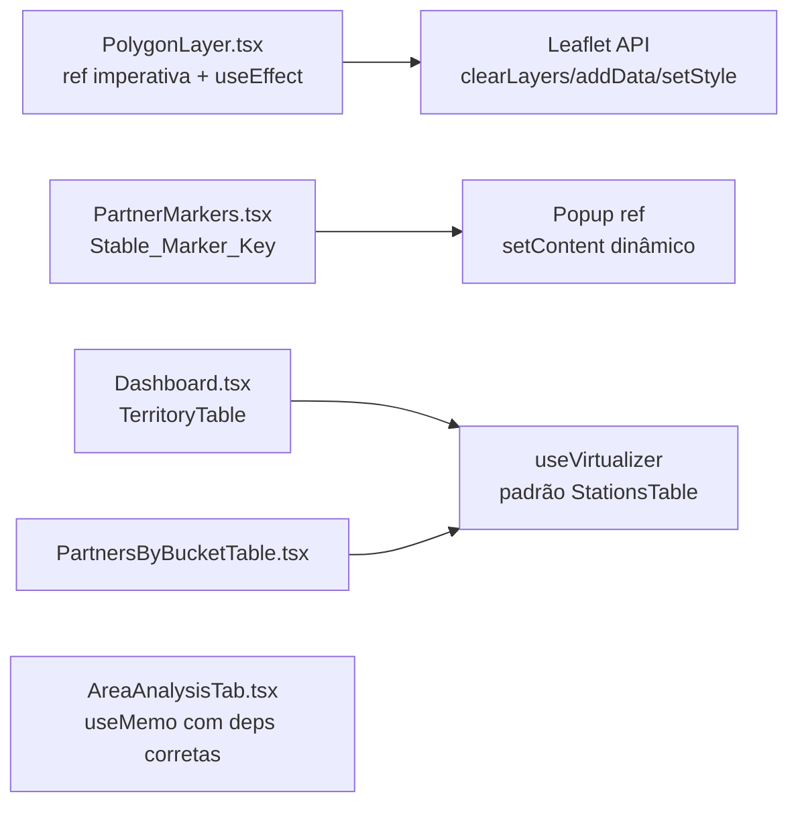

# Design Document — frontend-performance

## Overview

Este documento define a arquitetura das quatro otimizações aprovadas em `requirements.md` da spec `frontend-performance`. Todas visam eliminar trabalho visual/DOM desnecessário sem alterar o comportamento observável pelo usuário (`Behavior_Equivalence`).

As mudanças são locais a cinco arquivos e seguem padrões já estabelecidos no projeto (ex.: `StationsTable.tsx` como referência de virtualização com `@tanstack/react-virtual`, padrão de store Zustand com seletores).

Nenhuma nova dependência é introduzida — `@tanstack/react-virtual` já está instalada e o restante é vanilla React/Leaflet.

## Architecture

### Mapa de impacto



### Princípios de design

1. **Atualizar, não destruir**: camadas e markers Leaflet são reutilizados; mudanças de estado viram updates imperativos via ref.
2. **Virtualização como padrão reutilizável**: o mesmo padrão de `StationsTable` é replicado com helper interno compartilhado.
3. **Memoização explícita**: `useMemo` com dependências exatas; `React.memo` mantido onde já existia.
4. **Idioma é lateral**: textos internacionalizados entram via conteúdo renderizado, nunca via `key`.
5. **Sem regressão visual**: cada mudança é coberta por teste de snapshot/render e por PBT em funções puras.

## Components and Interfaces

### 1. `PolygonLayer.tsx` — atualização imperativa da camada Leaflet

#### Problema atual
```tsx
<GeoJSON
  key={JSON.stringify(filterState) + selectedBucket + prospectClusters.length
       + polygonColorField + String(showPolygons)}
  ...
/>
```
Qualquer alteração em `filterState` (ou nos outros campos) muda a `key` e força React-Leaflet a desmontar a `GeoJSON` anterior, criar uma nova instância, re-registrar todos os listeners e re-adicionar ao mapa. Em mapas com centenas de polígonos e estilos custosos, isso é a principal fonte de lag.

#### Solução
Remover a `key` dinâmica e usar `useRef` + `useEffect` para atualizar a camada Leaflet imperativamente via a API nativa.

```tsx
// atlas-react/src/components/map/PolygonLayer.tsx (versão otimizada)
import { useEffect, useMemo, useRef } from 'react';
import { useMap } from 'react-leaflet';
import L, { type StyleFunction, type PathOptions, type GeoJSON as LGeoJSON } from 'leaflet';
import type { Feature, FeatureCollection } from 'geojson';
import { useStore } from '../../store';
// ... restante dos imports preservados

export default function PolygonLayer() {
  const map = useMap();
  const layerRef = useRef<LGeoJSON | null>(null);

  // Seletores granulares (não mudam de referência sem necessidade)
  const polygonsData      = useStore((s) => s.polygonsData);
  const filterState       = useStore((s) => s.filterState);
  const showPolygons      = useStore((s) => s.styleConfig.showPolygons);
  const polygonColorField = useStore((s) => s.styleConfig.polygonColorField);
  const prospectClusters  = useStore((s) => s.prospectState.clusters);
  const selectedBucket    = useStore((s) => s.prospectState.selectedBucket);

  // filteredData mantém o useMemo existente
  const filteredData = useMemo<FeatureCollection | null>(() => {
    /* ... mesma lógica atual ... */
  }, [polygonsData, filterState, prospectClusters, selectedBucket]);

  const colorMap = useMemo(() => { /* ... mesma lógica atual ... */ }, [filteredData]);

  // StyleFunction estável por render (depende de colorMap + polygonColorField)
  const styleFunc = useMemo<StyleFunction>(() => {
    if (!colorMap) return () => ({} as PathOptions);
    return (feature?: Feature): PathOptions => {
      /* ... mesma lógica de switch(polygonColorField) ... */
    };
  }, [colorMap, polygonColorField]);

  // onEachFeature estável (lógica de popup inalterada)
  const onEachFeature = useMemo(
    () => (feature: Feature, layer: L.Layer) => {
      /* ... mesma lógica atual ... */
    },
    [], // popup usa apenas feature.properties; sem deps externas
  );

  // Efeito 1: criar a camada uma única vez por montagem
  useEffect(() => {
    const layer = L.geoJSON(undefined, {
      style: styleFunc,
      onEachFeature,
      pane: 'polygonsPane',
    });
    layerRef.current = layer;
    return () => {
      if (layerRef.current) {
        layerRef.current.remove();
        layerRef.current = null;
      }
    };
  }, [map]); // cria apenas quando o mapa troca (nunca, em prática)

  // Efeito 2: adicionar/remover ao mapa conforme visibilidade
  useEffect(() => {
    const layer = layerRef.current;
    if (!layer) return;
    const heatmapActive = prospectClusters.length > 0;
    const shouldShow = (showPolygons || heatmapActive) && filteredData != null;
    if (shouldShow && !map.hasLayer(layer)) layer.addTo(map);
    if (!shouldShow && map.hasLayer(layer)) layer.remove();
  }, [map, showPolygons, prospectClusters.length, filteredData]);

  // Efeito 3: atualizar as features quando filteredData muda
  useEffect(() => {
    const layer = layerRef.current;
    if (!layer || !filteredData) return;
    try {
      layer.clearLayers();
      layer.addData(filteredData);
      // Reaplica o estilo atual (addData usa o style do init; se polygonColorField
      // mudou antes deste efeito, garantimos consistência com setStyle)
      layer.setStyle(styleFunc);
    } catch (err) {
      console.error('[PolygonLayer] update failed, keeping last valid state:', err);
    }
  }, [filteredData, styleFunc]);

  // Efeito 4: atualizar apenas estilos quando polygonColorField muda
  // (cobre caso em que colorMap não muda mas a função de estilo precisa ser re-aplicada)
  useEffect(() => {
    const layer = layerRef.current;
    if (!layer) return;
    try {
      layer.setStyle(styleFunc);
    } catch (err) {
      console.error('[PolygonLayer] setStyle failed:', err);
    }
  }, [styleFunc]);

  // Componente não renderiza nada via React — a camada vive no DOM do Leaflet
  return null;
}
```

Por que quatro `useEffect` separados em vez de um só? Porque as dependências são ortogonais:
- Efeito 1 depende só de `map` (criação/destruição).
- Efeito 2 depende da visibilidade (`showPolygons`, `heatmapActive`).
- Efeito 3 depende de `filteredData` (dados).
- Efeito 4 depende de `styleFunc` (estilo visual).

Isso maximiza reuso: trocar `polygonColorField` aciona só o Efeito 4 (`setStyle` é barato); mudar `filteredData` aciona o Efeito 3 (`clearLayers + addData`, ainda sem remount da camada); e alterar visibilidade não refaz nada além de add/remove.

#### Tratamento de erro (AC 7 do Req 1)
Cada `useEffect` de atualização envolve a chamada Leaflet em `try/catch`, loga o erro com `console.error` e preserva o último estado válido (não retorna a camada ao estado anterior, apenas evita exceção no React).

### 2. `PartnerMarkers.tsx` — `Stable_Marker_Key` e popup reativo ao idioma

#### Problema atual
```tsx
<React.Fragment key={`${partner.salesforce_id}-${i18n.language}`}>
  <CircleMarker ...>
    <Popup>
      <div dangerouslySetInnerHTML={{ __html: popupHtml }} ... />
    </Popup>
  </CircleMarker>
</React.Fragment>
```
A `key` inclui `i18n.language`, o que força desmontagem e recriação do `CircleMarker` (e de seus refs) a cada troca de idioma. O `popupHtml` também é regenerado a cada render porque depende de `useTranslation`.

#### Solução
1. `key` apenas com `partner.salesforce_id`.
2. O conteúdo internacionalizado continua sendo recomputado (via `useTranslation` sobre `i18n.language`), mas agora atualiza o **mesmo Popup da mesma instância de marker** — React Leaflet reconcilia filhos pela key do Fragment/props.
3. `markerRefs` permanece estável para o mesmo parceiro entre trocas de idioma (AC 3 do Req 5).

```tsx
// atlas-react/src/components/map/PartnerMarkers.tsx (versão otimizada)
{!prospectActive && visibleData.filter(hasValidCoords).map((partner) => {
  const style = getMarkerStyle(partner, primary, secondary, colorMaps);
  const popupHtml = getPartnerPopupHtml(partner, routeOriginActive);

  return (
    <React.Fragment key={partner.salesforce_id}>
      <CircleMarker
        center={[partner.lat, partner.lon]}
        radius={7}
        pane="markersPane"
        ref={(ref) => {
          if (ref) markerRefs.current.set(partner.salesforce_id, ref);
          else markerRefs.current.delete(partner.salesforce_id);
        }}
        pathOptions={{
          color: style.color, fillColor: style.fillColor,
          weight: style.weight, fillOpacity: style.fillOpacity,
        }}
      >
        <Popup minWidth={276} maxWidth={300} autoPan autoPanPadding={[16, 16]}>
          <div dangerouslySetInnerHTML={{ __html: popupHtml }} onClick={handlePopupClick} />
        </Popup>
        {partner.tooltip && (
          <Tooltip direction="top" sticky className="custom-tooltip">
            {partner.tooltip}
          </Tooltip>
        )}
      </CircleMarker>

      {styleConfig.showRadii && (
        <Circle ...mesmo de antes... />
      )}
    </React.Fragment>
  );
})}
```

#### Como garantimos que o popup reflete o idioma sem remontar o marker?

O componente `PartnerMarkers` consome `useTranslation()`, então ele **re-renderiza** quando `i18n.language` muda. Nesse re-render:
- `partner.salesforce_id` não muda → React preserva o `<CircleMarker>`.
- O filho `<Popup>` recebe `children` atualizados (novo `popupHtml`).
- React Leaflet reconcilia o `<Popup>` e atualiza seu conteúdo via `setPopupContent` sob o capô (comportamento nativo de `react-leaflet`).

Se um popup estiver aberto durante a troca, seu conteúdo é atualizado sem fechar/reabrir.

#### Invariante chave para testes
```ts
// markerRefs é estável entre trocas de idioma
const refBefore = markerRefs.current.get(sid);
await changeLanguage('pt-BR');
const refAfter = markerRefs.current.get(sid);
assert(refBefore === refAfter); // mesma instância Leaflet
```

### 3. Virtualização de `TerritoryTable` e `PartnersByBucketTable`

#### Padrão compartilhado
Extrair um helper mínimo (não um componente wrapper, para não alterar DOM/acessibilidade) que encapsula a decisão de virtualizar:

```ts
// atlas-react/src/components/dashboard/useRowVirtualization.ts (novo)
import { useRef } from 'react';
import { useVirtualizer } from '@tanstack/react-virtual';

export interface RowVirtualizationOptions {
  rowCount: number;
  rowHeight: number;
  threshold?: number; // default 100
  maxHeight?: number; // altura máx. do container scrollável (px). default 400
}

export function useRowVirtualization(opts: RowVirtualizationOptions) {
  const parentRef = useRef<HTMLDivElement>(null);
  const threshold = opts.threshold ?? 100;
  const maxHeight = opts.maxHeight ?? 400;
  const enabled = opts.rowCount > threshold;

  const virtualizer = useVirtualizer({
    count: opts.rowCount,
    getScrollElement: () => parentRef.current,
    estimateSize: () => opts.rowHeight,
    enabled,
    overscan: 10,
  });

  return {
    parentRef,
    virtualizer,
    enabled,
    containerStyle: {
      height: Math.min(opts.rowCount * opts.rowHeight, maxHeight),
      overflowY: 'auto' as const,
    },
  };
}
```

#### `TerritoryTable` (em `Dashboard.tsx`)

A `TerritoryTable` hoje renderiza todas as `rows` no `<tbody>`. Refatoração preserva o mesmo markup e headers sticky; só altera o corpo:

```tsx
// Dentro do componente TerritoryTable
const ROW_HEIGHT = 36; // compatível com py-2 + fonte atual
const { parentRef, virtualizer, enabled: virtualizeOn, containerStyle } =
  useRowVirtualization({ rowCount: rows.length, rowHeight: ROW_HEIGHT });

if (rows.length === 0) { /* mensagem dashboard.no_territory_found (inalterado) */ }

return (
  <div className="bg-atlas-dark border border-atlas-navy rounded-lg overflow-hidden">
    {/* Thead permanece em uma tabela própria para sticky header confiável */}
    <div className="overflow-x-auto">
      <table className="w-full text-sm table-fixed">
        <thead className="bg-atlas-darker sticky top-0 z-10">
          <tr>{TERRITORY_COLUMNS.map(/* ... */)}</tr>
        </thead>
      </table>
    </div>

    {virtualizeOn ? (
      <div ref={parentRef} style={containerStyle}>
        <table className="w-full text-sm table-fixed"
               style={{ height: virtualizer.getTotalSize(), position: 'relative' }}>
          <tbody>
            {virtualizer.getVirtualItems().map((v) => {
              const row = rows[v.index];
              return renderTerritoryRow(row, {
                position: 'absolute',
                top: v.start,
                left: 0,
                width: '100%',
                height: ROW_HEIGHT,
              });
            })}
          </tbody>
        </table>
      </div>
    ) : (
      <div className="overflow-x-auto max-h-[400px] overflow-y-auto">
        <table className="w-full text-sm table-fixed">
          <tbody>{rows.map((row) => renderTerritoryRow(row))}</tbody>
        </table>
      </div>
    )}
  </div>
);
```

`renderTerritoryRow` é uma função local que extrai o `<tr>` atual (sem mudar classes ou conteúdos). O uso de `table-fixed` e de duas `<table>` separadas (header + body) evita problemas de alinhamento de colunas em tabelas virtualizadas — mesmo padrão testado em `StationsTable`. A largura das colunas é definida por `<colgroup>` ou por classes `w-*` nas `<th>`; precisamos adicionar larguras explícitas para manter alinhamento (detalhe de task).

#### `PartnersByBucketTable`

Mesmo padrão. A filtragem por `search` já existe no `useMemo` → `filtered`. O virtualizador opera sobre `filtered.length`, nunca sobre `rows` não filtradas:

```tsx
const ROW_HEIGHT = 36;
const { parentRef, virtualizer, enabled: virtualizeOn, containerStyle } =
  useRowVirtualization({ rowCount: filtered.length, rowHeight: ROW_HEIGHT });
```

Comportamentos preservados:
- Exportar CSV continua recebendo `filtered` (AC 7 do Req 3).
- `filtered.length === 0` exibe `dashboard.no_territory_found` **sem** ativar o virtualizador (AC 8).
- Ordenação por `bucket_ade` (localeCompare com `{numeric: true}`) permanece no `useMemo` de `rows`.

### 4. `AreaAnalysisTab.tsx` — memoização das computações derivadas

As funções puras `getGlobalOverview`, `getFilteredStats`, `getStatsByState` já estão no topo do arquivo. Hoje elas são chamadas dentro de `handleAnalyze` e o resultado é guardado em `analysisResult` via `setState`. Esse padrão já evita recálculos em renders sucessivos **se** o usuário não clicar "Analisar" novamente.

A lacuna é que, quando `allMarkersData` muda (ex.: fetch de dados novos), o `analysisResult` fica stale ou o recálculo é implícito via re-click. A otimização é explicitar memoização de computações derivadas:

```tsx
// Dentro de AreaAnalysisTab principal
const overview = useMemo(
  () => getGlobalOverview(allMarkersData),
  [allMarkersData],
);

const filteredProspects = useMemo(() => {
  return allMarkersData.filter((p) => {
    if (p.status !== 'Prospect') return false;
    if (!p.decision) return false;
    if (selectedState !== 'all' && p.state !== selectedState) return false;
    if (selectedDecision !== 'all' && p.decision !== selectedDecision) return false;
    return true;
  });
}, [allMarkersData, selectedState, selectedDecision]);

const filteredStats = useMemo(
  () => getFilteredStats(filteredProspects),
  [filteredProspects],
);

const stateRows = useMemo(
  () => getStatsByState(filteredProspects),
  [filteredProspects],
);

const leads = useMemo(
  () => filteredProspects, // já filtrado; se LeadsPanel precisa de sort, mover pro useMemo
  [filteredProspects],
);
```

O `handleAnalyze` passa a simplesmente compor esses valores (ou disparar o estado `showPanel`), sem recomputá-los:

```tsx
const handleAnalyze = useCallback(() => {
  if (manualAnalysisOpen) setManualAnalysisOpen(false);
  if (showCapOpportunityPanel) {
    setShowCapOpportunityPanel(false);
    setSelectedCapOpportunity(null);
  }
  applyFilters({ selectedStatuses: ['Prospect'] });
  setAnalysisResult({
    overview, filtered: filteredStats, stateRows, leads,
    stateFilter: selectedState, decisionFilter: selectedDecision,
  });
  setShowPanel(true);
}, [
  manualAnalysisOpen, showCapOpportunityPanel, applyFilters,
  setManualAnalysisOpen, setSelectedCapOpportunity,
  overview, filteredStats, stateRows, leads,
  selectedState, selectedDecision,
]);
```

#### Sub-painéis (`LeadsPanel`, `CapOpportunityPanel`)
Ambos já usam `useMemo`:
- `LeadsPanel`: `filtered` memoizado com deps `[leads, search]` — **preservado** (AC 5).
- `CapOpportunityPanel`: `opportunities` memoizado com deps `[allMarkersData]` — **preservado** (AC 6).

Nenhuma mudança é necessária nesses sub-painéis além de garantir que continuem com `useMemo` quando forem tocados em iterações futuras.

#### Invariante de referência estável (AC 9)
```ts
const prev = result;
// re-render sem mudar deps
const next = result;
assert(prev === next); // mesma referência ⇒ propaga memoização para filhos
```

Isso é automático com `useMemo`. Testes validam isso capturando o valor entre renders controlados por React Testing Library.

## Data Models

Nenhum novo model. Apenas tipos de apoio do helper de virtualização:

```ts
interface RowVirtualizationOptions {
  rowCount: number;
  rowHeight: number;
  threshold?: number;
  maxHeight?: number;
}
interface RowVirtualizationResult {
  parentRef: React.RefObject<HTMLDivElement>;
  virtualizer: ReturnType<typeof useVirtualizer>;
  enabled: boolean;
  containerStyle: { height: number; overflowY: 'auto' };
}
```

## Error Handling

### `PolygonLayer`
- Cada `useEffect` que chama API Leaflet é protegido por `try/catch`. Falhas logam via `console.error` e mantêm o último estado válido. O React nunca recebe a exceção (AC 7 do Req 1).
- Se `layerRef.current` é `null` (montagem incompleta), os efeitos fazem early return.

### `PartnerMarkers`
- `markerRefs` permanece estável através do ciclo de vida do componente. Refs ausentes (parceiros removidos entre renders) são limpos pelo callback do `ref` do `CircleMarker` (`else markerRefs.current.delete(sid)`), idêntico ao comportamento atual.

### Virtualização
- Quando `rowCount` é 0, o helper retorna `enabled=false` e a tabela exibe a mensagem vazia padrão, sem ativar o virtualizador (ACs 8 de Req 2 e 3).
- `parentRef` sendo `null` temporariamente (primeiro render) é aceitável; `useVirtualizer` lida com isso nativamente.

### `AreaAnalysisTab`
- `useMemo` é transparente a erros das funções puras — se `getFilteredStats` lançar, o erro sobe na árvore (mesmo comportamento da versão atual).

## Testing Strategy

### Ferramentas
- **React Testing Library** para testes de render/interação.
- **fast-check** para PBT de funções puras em `AreaAnalysisTab`.
- **Vitest** (já configurado no projeto).

### Estrutura
```
atlas-react/src/__tests__/
  map/
    PolygonLayer.test.tsx          # Req 1 + Req 6.4
    PartnerMarkers.test.tsx        # Req 5 + Req 6.5
  dashboard/
    TerritoryTable.test.tsx        # Req 2 + Req 6.3
    PartnersByBucketTable.test.tsx # Req 3 + Req 6.2
    useRowVirtualization.test.tsx  # helper
  controls/
    AreaAnalysisTab.memo.test.tsx  # Req 4 + Req 6.1, 6.6, 6.7
    areaAnalysis.pure.test.ts      # fast-check sobre getGlobalOverview etc.
```

### Exemplos ilustrativos

#### `AreaAnalysisTab` — PBT sobre funções puras

```ts
// areaAnalysis.pure.test.ts
import fc from 'fast-check';
import { getGlobalOverview, getFilteredStats, getStatsByState } from '...';

const partnerArb = fc.record({
  status: fc.constantFrom('Active', 'Prospect', 'Inactive'),
  decision: fc.option(fc.constantFrom('Go', 'No Go', ''), { nil: undefined }),
  reason: fc.option(fc.constantFrom(...NO_GO_REASONS, ''), { nil: undefined }),
  state: fc.option(fc.string({ minLength: 1, maxLength: 3 }), { nil: undefined }),
  lat: fc.option(fc.float({ min: -90, max: 90, noNaN: true }), { nil: null }),
  lon: fc.option(fc.float({ min: -180, max: 180, noNaN: true }), { nil: null }),
});

test('getGlobalOverview: go + nogo === total evaluated', () => {
  fc.assert(fc.property(fc.array(partnerArb, { maxLength: 200 }), (data) => {
    const o = getGlobalOverview(data as any);
    expect(o.go + o.nogo).toBe(o.total);
  }));
});

test('getFilteredStats: soma de nogoReasonRows ≤ nogo', () => {
  fc.assert(fc.property(fc.array(partnerArb, { maxLength: 200 }), (data) => {
    const prospects = data.filter((p) => p.status === 'Prospect' && p.decision);
    const s = getFilteredStats(prospects as any);
    const sum = s.nogoReasonRows.reduce((a, r) => a + r.count, 0);
    expect(sum).toBeLessThanOrEqual(s.nogo);
  }));
});
```

#### `useMemo` — estabilidade referencial (Req 6.6)

```tsx
test('overview não muda de referência quando allMarkersData é estável', () => {
  const data = makeFixture();
  const { result, rerender } = renderHook(
    ({ d }) => useMemo(() => getGlobalOverview(d), [d]),
    { initialProps: { d: data } },
  );
  const first = result.current;
  rerender({ d: data }); // mesma referência
  expect(result.current).toBe(first);
});
```

#### `PolygonLayer` — não remonta a camada ao alterar filtros (Req 6.4)

```tsx
test('mudar filterState não recria a instância da GeoJSON layer', async () => {
  const { result } = renderWithLeafletMap(<PolygonLayer />);
  const layerBefore = result.leafletLayerInstance(); // acessor de teste
  act(() => useStore.setState({ filterState: {
    selectedStations: ['DSP2'], selectedBuckets: 'all',
  }}));
  const layerAfter = result.leafletLayerInstance();
  expect(layerAfter).toBe(layerBefore);
});
```

#### `PartnerMarkers` — `markerRefs` estável entre trocas de idioma (Req 6.5)

```tsx
test('trocar i18n.language não recria os markers', async () => {
  const data = [{ salesforce_id: 's1', lat: -23.5, lon: -46.6, /*...*/ }];
  useStore.setState({ currentFilteredData: data });
  const { getRefsSnapshot, changeLanguage } = renderPartnerMarkers();
  const before = getRefsSnapshot();
  await changeLanguage('en');
  const after = getRefsSnapshot();
  expect(after.get('s1')).toBe(before.get('s1'));
});
```

#### Virtualização — equivalência de conjunto de linhas (Req 6.2, 6.3)

```tsx
test('rows acessíveis via scroll === rows do reference_component', () => {
  fc.assert(fc.property(fc.array(rowArb, { minLength: 0, maxLength: 500 }), (rows) => {
    const { queryAllByRole, scrollToEnd } = render(<TerritoryTable rows={rows} sortState={{column:null,direction:'asc'}} onSort={() => {}} />);
    const visibleFirst = queryAllByRole('row').map(r => r.textContent);
    scrollToEnd();
    const visibleLast  = queryAllByRole('row').map(r => r.textContent);
    const union = new Set([...visibleFirst, ...visibleLast]);
    // conjunto completo coincide com o esperado (não virtualizado como referência)
    expect([...union].sort()).toEqual(expectedRowLabels(rows).sort());
  }));
});
```

### Cobertura mínima por Req 6.9
- 1 teste de render por componente otimizado (5 componentes: `PolygonLayer`, `PartnerMarkers`, `TerritoryTable`, `PartnersByBucketTable`, `AreaAnalysisTab`).
- 1 teste fast-check por função pura em `AreaAnalysisTab` (3 funções: `getGlobalOverview`, `getFilteredStats`, `getStatsByState`).
