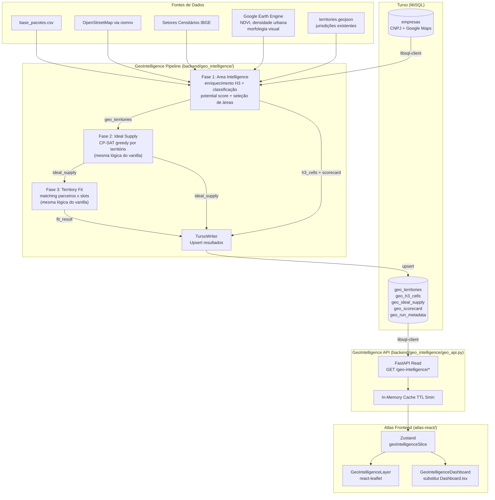
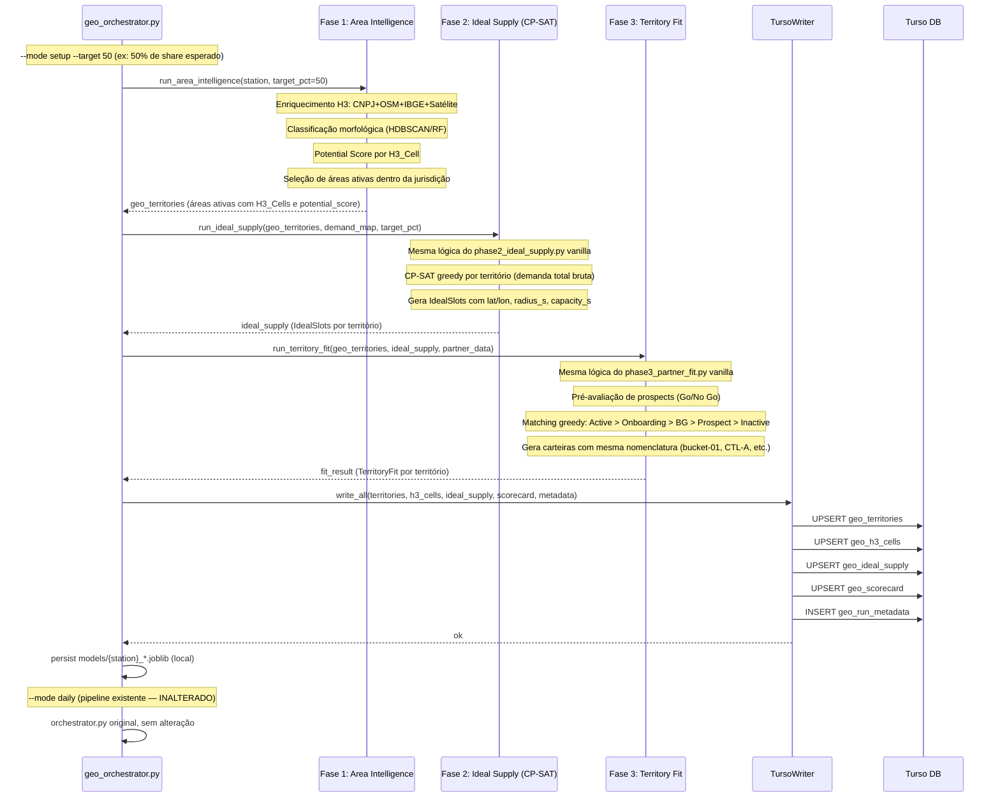

# Design Document: Geo-Intelligence Expansion

## Overview

O módulo de Geointeligência para Expansão Logística transforma o Atlas de uma ferramenta de visualização de dados operacionais em uma plataforma de inteligência territorial. O sistema integra dados multidimensionais (CNPJ/Receita Federal, Google Maps, OpenStreetMap, IBGE, imagens de satélite) com os dados internos do Atlas para classificar automaticamente territórios geográficos, calcular potencial de expansão em três níveis hierárquicos (Território → DS → BDM) e otimizar o posicionamento de novos parceiros logísticos via programação por restrições (OR-Tools CP-SAT).

A feature é composta por três grandes blocos:

1. **GeoIntelligence Pipeline** (backend Python): pipeline de três fases que espelha a lógica do pipeline vanilla, com a diferença fundamental na **Fase 1** — em vez de usar apenas volume de pacotes para definir territórios, usa dados multidimensionais + IA + análise de satélite para descobrir as áreas mais indicadas para hub delivery dentro da jurisdição de cada DS, dado um target de share. As **Fases 2 e 3** seguem a mesma lógica e nomenclatura do pipeline vanilla. Executado via `geo_orchestrator.py --mode setup --target <share_pct>`.
2. **GeoIntelligence API** (FastAPI): exposição dos resultados para o frontend via REST, lendo e escrevendo no Turso.
3. **GeoIntelligence UI** (React/TypeScript): visão principal do Atlas. O frontend mantém exatamente a mesma estrutura atual (mapa react-leaflet, painel de controles, marcadores, camadas), com **apenas o dashboard reformulado** para exibir os novos dados de geointeligência. Tudo que existe hoje no mapa continua funcionando — a mudança é exclusivamente no componente `Dashboard.tsx`, que é substituído pelo `GeoIntelligenceDashboard.tsx` com os novos KPIs, scorecard multinível e ranking de territórios.

O GeoIntelligence Pipeline é **completamente separado** do pipeline de produção atual. Reside em `backend/geo_intelligence/` como um módulo independente com seu próprio ponto de entrada (`geo_orchestrator.py`), sem nenhuma dependência ou modificação nos arquivos existentes (`orchestrator.py`, `phase_setup.py`, `phase2_ideal_supply.py`, etc.). O pipeline de produção (`--mode setup` e `--mode daily`) continua funcionando exatamente como hoje.

O banco de dados de empresas utilizado pelo `CNPJ_Enricher` é o banco existente da API de empresas hospedado no **Turso** (libSQL), acessado via HTTP usando o SDK `libsql-client`. Todo o output do pipeline é persistido no mesmo banco Turso em tabelas dedicadas. Não há necessidade de manter arquivos locais de output (exceto modelos `.joblib`).

---

## Architecture

### Visão Geral do Sistema



### Modos de Execução do Pipeline



---

## Components and Interfaces

### Separação Total do Pipeline de Produção

O GeoIntelligence Pipeline é um módulo **completamente independente**. Nenhum arquivo do pipeline atual é modificado:

```
backend/
├── orchestrator.py          ← INALTERADO (--mode setup / --mode daily)
├── phase_setup.py           ← INALTERADO
├── phase2_ideal_supply.py   ← INALTERADO
├── phase3_partner_fit.py    ← INALTERADO
├── phase4_webleads.py       ← INALTERADO
├── phase5_reports.py        ← INALTERADO
│
└── geo_intelligence/        ← NOVO — totalmente separado
    ├── geo_orchestrator.py  # Ponto de entrada: --mode setup --target <pct>
    │
    ├── phase1_area_intelligence.py  # Fase 1: descoberta de áreas indicadas
    │   ├── ingestor.py              # Mapeamento pacotes → H3, leitura jurisdição
    │   ├── enrichers/
    │   │   ├── cnpj_enricher.py     # Consulta Turso (empresas CNPJ + Google Maps)
    │   │   ├── osm_enricher.py      # osmnx: buildings, landuse, POIs, roads
    │   │   ├── ibge_enricher.py     # Setores censitários: renda, densidade pop.
    │   │   └── satellite_enricher.py # Google Earth Engine: NDVI, densidade urbana
    │   ├── feature_engineer.py      # Cálculo e normalização de features por H3
    │   ├── classifier.py            # HDBSCAN + RF/XGBoost → region_type
    │   ├── potential_calculator.py  # Scorecard multinível (Território/DS/BDM)
    │   └── area_selector.py         # Seleciona áreas ativas dado o target_pct
    │
    ├── phase2_ideal_supply.py  # Fase 2: CP-SAT (mesma lógica do vanilla)
    │
    ├── phase3_territory_fit.py # Fase 3: matching + carteiras (mesma lógica do vanilla)
    │
    ├── turso_writer.py         # Upsert de todos os outputs para o Turso
    ├── turso_reader.py         # Leitura dos dados pelo lado da API
    ├── geo_api.py              # FastAPI — leitura (frontend) + metadados
    └── geo_config.py           # TURSO_URL, TURSO_AUTH_TOKEN, pesos, etc.
```

O ponto de entrada é `geo_orchestrator.py`, invocado diretamente:
```bash
python geo_intelligence/geo_orchestrator.py --mode setup --target 50 --stations DSP2
```

### Fase 1: Area Intelligence (Diferencial do GeoIntelligence)

Esta é a fase que diferencia o pipeline GeoIntelligence do vanilla. Em vez de usar apenas volume de pacotes para definir territórios, ela descobre **quais áreas dentro da jurisdição são mais indicadas para hub delivery** com base em dados multidimensionais.

**Fluxo interno da Fase 1:**

1. **Ingestão**: carrega base de pacotes e mapeia cada entrega para H3_Cell (res 9). Lê o polígono de jurisdição da DS do `territories.geojson` existente.
2. **Enriquecimento**: para cada H3_Cell dentro da jurisdição, coleta features de 4 fontes:
   - Turso (empresas CNPJ + Google Maps): densidade de empresas, diversidade CNAE, negócios-alvo
   - OSM via osmnx: buildings, landuse, POIs, conectividade viária
   - IBGE: renda média, densidade populacional por setor censitário
   - Satélite (Google Earth Engine): NDVI, densidade urbana, classificação morfológica visual
3. **Classificação morfológica**: HDBSCAN sobre o vetor de features → `region_type` por H3_Cell. Fallback KMeans k=6.
4. **Potential Score**: scorecard por H3_Cell → agregado por território → DS → BDM.
5. **Seleção de áreas**: `area_selector.py` usa o `potential_score` e o `target_pct` para selecionar o conjunto mínimo de H3_Cells (agrupadas em territórios) cuja capacidade estimada atinge o share alvo. Produz `geo_territories` — a lista de territórios ativos com seus H3_Cells.

**Output da Fase 1** → `geo_territories`: mesma estrutura de `territories_index.json` do vanilla, enriquecida com `region_type`, `potential_score`, `gap` e `model_confidence` por território.

### Análise de Satélite (satellite_enricher.py)

O `SatelliteEnricher` usa o **Google Earth Engine (GEE) Python API** para extrair features de imagens de satélite por H3_Cell, permitindo classificação visual da morfologia urbana:

```python
# geo_intelligence/enrichers/satellite_enricher.py
import ee

class SatelliteEnricher:
    def __init__(self):
        ee.Initialize()  # requer autenticação GEE configurada

    def get_features_for_h3_cells(self, h3_ids: list[str]) -> pd.DataFrame:
        """
        Extrai por H3_Cell:
        - ndvi_mean: índice de vegetação (NDVI médio) — distingue áreas verdes de construídas
        - urban_density_index: densidade urbana via GHSL (Global Human Settlement Layer)
        - built_up_ratio: proporção de área construída (Sentinel-2 / Landsat)
        - morphology_class: classificação visual preliminar
          ('high_density_urban', 'low_density_urban', 'informal_settlement',
           'commercial_industrial', 'green_area', 'rural')
        """
        features = []
        for h3_id in h3_ids:
            boundary = self._h3_to_ee_geometry(h3_id)
            ndvi = self._compute_ndvi(boundary)
            urban = self._compute_urban_density(boundary)
            built = self._compute_built_up_ratio(boundary)
            morph = self._classify_morphology(ndvi, urban, built)
            features.append({
                "h3_id": h3_id,
                "ndvi_mean": ndvi,
                "urban_density_index": urban,
                "built_up_ratio": built,
                "morphology_class": morph,
            })
        return pd.DataFrame(features)
```

As features de satélite são incorporadas ao vetor de features do `Feature_Engineer` e usadas tanto na classificação morfológica (HDBSCAN/RF) quanto no cálculo do `potential_score`. A análise de satélite é especialmente relevante para distinguir:
- **Favelas/comunidades**: alta densidade construída + baixo NDVI + padrão irregular
- **Condomínios/alto padrão**: alta densidade construída + NDVI moderado + padrão regular
- **Áreas comerciais**: alta densidade + baixo NDVI + padrão de grandes construções
- **Residencial urbano**: densidade média + NDVI variável

Se o GEE estiver indisponível, o `SatelliteEnricher` retorna `None` para todas as features e o pipeline continua sem elas (degradação graciosa).

### Fases 2 e 3: Mesma Lógica do Pipeline Vanilla

**Fase 2 (`phase2_ideal_supply.py`)**: implementação idêntica ao `phase2_ideal_supply.py` vanilla. Recebe `geo_territories` (output da Fase 1) no lugar de `territories_index.json`. Roda o solver CP-SAT greedy por território sobre a demanda diária bruta dos H3_Cells. Gera `IdealSlot` com `slot_id`, `origin_hex`, `radius_s`, `capacity_s`, `lat`, `lon`, `allocations`.

**Fase 3 (`phase3_territory_fit.py`)**: implementação idêntica ao `phase3_partner_fit.py` vanilla. Recebe `geo_territories` + `ideal_supply` + `partner_data`. Executa:
- Pré-avaliação de todos os prospects (Go/No Go com reasons canônicos)
- Matching greedy: Active > Onboarding > BG Checks > Prospect > Inactive
- Gera carteiras com **mesma nomenclatura atual**: `{station}_bucket-{nn}`, `CTL-{letra}`
- Produz `TerritoryFit` por território com `attainment`, `accuracy`, `partners`, `slots`

### Banco de Dados de Empresas (Turso — leitura)

O `CNPJ_Enricher` consulta o banco de empresas existente hospedado no **Turso** (libSQL/SQLite distribuído). A conexão é feita via HTTP usando `libsql-client` (Python SDK oficial do Turso):

```python
# geo_intelligence/enrichers/cnpj_enricher.py
import libsql_client

class CnpjEnricher:
    def __init__(self, url: str, auth_token: str):
        self.client = libsql_client.create_client_sync(
            url=url,           # ex: libsql://atlas-empresas.turso.io
            auth_token=auth_token,
        )

    def get_companies_in_h3_cells(self, h3_ids: list[str]) -> pd.DataFrame:
        """Busca empresas cujo h3_id (res 9) está na lista fornecida."""
        placeholders = ",".join("?" * len(h3_ids))
        result = self.client.execute(
            f"SELECT h3_id, cnae_code, lat, lng FROM empresas WHERE h3_id IN ({placeholders})",
            h3_ids,
        )
        return pd.DataFrame(result.rows, columns=[c.name for c in result.columns])
```

### Banco de Dados de Output (Turso — escrita e leitura)

Todo o output do pipeline é persistido no **mesmo banco Turso** em tabelas dedicadas ao módulo de geointeligência. O `TursoWriter` faz upsert ao final de cada execução; a `GeoIntelligence API` lê diretamente dessas tabelas.

#### Schema das Tabelas

```sql
-- Territórios com métricas agregadas
CREATE TABLE IF NOT EXISTS geo_territories (
    territory_id      TEXT NOT NULL,
    station_code      TEXT NOT NULL,
    run_id            TEXT NOT NULL,          -- FK para geo_run_metadata
    region_type       TEXT NOT NULL,
    potential_score   REAL NOT NULL,
    current_partners  INTEGER NOT NULL,
    ideal_slots       INTEGER NOT NULL,
    gap               REAL NOT NULL,
    model_confidence  REAL NOT NULL,
    low_confidence    INTEGER NOT NULL,       -- 0/1 (SQLite boolean)
    high_opportunity  INTEGER NOT NULL,
    geometry_geojson  TEXT NOT NULL,          -- GeoJSON Polygon serializado
    h3_ids_json       TEXT NOT NULL,          -- JSON array de h3_ids
    attainment        REAL,
    accuracy          REAL,
    updated_at        TEXT NOT NULL,
    PRIMARY KEY (territory_id, run_id)
);

-- Features por H3_Cell (granularidade máxima)
CREATE TABLE IF NOT EXISTS geo_h3_cells (
    h3_id                       TEXT NOT NULL,
    territory_id                TEXT NOT NULL,
    station_code                TEXT NOT NULL,
    run_id                      TEXT NOT NULL,
    -- Econômicas
    company_density             REAL,
    cnae_diversity_index        REAL,
    target_business_density     REAL,
    -- Urbanas
    building_density            REAL,
    avg_building_size_m2        REAL,
    landuse_residential_ratio   REAL,
    landuse_commercial_ratio    REAL,
    poi_density                 REAL,
    road_connectivity_index     REAL,
    -- Socioeconômicas
    avg_income                  REAL,
    population_density          REAL,
    -- Indiretas
    bars_restaurants_density    REAL,
    churches_density            REAL,
    schools_density             REAL,
    dealerships_density         REAL,
    petshops_density            REAL,
    -- Avançadas
    landuse_entropy             REAL,
    road_centrality_index       REAL,
    local_clustering_coefficient REAL,
    -- Classificação
    region_type                 TEXT,
    potential_score             REAL,
    model_confidence            REAL,
    PRIMARY KEY (h3_id, run_id)
);

-- Pontos de supply ideal calculados pelo CP-SAT
CREATE TABLE IF NOT EXISTS geo_ideal_supply (
    supply_id       TEXT NOT NULL,
    territory_id    TEXT NOT NULL,
    station_code    TEXT NOT NULL,
    run_id          TEXT NOT NULL,
    lat             REAL NOT NULL,
    lon             REAL NOT NULL,
    radius_km       REAL NOT NULL,
    capacity_day    INTEGER NOT NULL,
    PRIMARY KEY (supply_id, run_id)
);

-- Scorecard agregado por DS e BDM
CREATE TABLE IF NOT EXISTS geo_scorecard (
    entity_id       TEXT NOT NULL,            -- station_code ou bdm_id
    entity_type     TEXT NOT NULL,            -- 'ds' | 'bdm'
    run_id          TEXT NOT NULL,
    potential_score REAL NOT NULL,
    n_territories   INTEGER,
    n_high_opportunity INTEGER,
    avg_gap         REAL,
    coverage_pct    REAL,
    updated_at      TEXT NOT NULL,
    PRIMARY KEY (entity_id, entity_type, run_id)
);

-- Metadados de cada execução do pipeline
CREATE TABLE IF NOT EXISTS geo_run_metadata (
    run_id              TEXT PRIMARY KEY,
    station_code        TEXT NOT NULL,
    expansion_target_pct REAL NOT NULL,
    timestamp_start     TEXT NOT NULL,
    timestamp_end       TEXT,
    n_h3_cells          INTEGER,
    n_territories       INTEGER,
    clustering_algorithm TEXT,
    silhouette_score    REAL,
    supervised_model    TEXT,
    supervised_f1_macro REAL,
    is_optimal          INTEGER,              -- CP-SAT: 0/1
    solver_status       TEXT,
    status              TEXT NOT NULL         -- 'running' | 'completed' | 'failed'
);
```

#### TursoWriter

```python
# geo_intelligence/turso_writer.py
class TursoWriter:
    def __init__(self, url: str, auth_token: str):
        self.client = libsql_client.create_client_sync(url=url, auth_token=auth_token)

    def upsert_run(self, run_id: str, config: GeoSetupConfig) -> None:
        """Cria registro de execução com status 'running'."""

    def upsert_territories(self, run_id: str, territories: list[TerritoryOutput]) -> None:
        """Upsert em lote de geo_territories (batch de 100 por transação)."""

    def upsert_h3_cells(self, run_id: str, cells: list[H3CellFeatures]) -> None:
        """Upsert em lote de geo_h3_cells."""

    def upsert_ideal_supply(self, run_id: str, supply: list[IdealSupplyPoint]) -> None:
        """Upsert em lote de geo_ideal_supply."""

    def upsert_scorecard(self, run_id: str, scorecard: ScorecardData) -> None:
        """Upsert de geo_scorecard para DS e BDM."""

    def finalize_run(self, run_id: str, metadata: RunMetadata) -> None:
        """Atualiza geo_run_metadata com status 'completed' e métricas finais."""
```

### Interfaces Python Principais

```python
# geo_intelligence/pipeline.py
@dataclass
class GeoSetupConfig:
    station_code: str
    expansion_target_pct: float          # 0–100, passado via --target (ex: --mode setup --target 50)
    potential_weights: dict[str, float]  # pesos configuráveis
    cp_time_limit_s: int = 300
    supervised_min_samples: int = 50

@dataclass
class H3CellFeatures:
    h3_id: str
    # Econômicas (Turso: CNPJ + Google Maps)
    company_density: float | None
    cnae_diversity_index: float | None
    target_business_density: float | None
    # Urbanas (OSM)
    building_density: float | None
    avg_building_size_m2: float | None
    landuse_residential_ratio: float | None
    landuse_commercial_ratio: float | None
    poi_density: float | None
    road_connectivity_index: float | None
    # Socioeconômicas (IBGE)
    avg_income: float | None
    population_density: float | None
    # Indiretas (Turso: Google Maps)
    bars_restaurants_density: float | None
    churches_density: float | None
    schools_density: float | None
    dealerships_density: float | None
    petshops_density: float | None
    # Avançadas (OSM derivadas)
    landuse_entropy: float | None
    road_centrality_index: float | None
    local_clustering_coefficient: float | None
    # Satélite (Google Earth Engine)
    ndvi_mean: float | None                # índice de vegetação — distingue verde de construído
    urban_density_index: float | None      # GHSL: densidade urbana global
    built_up_ratio: float | None           # proporção de área construída (Sentinel-2)
    morphology_class: str | None           # classificação visual: 'high_density_urban',
                                           # 'low_density_urban', 'informal_settlement',
                                           # 'commercial_industrial', 'green_area', 'rural'

@dataclass
class TerritoryOutput:
    territory_id: str
    h3_ids: list[str]
    region_type: RegionType
    potential_score: float          # [0–100]
    current_partners: int
    ideal_slots: int
    gap: float
    model_confidence: float         # [0–1]
    low_confidence: bool
    high_opportunity: bool
    geometry: dict                  # GeoJSON geometry

@dataclass
class SetupOutput:
    station_code: str
    expansion_target_pct: float
    activated_areas: list[ActivatedArea]
    is_optimal: bool
    solver_status: str
    execution_time_s: float

@dataclass
class ActivatedArea:
    area_id: str
    h3_ids: list[str]
    n_partners: int
    ideal_supplies: list[IdealSupplyPoint]
    total_capacity: int

@dataclass
class IdealSupplyPoint:
    lat: float
    lon: float
    radius_km: float
    capacity_day: int
```

### GeoIntelligence API (FastAPI)

A API tem dois papéis: **leitura** para o frontend (GET) e **ingestão** para o pipeline (POST interno). Ambos residem em `geo_intelligence/geo_api.py` e leem/escrevem diretamente no Turso via `TursoReader`/`TursoWriter`.

```python
# geo_intelligence/geo_api.py — endpoints

# --- Leitura (consumidos pelo frontend) ---
GET  /geo-intelligence/{station_code}/territories
     → list[TerritoryOutputJSON]
     query: region_type?: str, min_gap?: float, run_id?: str (default: latest)

GET  /geo-intelligence/{station_code}/territories/{territory_id}
     → TerritoryOutputDetailJSON  # inclui breakdown por H3_Cell (geo_h3_cells)

GET  /geo-intelligence/{station_code}/geojson
     → GeoJSON FeatureCollection  # geometrias + propriedades de geo_territories

GET  /geo-intelligence/{station_code}/scorecard
     → ScorecardResponse          # KPIs DS + BDM de geo_scorecard

GET  /geo-intelligence/{station_code}/ideal-supply
     → list[IdealSupplyJSON]      # pontos de geo_ideal_supply

POST /geo-intelligence/{station_code}/expansion-targets
     body: { expansion_target_pct: float }
     → ExpansionTargetResponse    # calcula on-the-fly a partir de geo_territories

# --- Metadados ---
GET  /geo-intelligence/{station_code}/runs
     → list[RunMetadataJSON]      # histórico de execuções de geo_run_metadata

GET  /geo-intelligence/runs/{run_id}
     → RunMetadataJSON
```

O `TursoReader` encapsula todas as queries de leitura com cache em memória (TTL 5 min):

```python
# geo_intelligence/turso_reader.py
class TursoReader:
    def __init__(self, url: str, auth_token: str, cache_ttl_s: int = 300):
        self.client = libsql_client.create_client_sync(url=url, auth_token=auth_token)
        self._cache: dict = {}

    def get_latest_run_id(self, station_code: str) -> str | None:
        """Retorna o run_id mais recente com status 'completed' para a DS."""

    def get_territories(self, station_code: str, run_id: str,
                        region_type: str | None = None,
                        min_gap: float | None = None) -> list[dict]:
        """SELECT de geo_territories com filtros opcionais."""

    def get_h3_cells(self, territory_id: str, run_id: str) -> list[dict]:
        """SELECT de geo_h3_cells para um território específico."""

    def get_scorecard(self, station_code: str, run_id: str) -> dict:
        """SELECT de geo_scorecard para DS e BDM."""

    def get_ideal_supply(self, station_code: str, run_id: str) -> list[dict]:
        """SELECT de geo_ideal_supply."""
```

### Frontend: Novos Componentes React

```
atlas-react/src/
├── components/
│   ├── map/
│   │   └── GeoIntelligenceLayer.tsx   # Nova camada react-leaflet (visão principal do mapa)
│   └── dashboard/
│       └── GeoIntelligenceDashboard.tsx  # Substitui apenas Dashboard.tsx — resto do frontend inalterado
├── store/
│   └── geoIntelligenceSlice.ts        # Slice Zustand para geo data
├── lib/
│   └── geoIntelligenceUtils.ts        # Utilitários (cores, formatação)
└── hooks/
    └── useGeoIntelligence.ts          # Hook de fetch + cache
```

O mapa, os controles, os marcadores de parceiros, as camadas existentes (heatmap, polígonos, rotas) e toda a navegação permanecem **inalterados**. Apenas `Dashboard.tsx` é substituído. O `App.tsx` passa a importar `GeoIntelligenceDashboard` no lugar de `Dashboard`.

### Integração com Store Zustand Existente

O slice de geointeligência é adicionado ao `AtlasStore` existente sem modificar os slices atuais:

```typescript
// Adição ao AtlasStore em store/index.ts
interface AtlasStore {
  // ... campos existentes preservados ...

  // Geo Intelligence slice
  geoIntelligence: GeoIntelligenceState;
  loadGeoIntelligence: (stationCode: string) => Promise<void>;
  setGeoFilter: (filter: Partial<GeoIntelligenceFilter>) => void;
  setExpansionTarget: (pct: number) => void;
  selectGeoTerritory: (territoryId: string | null) => void;
}

interface GeoIntelligenceState {
  territories: TerritoryOutput[];
  geojson: GeoJSON.FeatureCollection | null;
  scorecard: ScorecardData | null;
  expansionTargetResult: ExpansionTargetResult | null;
  selectedTerritoryId: string | null;
  filter: GeoIntelligenceFilter;
  isLoading: boolean;
  error: string | null;
}

interface GeoIntelligenceFilter {
  regionTypes: RegionType[] | 'all';
  minGap: number;
}
```

---

## Data Models

### Enumerações

```python
# Python (backend)
from enum import Enum

class RegionType(str, Enum):
    FAVELA_COMUNIDADE = "favela_comunidade"
    RESIDENCIAL_BAIXA_RENDA = "residencial_baixa_renda"
    RESIDENCIAL_MEDIA_RENDA = "residencial_media_renda"
    RESIDENCIAL_ALTA_RENDA = "residencial_alta_renda"
    COMERCIAL = "comercial"
    INDUSTRIAL = "industrial"
    RURAL = "rural"
    ALTO_PADRAO = "alto_padrao"
```

```typescript
// TypeScript (frontend)
export type RegionType =
  | 'favela_comunidade'
  | 'residencial_baixa_renda'
  | 'residencial_media_renda'
  | 'residencial_alta_renda'
  | 'comercial'
  | 'industrial'
  | 'rural'
  | 'alto_padrao';
```

### Schema GeoJSON de Territory_Output

```json
{
  "type": "FeatureCollection",
  "features": [
    {
      "type": "Feature",
      "geometry": { "type": "Polygon", "coordinates": [[...]] },
      "properties": {
        "territory_id": "DSP2_bucket-01",
        "h3_ids": ["8a2a100d2dfffff", "..."],
        "region_type": "residencial_media_renda",
        "potential_score": 72.4,
        "current_partners": 3,
        "ideal_slots": 5,
        "gap": 12.8,
        "model_confidence": 0.87,
        "low_confidence": false,
        "high_opportunity": false,
        "station_code": "DSP2",
        "attainment": 0.6,
        "accuracy": 0.75
      }
    }
  ]
}
```

### Schema de Metadados de Execução

```json
{
  "timestamp_start": "2025-01-15T10:00:00Z",
  "timestamp_end": "2025-01-15T10:45:00Z",
  "station_code": "DSP2",
  "n_h3_cells": 1240,
  "n_territories": 12,
  "features_computed": 20,
  "features_null_count": {"avg_income": 3, "road_centrality_index": 0},
  "clustering_algorithm": "hdbscan",
  "silhouette_score": 0.42,
  "supervised_model": "random_forest",
  "supervised_metrics": {
    "accuracy": 0.84,
    "f1_macro": 0.81,
    "per_class": {}
  },
  "region_type_distribution": {
    "residencial_media_renda": 4,
    "comercial": 3,
    "residencial_alta_renda": 2,
    "residencial_baixa_renda": 2,
    "industrial": 1
  },
  "model_version": "DSP2_20250115_100000"
}
```

### Configuração de Pesos do Potential Calculator

```json
{
  "potential_weights": {
    "target_business_density": 0.25,
    "avg_income": 0.20,
    "population_density": 0.15,
    "region_type_weight": 0.20,
    "road_connectivity_index": 0.10,
    "commercial_activity_index": 0.10
  },
  "region_type_weights": {
    "comercial": 1.0,
    "residencial_alta_renda": 0.9,
    "alto_padrao": 0.85,
    "residencial_media_renda": 0.7,
    "residencial_baixa_renda": 0.5,
    "favela_comunidade": 0.4,
    "industrial": 0.3,
    "rural": 0.1
  },
  "high_opportunity_threshold": 20.0,
  "cp_solver_time_limit_s": 300,
  "cp_capacity_tolerance": 0.10
}
```

---

## Correctness Properties

*A property is a characteristic or behavior that should hold true across all valid executions of a system — essentially, a formal statement about what the system should do. Properties serve as the bridge between human-readable specifications and machine-verifiable correctness guarantees.*

### Property 1: Mapeamento H3 é válido para qualquer coordenada

*For any* coordenada geográfica (lat, lng) dentro dos limites do Brasil, o mapeamento para H3 deve produzir um índice H3 válido na resolução 9, e o centróide desse índice deve estar a uma distância máxima de ~174m (aresta do hexágono) da coordenada original.

**Validates: Requirements 1.1**

---

### Property 2: Features econômicas respeitam invariantes de domínio

*For any* H3_Cell com dados de CNPJ associados, as features calculadas pelo Feature_Engineer devem satisfazer: `company_density >= 0`, `cnae_diversity_index in [0, 1]`, `target_business_density >= 0`, e `target_business_density <= company_density`.

**Validates: Requirements 1.2, 2.1**

---

### Property 3: Normalização min-max preserva ordem e limites

*For any* conjunto não-vazio de valores de feature por Delivery_Station, após a normalização min-max: todos os valores normalizados devem estar em `[0, 1]`, o valor mínimo original deve mapear para `0`, e o valor máximo original deve mapear para `1`. A ordem relativa entre quaisquer dois valores deve ser preservada.

**Validates: Requirements 2.7**

---

### Property 4: Imputação por mediana dos vizinhos H3

*For any* H3_Cell com feature nula e vizinhos de primeiro anel com valores conhecidos, o valor imputado deve ser igual à mediana dos valores dos vizinhos disponíveis. Se todos os vizinhos também forem nulos, o valor permanece nulo.

**Validates: Requirements 2.6**

---

### Property 5: Model_Confidence está em [0, 1] e low_confidence é consistente

*For any* H3_Cell classificada pelo Classifier, `model_confidence` deve estar no intervalo `[0, 1]`, e `low_confidence` deve ser `True` se e somente se `model_confidence < 0.5`.

**Validates: Requirements 3.5, 3.6**

---

### Property 6: Region_Type mapeado é sempre um valor válido do enum

*For any* cluster_id produzido pelo algoritmo de clusterização e qualquer configuração de mapeamento válida, o `region_type` resultante deve ser um dos valores definidos no enum `RegionType`.

**Validates: Requirements 3.3**

---

### Property 7: Serialização de modelo é round-trip fiel

*For any* modelo treinado (Random Forest ou XGBoost), serializar com joblib e desserializar deve produzir um modelo que gera predições idênticas ao modelo original para qualquer conjunto de entrada válido.

**Validates: Requirements 3.7**

---

### Property 8: potential_score normalizado está em [0, 100] com máximo = 100

*For any* conjunto não-vazio de territórios de uma Delivery_Station, após a normalização do `potential_score`: todos os valores devem estar em `[0, 100]`, e o território de maior favorabilidade deve ter `potential_score = 100`.

**Validates: Requirements 4.2, 4.5**

---

### Property 9: Agregação ponderada está dentro do intervalo dos componentes

*For any* conjunto de `potential_score` de territórios com pesos positivos, o `potential_score` agregado da DS deve estar dentro do intervalo `[min(territory_scores), max(territory_scores)]`.

**Validates: Requirements 4.3, 4.4**

---

### Property 10: Cálculo de gap é determinístico e correto

*For any* território com `potential_score` conhecido, `current_partners` e `ideal_slots > 0`, o `gap` calculado deve ser exatamente `potential_score - (current_partners / ideal_slots * 100)`, e `high_opportunity` deve ser `True` se e somente se `gap > 20`.

**Validates: Requirements 4.6, 4.7**

---

### Property 11: Ranking por gap é ordenado de forma decrescente

*For any* lista de territórios, o ranking gerado pelo Potential_Calculator deve ser uma permutação da lista original onde `gap[i] >= gap[i+1]` para todo `i`.

**Validates: Requirements 4.8**

---

### Property 12: Territory_Output contém todos os campos obrigatórios

*For any* território processado pelo pipeline, o `TerritoryOutput` gerado deve conter todos os campos obrigatórios não-nulos: `territory_id`, `h3_ids` (lista não-vazia), `region_type`, `potential_score`, `current_partners`, `ideal_slots`, `gap`, `model_confidence`, `low_confidence`.

**Validates: Requirements 5.1**

---

### Property 13: Serialização GeoJSON de Territory_Output é round-trip fiel

*For any* `TerritoryOutput` válido, serializar para GeoJSON e desserializar deve produzir um objeto com propriedades idênticas ao original, preservando todos os campos numéricos com precisão de ponto flutuante adequada.

**Validates: Requirements 5.2, 5.3**

---

### Property 14: Filtro por region_type retorna apenas territórios do tipo solicitado

*For any* filtro de `region_type` aplicado à API ou ao estado do frontend, todos os territórios retornados devem ter `region_type` igual ao filtro especificado. Para filtro `min_gap`, todos os territórios retornados devem ter `gap >= min_gap`.

**Validates: Requirements 6.6**

---

### Property 15: Ideal_Supply é o centróide ponderado pelo potential_score

*For any* conjunto de H3_Cells atribuídas a um parceiro planejado, a localização `Ideal_Supply` calculada pelo CP_Model_Optimizer deve ser o centróide ponderado pelos `potential_score` das células, ou seja: `lat = sum(cell.lat * cell.potential_score) / sum(cell.potential_score)` e analogamente para `lon`.

**Validates: Requirements 11.4**

---

### Property 16: Capacidade total dos parceiros satisfaz o Expansion_Target com tolerância

*For any* execução bem-sucedida do CP_Model_Optimizer com `expansion_target_pct` e `total_volume`, a soma da capacidade de todos os parceiros planejados deve satisfazer: `total_capacity >= expansion_target_volume * (1 - tolerance)` e `total_capacity <= expansion_target_volume * (1 + tolerance)`, onde `tolerance = 0.10` por padrão.

**Validates: Requirements 11.7**

---

## Error Handling

### Backend Pipeline

| Situação | Comportamento |
|---|---|
| Fonte externa (OSM/IBGE) indisponível | Log estruturado do erro; features afetadas preenchidas com `None`; pipeline continua |
| Google Earth Engine indisponível | Log de aviso; features de satélite (`ndvi_mean`, `urban_density_index`, `built_up_ratio`, `morphology_class`) preenchidas com `None`; pipeline continua sem degradação funcional |
| HDBSCAN produz < 3 clusters | Fallback automático para KMeans k=6; evento registrado no log |
| Silhouette score < 0.2 | Alerta no log; pipeline não é abortado |
| CP-SAT excede tempo limite (Fase 2) | Retorna melhor solução parcial; `is_optimal = False` no `geo_run_metadata` |
| Falha no upsert para o Turso | Log de erro com detalhes; retry automático até 3x com backoff exponencial; se persistir, pipeline aborta e atualiza `geo_run_metadata.status = 'failed'` |
| Turso indisponível durante leitura de empresas | Log de erro; features econômicas preenchidas com `None`; pipeline continua |
| Território sem dados no Turso | API retorna HTTP 404 com mensagem descritiva |

### Frontend

| Situação | Comportamento |
|---|---|
| API retorna 404 para DS sem dados | Camada `GeoIntelligenceLayer` oculta automaticamente; sem erro visível |
| Falha no fetch da API | `ErrorToast` existente exibe mensagem; estado de erro no slice Zustand |
| Dados de geointeligência ausentes | Dashboard exibe estado vazio com mensagem orientativa |
| Timeout de carregamento | `LoadingIndicator` existente; retry automático após 3s |

### Estratégia de Rollback de Modelos

O pipeline mantém os 3 últimos modelos joblib por DS com timestamp no nome do arquivo:
```
models/DSP2_20250115_100000.joblib  ← mais recente
models/DSP2_20250110_090000.joblib
models/DSP2_20250105_080000.joblib  ← mais antigo (será removido na próxima execução)
```

---

## Testing Strategy

### Abordagem Dual

O projeto usa **Hypothesis** (Python) para property-based testing no backend e **Vitest** com **fast-check** para o frontend TypeScript.

### Testes de Propriedade (Backend — Hypothesis)

Cada propriedade do design é implementada como um teste Hypothesis com mínimo de 100 iterações. Os testes ficam em `backend/tests/test_geo_intelligence_properties.py`.

```python
# Exemplo de estrutura
from hypothesis import given, settings
from hypothesis import strategies as st

# Feature: geo-intelligence-expansion, Property 3: Normalização min-max
@given(st.lists(st.floats(min_value=0, max_value=1e6, allow_nan=False), min_size=2))
@settings(max_examples=200)
def test_minmax_normalization_bounds(values):
    """Property 3: Normalização min-max preserva ordem e limites."""
    normalized = minmax_normalize(values)
    assert min(normalized) == pytest.approx(0.0)
    assert max(normalized) == pytest.approx(1.0)
    # Preservação de ordem
    for i in range(len(values) - 1):
        if values[i] <= values[i+1]:
            assert normalized[i] <= normalized[i+1]
```

**Propriedades cobertas por testes Hypothesis:**
- Property 1: Mapeamento H3 (usando `st.floats` para lat/lng no bounding box do Brasil)
- Property 2: Invariantes de features econômicas (usando `st.builds` para H3CellFeatures)
- Property 3: Normalização min-max
- Property 4: Imputação por mediana de vizinhos H3
- Property 5: Model_Confidence e low_confidence
- Property 6: Region_Type válido
- Property 7: Round-trip de serialização joblib
- Property 8: potential_score normalizado [0, 100]
- Property 9: Agregação ponderada dentro do intervalo
- Property 10: Cálculo de gap e high_opportunity
- Property 11: Ranking por gap decrescente
- Property 12: Campos obrigatórios no Territory_Output
- Property 13: Round-trip GeoJSON
- Property 14: Filtros da API
- Property 15: Ideal_Supply como centróide ponderado
- Property 16: Capacidade total satisfaz Expansion_Target

### Testes de Exemplo (Backend)

Ficam em `backend/tests/test_geo_intelligence_examples.py`:

- Fallback HDBSCAN → KMeans quando < 3 clusters
- Pipeline continua com fonte externa indisponível (mock)
- API retorna 404 para DS sem dados
- Geração de arquivo de metadados de execução
- Alerta de silhouette score < 0.2

### Testes de Integração (Backend)

Ficam em `backend/tests/test_geo_intelligence_integration.py`:

- Pipeline completo com dados mock para uma DS pequena
- TursoWriter: upsert de territories, h3_cells, ideal_supply e scorecard (usando Turso em modo embedded/local para testes)
- TursoReader: leitura dos dados inseridos pelo TursoWriter
- Endpoints da API com FastAPI TestClient + Turso mock
- CP-SAT optimizer com instância pequena (< 50 hexágonos)

### Testes de Componente (Frontend — Vitest + fast-check)

Ficam em `atlas-react/src/components/`:

- `GeoIntelligenceLayer.test.tsx`: renderização de polígonos, popup com campos corretos
- `GeoIntelligenceDashboard.test.tsx`: KPIs, tabela de territórios, exportação CSV
- `geoIntelligenceUtils.test.ts`: escala de cores, formatação de scores (property tests com fast-check)

### Configuração de Property Tests

```python
# backend/tests/conftest.py
from hypothesis import settings, HealthCheck

settings.register_profile("ci", max_examples=100, suppress_health_check=[HealthCheck.too_slow])
settings.register_profile("dev", max_examples=50)
settings.load_profile("ci")
```

```typescript
// atlas-react/src/lib/geoIntelligenceUtils.test.ts
import fc from 'fast-check';

// Feature: geo-intelligence-expansion, Property 8: potential_score em [0,100]
test('colorScale maps any score in [0,100] to a valid hex color', () => {
  fc.assert(
    fc.property(fc.float({ min: 0, max: 100 }), (score) => {
      const color = potentialScoreToColor(score);
      expect(color).toMatch(/^#[0-9a-f]{6}$/i);
    }),
    { numRuns: 200 }
  );
});
```
