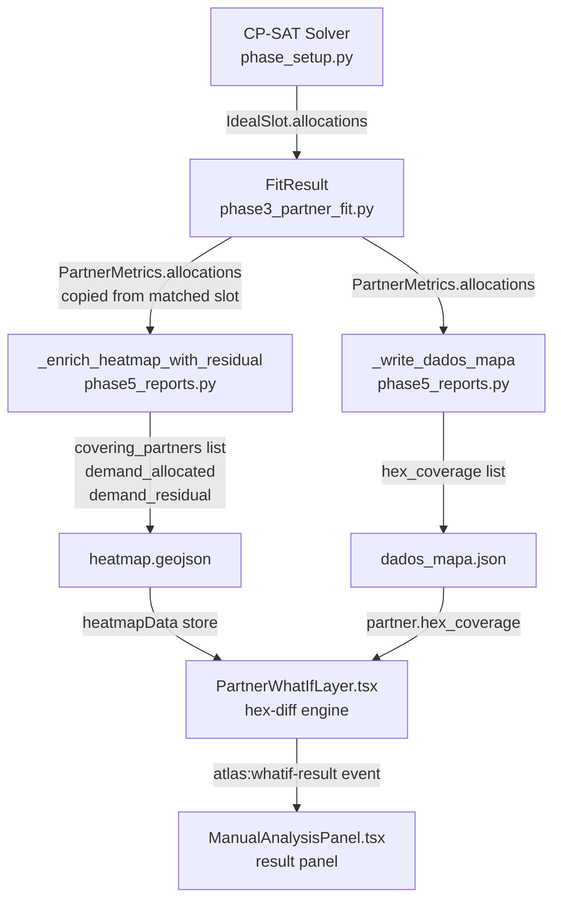

# Design Document: Hex Partner Coverage Model

## Overview

The Atlas platform currently uses a binary, single-partner coverage model: each heatmap hex either has one `covering_partner_id` or none, and `demand_allocated` is either the full `demand_daily` or zero. This does not reflect the CP-SAT solver's actual output, which assigns specific package quantities per hex per slot, and allows multiple partners to share a hex.

This feature replaces the binary model with a multi-partner, allocation-aware model across three layers:

1. **Backend heatmap enrichment** (`_enrich_heatmap_with_residual` in `phase5_reports.py`): each hex gains a `covering_partners` list with per-partner allocation and share, replacing the single `covering_partner_id`.
2. **Backend partner serialization** (`_write_dados_mapa` in `phase5_reports.py`): each Active/Onboarding partner gains a `hex_coverage` list derived directly from CP-SAT allocations.
3. **Frontend what-if simulation** (`PartnerWhatIfLayer.tsx` / `ManualAnalysisPanel.tsx`): the drag-end calculation is replaced with hex-diff logic that uses the new coverage data to compute accurate ADV gain/loss.

The change is backward-compatible: partial station merges continue to work, and non-target hexes/partners are preserved unchanged.

---

## Architecture

### Data Flow



### Key Invariant

The CP-SAT solver assigns packages to hexes via `IdealSlot.allocations`. Phase 3 copies these allocations to `PartnerMetrics.allocations` when a partner is matched to a slot (see `phase3_partner_fit.py` ~line 445). Phase 5 reads `PartnerMetrics.allocations` as the authoritative source — no neighborhood heuristic (`grid_disk`) is used.

### Partial Merge Safety

Both backend functions accept an optional `stations: List[str]` parameter. When provided, only hexes/partners belonging to those stations are modified. All other records are preserved verbatim. This allows running the pipeline for a single station without corrupting data for other stations.

---

## Components and Interfaces

### Backend: `_enrich_heatmap_with_residual` (phase5_reports.py)

**Current behavior (to be replaced):**
- Builds `covering_partners: Dict[str, PartnerMetrics]` mapping `origin_hex → ONE partner` (last wins).
- Uses `h3.grid_disk(hex_id, 1)` neighborhood heuristic to check coverage.
- Writes single `covering_partner_id` field.

**New behavior:**
- Builds `hex_coverage_index: Dict[str, List[PartnerMetrics]]` mapping `hex_id → List[PartnerMetrics]` using `PartnerMetrics.allocations` directly.
- For each hex in the target stations, computes `demand_allocated`, `demand_residual`, `is_covered`, and `covering_partners` list.
- Writes `covering_partners` list; does NOT write `covering_partner_id`.

**New index construction algorithm:**
```python
# hex_id → list of (partner, packages_assigned) for Active/Onboarding partners
hex_coverage_index: Dict[str, List[Tuple[PartnerMetrics, int]]] = defaultdict(list)

for partner in fit.all_partners():
    if partner.status not in ("Active", "Onboarding"):
        continue
    if not partner.matched_slot_id:
        continue
    for alloc in partner.allocations:
        hex_coverage_index[alloc.hex_id].append((partner, alloc.packages_assigned))
```

**New hex enrichment logic:**
```python
for ft in features:
    props = ft.get("properties", {})
    if stations and props.get("delivery_station") not in stations:
        continue

    hex_id = props.get("hex_id", "")
    demand_daily = props.get("demand_daily", 0)
    entries = hex_coverage_index.get(hex_id, [])

    demand_allocated = sum(pkg for _, pkg in entries)
    demand_residual = round(demand_daily - demand_allocated, 4)
    is_covered = demand_allocated > 0

    covering_partners_list = []
    for partner, pkg in entries:
        share = round(pkg / demand_allocated, 2) if demand_allocated > 0 else 0.0
        covering_partners_list.append({
            "salesforce_id": partner.salesforce_id,
            "packages_allocated": pkg,
            "share": share,
        })

    props["demand_allocated"]   = demand_allocated
    props["demand_residual"]    = demand_residual
    props["is_covered"]         = is_covered
    props["covering_partners"]  = covering_partners_list
    # NOTE: covering_partner_id is NOT written
```

### Backend: `_write_dados_mapa` (phase5_reports.py)

**Current behavior:** Updates `decision`, `reason`, `bucket_ade`, `radius_suggestion`, `cap_suggestion` for matched partners.

**New behavior:** Also writes `hex_coverage` for Active/Onboarding partners.

**Additional logic to add:**
```python
if pm.status in ("Active", "Onboarding"):
    record["hex_coverage"] = [
        {"hex_id": a.hex_id, "packages_allocated": a.packages_assigned}
        for a in pm.allocations
    ]
```

The `stations` filter already applies to the outer loop — only partners whose `delivery_station` is in the provided `stations` list are updated.

### Frontend: TypeScript Types (`atlas-react/src/store/types.ts`)

Two new interfaces and one extension to `Partner`:

```typescript
export interface CoveringPartner {
  salesforce_id: string;
  packages_allocated: number;
  share: number;
}

export interface HexCoverageEntry {
  hex_id: string;
  packages_allocated: number;
}

// Extend Partner interface:
export interface Partner {
  // ... existing fields ...
  hex_coverage?: HexCoverageEntry[];
}
```

Heatmap feature properties are accessed at runtime via `feature.properties` (GeoJSON). The `covering_partners` field replaces `covering_partner_id` in runtime property access — no separate type file exists for heatmap properties, so this is a runtime convention change.

### Frontend: `PartnerWhatIfLayer.tsx` — Hex-Diff Engine

**Current behavior (to be replaced):**
- `sumResidualWithinRadius`: sums `demand_residual` of all heatmap features within `radiusMeters` of the new position.
- `simulatedCap = min(floor(totalResidual), MAX_CAP)`.

**New behavior — hex-diff algorithm:**

```typescript
// Build O(1) lookup index for heatmap features by hex_id
// (built once per render, passed to WhatIfMarker)
const heatmapIndex = useMemo(
  () => new Map(heatmapFeatures
    .filter(f => f.properties?.hex_id)
    .map(f => [f.properties!.hex_id as string, f])),
  [heatmapFeatures]
);

// In handleDragEnd:
function getHexesWithinRadius(
  features: GeoJSON.Feature[],
  lat: number,
  lon: number,
  radiusMeters: number,
): Set<string> {
  const center = turf.point([lon, lat]);
  const result = new Set<string>();
  for (const feature of features) {
    const hexId = feature.properties?.hex_id as string | undefined;
    if (!hexId) continue;
    // compute centroid of feature
    let fLon: number, fLat: number;
    if (feature.geometry.type === 'Point') {
      [fLon, fLat] = (feature.geometry as GeoJSON.Point).coordinates as [number, number];
    } else {
      const c = turf.centroid(feature as GeoJSON.Feature<GeoJSON.Polygon | GeoJSON.MultiPolygon>);
      [fLon, fLat] = c.geometry.coordinates as [number, number];
    }
    const dist = turf.distance(center, turf.point([fLon, fLat]), { units: 'meters' });
    if (dist <= radiusMeters) result.add(hexId);
  }
  return result;
}

// handleDragEnd core logic:
const hexesOriginal = getHexesWithinRadius(heatmapFeatures, origLat, origLon, radiusMeters);
const hexesSimulated = getHexesWithinRadius(heatmapFeatures, lat, lng, radiusMeters);

const hexesLost = new Set([...hexesOriginal].filter(h => !hexesSimulated.has(h)));
const hexesGained = new Set([...hexesSimulated].filter(h => !hexesOriginal.has(h)));

// Build hex_coverage lookup from partner data
const hexCoverageMap = new Map<string, number>(
  (partner.hex_coverage ?? []).map(e => [e.hex_id, e.packages_allocated])
);

const loss = [...hexesLost].reduce((sum, h) => sum + (hexCoverageMap.get(h) ?? 0), 0);
const gain = [...hexesGained].reduce((sum, h) => {
  const feature = heatmapIndex.get(h);
  return sum + ((feature?.properties?.demand_residual as number) ?? 0);
}, 0);

const advSimulated = Math.min(Math.max(partner.capacity - loss + gain, 0), MAX_CAP);
const advGain = advSimulated - partner.capacity;
```

**Guard:** If `partner.hex_coverage` is undefined or empty AND `hexesLost.size > 0`, dispatch `atlas:whatif-warning` and return without dispatching `atlas:whatif-result`.

**Heatmap index:** `heatmapIndex: Map<string, GeoJSON.Feature>` is built in the parent `PartnerWhatIfLayer` component using `useMemo` and passed down to each `WhatIfMarker`. This replaces the O(n) linear scan with O(1) lookup.

### Frontend: `ManualAnalysisPanel.tsx` — Result Panel Labels

The `WhatIfResult` interface and result panel rendering are updated:

```typescript
interface WhatIfResult {
  partnerName: string;
  simulatedLat: number;
  simulatedLon: number;
  advSimulated: number;      // renamed from simulatedCap
  simulatedRadius: number;
  advGain: number;           // renamed from simulatedAdvGain
  originalCap: number;
}
```

Label changes in the result panel:
- `"Cap simulado"` → `"ADV simulado"`
- `"Ganho de ADV (cap simulado − cap atual)"` → `"Ganho ADV"`
- Values displayed as `Math.round(advSimulated)` and `Math.round(advGain)`.

---

## Data Models

### Heatmap Feature Properties (after enrichment)

| Field | Type | Description |
|---|---|---|
| `hex_id` | `string` | H3 cell identifier |
| `demand_daily` | `number` | Average daily package demand (unchanged) |
| `demand_allocated` | `number` | Sum of `packages_allocated` across all covering partners |
| `demand_residual` | `number` | `demand_daily - demand_allocated`, rounded to 4 decimal places |
| `is_covered` | `boolean` | `true` iff `demand_allocated > 0` |
| `covering_partners` | `CoveringPartner[]` | List of covering partners with allocation and share |
| ~~`covering_partner_id`~~ | ~~`string \| null`~~ | **Removed** |

### `CoveringPartner` (heatmap feature property entry)

| Field | Type | Description |
|---|---|---|
| `salesforce_id` | `string` | Partner Salesforce ID |
| `packages_allocated` | `number` | Packages allocated to this partner for this hex |
| `share` | `number` | `packages_allocated / demand_allocated`, rounded to 2 decimal places |

### `HexCoverageEntry` (partner record field)

| Field | Type | Description |
|---|---|---|
| `hex_id` | `string` | H3 cell identifier |
| `packages_allocated` | `number` | Packages allocated to this partner for this hex |

### Partner Record in `dados_mapa.json` (Active/Onboarding only)

New field added:

| Field | Type | Description |
|---|---|---|
| `hex_coverage` | `HexCoverageEntry[]` | List of hexes this partner covers with their allocation counts |

### `WhatIfResult` Event Detail (frontend)

| Field | Type | Description |
|---|---|---|
| `partnerName` | `string` | Partner display name |
| `simulatedLat` | `number` | Dragged latitude |
| `simulatedLon` | `number` | Dragged longitude |
| `advSimulated` | `number` | `min(max(capacity - loss + gain, 0), 80)` |
| `simulatedRadius` | `number` | Radius used for simulation (metres) |
| `advGain` | `number` | `advSimulated - capacity` |
| `originalCap` | `number` | Partner's current capacity |

---

## Correctness Properties

*A property is a characteristic or behavior that should hold true across all valid executions of a system — essentially, a formal statement about what the system should do. Properties serve as the bridge between human-readable specifications and machine-verifiable correctness guarantees.*

### Property 1: Coverage Index Correctness

*For any* `FitResult` containing partners with various statuses and slot allocations, the coverage index built by `_enrich_heatmap_with_residual` SHALL contain exactly the Active and Onboarding partners that have a `matched_slot_id` and whose `allocations` list includes that hex — no more, no fewer.

**Validates: Requirements 1.1, 1.3, 1.4**

### Property 2: Hex Enrichment Invariants

*For any* hex feature and any list of covering partners derived from CP-SAT allocations:
- `demand_allocated` equals the sum of `packages_allocated` across all covering partners
- `demand_residual` equals `round(demand_daily - demand_allocated, 4)`
- `is_covered` equals `demand_allocated > 0`
- Each entry in `covering_partners` contains `salesforce_id`, `packages_allocated`, and `share`
- The field `covering_partner_id` is absent from the enriched properties

**Validates: Requirements 2.1, 2.2, 2.3, 2.4, 2.5, 2.6**

### Property 3: Share Sum Invariant

*For any* hex where `demand_allocated > 0`, the sum of all `share` values in `covering_partners` SHALL equal 1.0 within a floating-point tolerance of 0.01.

**Validates: Requirements 2.7**

### Property 4: Hex Coverage Derivation Round-Trip

*For any* Active or Onboarding partner with a `matched_slot_id` and non-empty `allocations`, the `hex_coverage` list written by `_write_dados_mapa` SHALL contain exactly one entry per allocation, with `hex_id` and `packages_allocated` matching the source `Allocation` objects. Partners with status other than Active or Onboarding SHALL have no `hex_coverage` field.

**Validates: Requirements 3.1, 3.2, 3.3, 3.4**

### Property 5: Hex-Diff Disjointness

*For any* original position and simulated position with any `radiusMeters`, the sets `hexes_lost` and `hexes_gained` SHALL be disjoint: `hexes_lost ∩ hexes_gained = ∅`.

**Validates: Requirements 5.1, 5.2**

### Property 6: ADV Simulation Formula

*For any* valid combination of `capacity` (integer ≥ 0), `loss` (float ≥ 0), and `gain` (float ≥ 0), the WhatIf_Engine SHALL compute `adv_simulated = min(max(capacity - loss + gain, 0), 80)` and `adv_gain = adv_simulated - capacity`.

**Validates: Requirements 5.3, 5.4, 5.5, 5.6**

### Property 7: Partial Merge Preservation

*For any* heatmap with hexes belonging to multiple delivery stations, and any non-empty `stations` list, running `_enrich_heatmap_with_residual` SHALL leave all properties of hexes belonging to stations NOT in the list completely unchanged. The same holds for `_write_dados_mapa` and partner records.

**Validates: Requirements 7.1, 7.2, 7.3**

---

## Error Handling

### Backend

| Scenario | Handling |
|---|---|
| `heatmap.geojson` not found | Print `WARN` and return early (existing behavior preserved) |
| `dados_mapa.json` not found | Print `WARN` and return early (existing behavior preserved) |
| Partner has `matched_slot_id` but slot not found in `FitResult` | Skip partner silently (no allocations to index) |
| `demand_allocated == 0` when computing share | Set `share = 0.0` for all entries; skip division |
| JSON parse error on heatmap/partner file | Print `WARN` with exception message and return early |

### Frontend

| Scenario | Handling |
|---|---|
| `partner.hex_coverage` is `undefined` or empty AND hexes are lost | Dispatch `atlas:whatif-warning` with message; do NOT dispatch `atlas:whatif-result` |
| `partner.hex_coverage` is `undefined` or empty AND no hexes are lost | Treat `loss = 0`; proceed normally (gain-only scenario) |
| Heatmap feature missing `hex_id` property | Skip feature when building `heatmapIndex` |
| Heatmap feature missing `demand_residual` property | Treat as `0` in gain computation |
| Drag outside 300 m guardrail | Snap back and dispatch `atlas:whatif-warning` (existing behavior preserved) |

---

## Testing Strategy

### Backend (Python — Hypothesis)

**Property-based tests** using [Hypothesis](https://hypothesis.readthedocs.io/):

Each property test runs a minimum of 100 iterations. Tests are tagged with a comment referencing the design property.

```python
# Feature: hex-partner-coverage-model, Property 1: Coverage Index Correctness
@given(st.lists(partner_metrics_strategy(), min_size=0, max_size=20))
@settings(max_examples=200)
def test_coverage_index_correctness(partners): ...

# Feature: hex-partner-coverage-model, Property 2: Hex Enrichment Invariants
@given(hex_feature_strategy(), st.lists(allocation_strategy(), min_size=0, max_size=10))
@settings(max_examples=200)
def test_hex_enrichment_invariants(hex_feature, allocations): ...

# Feature: hex-partner-coverage-model, Property 3: Share Sum Invariant
@given(st.lists(st.floats(min_value=0.01, max_value=1000.0), min_size=1, max_size=20))
@settings(max_examples=200)
def test_share_sum_invariant(packages): ...

# Feature: hex-partner-coverage-model, Property 4: Hex Coverage Derivation Round-Trip
@given(partner_with_allocations_strategy())
@settings(max_examples=200)
def test_hex_coverage_derivation(partner_data): ...

# Feature: hex-partner-coverage-model, Property 7: Partial Merge Preservation
@given(multi_station_heatmap_strategy(), st.lists(st.text(), min_size=1))
@settings(max_examples=100)
def test_partial_merge_preservation(heatmap, stations): ...
```

**Unit/example tests:**
- Verify `covering_partner_id` is absent from enriched properties (Requirement 2.6)
- Verify a partner with `matched_slot_id = None` is excluded from the coverage index (Requirement 1.4)
- Verify `hex_coverage` is absent for `BG Checks`, `Inactive`, `Exited` partners (Requirement 3.4)
- Verify `_write_dados_mapa` with `stations=["DSP2"]` does not modify partners from `DSP4` (Requirement 7.3)

### Frontend (TypeScript — fast-check)

**Property-based tests** using [fast-check](https://fast-check.dev/):

```typescript
// Feature: hex-partner-coverage-model, Property 5: Hex-Diff Disjointness
fc.assert(fc.property(
  hexSetArbitrary(), hexSetArbitrary(),
  (original, simulated) => {
    const lost = difference(original, simulated);
    const gained = difference(simulated, original);
    return intersection(lost, gained).size === 0;
  }
), { numRuns: 500 });

// Feature: hex-partner-coverage-model, Property 6: ADV Simulation Formula
fc.assert(fc.property(
  fc.integer({ min: 0, max: 80 }),
  fc.float({ min: 0, max: 200 }),
  fc.float({ min: 0, max: 200 }),
  (capacity, loss, gain) => {
    const result = computeAdvSimulated(capacity, loss, gain);
    return result === Math.min(Math.max(capacity - loss + gain, 0), 80);
  }
), { numRuns: 1000 });
```

**Unit/example tests:**
- Verify `atlas:whatif-warning` is dispatched and `atlas:whatif-result` is NOT dispatched when `hex_coverage` is absent and hexes are lost (Requirement 5.8)
- Verify result panel renders `"ADV simulado"` and `"Ganho ADV"` labels (Requirements 6.1, 6.2)
- Verify result values are rounded to nearest integer (Requirement 6.3)
- Verify `heatmapIndex` is a `Map<string, GeoJSON.Feature>` keyed by `hex_id`
- TypeScript compilation verifies `CoveringPartner`, `HexCoverageEntry`, and `Partner.hex_coverage` type definitions (Requirements 4.1–4.4)

### Integration Tests

- Run the full Phase 5 pipeline on a fixture `FitResult` and verify the output `heatmap.geojson` contains `covering_partners` lists and no `covering_partner_id` fields.
- Run the full Phase 5 pipeline on a fixture and verify `dados_mapa.json` contains `hex_coverage` for Active/Onboarding partners and not for others.
- Verify that running the pipeline for station `DSP2` does not modify any hex or partner record belonging to `DSP4` in the output files.
