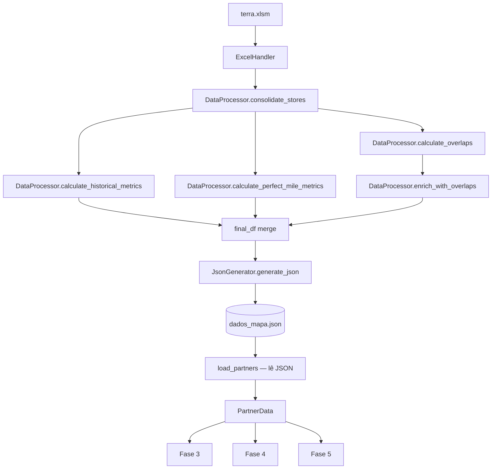
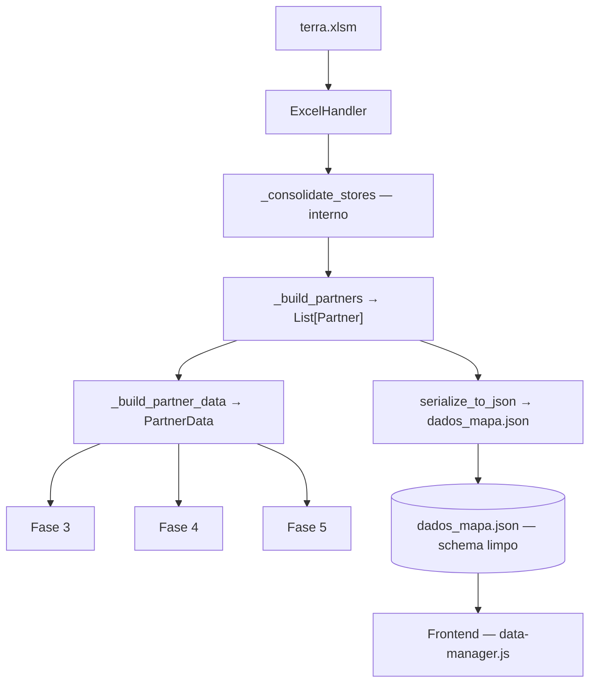
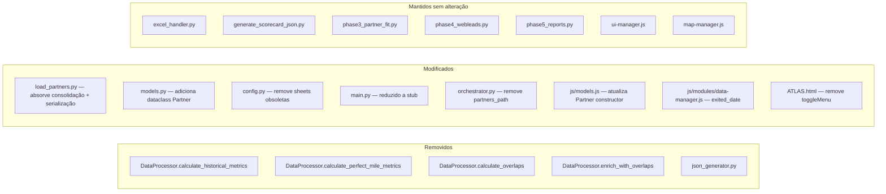

# Design Document — pipeline-refactor

## Overview

Esta refatoração unifica o pipeline de dados do ATLAS em um único fluxo linear: `load_partners.py` passa a ler diretamente do `terra.xlsm`, construir objetos `Partner` tipados, serializar para `dados_mapa.json` com schema limpo, e expor `PartnerData` para as Fases 3/4/5 sem alteração de interface.

O objetivo central é eliminar a dependência do JSON intermediário como entrada do backend, remover ~400 linhas de lógica morta (`DataProcessor` + `JsonGenerator`), e estabelecer um contrato explícito entre backend e frontend via schema versionado.

**Decisões de design:**
- `consolidate_stores` migra para dentro de `load_partners.py` como função privada `_consolidate_stores`, eliminando a dependência de `DataProcessor` no fluxo diário.
- A dataclass `Partner` (backend) é introduzida em `models.py` para tipar o pipeline de construção antes da serialização.
- `main.py` é reduzido a um stub que apenas chama `load_partners` + `ScorecardGenerator`, sem mais orquestrar métricas.
- O frontend recebe ajustes mínimos: renomear dois campos (`exitedDate` → `exited_date`, `leadSource` → `lead_source`) e remover referências a campos obsoletos.


## Architecture

### Fluxo Atual (ANTES)



### Fluxo Novo (DEPOIS)



### Diagrama de Componentes — O que muda




## Components and Interfaces

### `backend/models.py` — dataclass `Partner`

Nova dataclass que representa um parceiro durante a construção do pipeline, antes da serialização para JSON.

```python
@dataclass
class Partner:
    salesforce_id: str
    store_id: Optional[str]
    name: str
    status: str
    lead_source: Optional[str]
    lat: Optional[float]
    lon: Optional[float]
    zip_code: Optional[str]
    city: Optional[str]
    state: Optional[str]
    delivery_station: str
    supply_run: Optional[str]
    radius: int                    # default 1500
    capacity: int                  # default 42
    bucket: Optional[str]
    jurisdiction_type: Optional[str]
    hub_delivey_initiatives: Optional[str]
    HCP_rate_card: Optional[str]
    HCP_host_partner: Optional[str]
    launch_date: Optional[str]     # formato "YYYY-MM-DD" ou None
    exited_date: Optional[str]     # snake_case, formato "YYYY-MM-DD" ou None
    telefone: Optional[str]        # apenas dígitos após normalização
    owner_id: Optional[str]
    decision_status: Optional[str]
    tooltip: str                   # nunca None

    @classmethod
    def from_row(cls, row: pd.Series, active_df: pd.DataFrame, station_map: dict, jurisdictions_map: dict) -> "Partner":
        """
        Constrói um Partner a partir de uma linha do DataFrame consolidado.
        Aplica todas as transformações: vírgula→ponto em coords, mapeamento DS,
        resolução de HCP Host Partner por Id→Name, normalização de telefone,
        geração de tooltip.
        """
        ...

    def to_dict(self) -> dict:
        """
        Serializa para o formato exato do Schema_Limpo.
        Converte NaN/None em None (→ JSON null).
        Garante que campos numéricos ausentes viram None.
        """
        ...
```

**Rationale:** Separar a construção (tipada) da serialização (JSON) permite testar cada etapa independentemente e garante que o schema de saída seja determinístico.

---

### `backend/load_partners.py` — funções novas/modificadas

```python
def load_partners(
    partners_path: str = None,
    jurisdiction_path: str = None,
) -> PartnerData:
    """
    Ponto de entrada principal. Dois modos:
    - partners_path=None  → lê do Excel via ExcelHandler (modo produção)
    - partners_path=str   → lê do JSON (compatibilidade com testes/manual)

    Fluxo (modo Excel):
    1. ExcelHandler.refresh_and_load_sheets(SHEETS_TO_LOAD_NEW, ...)
    2. _consolidate_stores(dataframes) → consolidated_df
    3. _build_partners(consolidated_df) → List[Partner]
    4. serialize_to_json(partners, period, output_path)
    5. _build_partner_data(partners) → PartnerData
    6. Carregar jurisdições GeoJSON
    7. Retornar PartnerData
    """
    ...


def _consolidate_stores(dfs: Dict[str, pd.DataFrame]) -> pd.DataFrame:
    """
    Migrado de DataProcessor.consolidate_stores.
    Consolida Active + Launches + WebLeads, aplica mapeamento DS,
    resolve Bucket via Jurisdictions, normaliza coordenadas.
    Mantém a mesma lógica e assinatura de saída.
    """
    ...


def _build_partners(consolidated_df: pd.DataFrame) -> List[Partner]:
    """
    Itera sobre o DataFrame consolidado e constrói objetos Partner
    via Partner.from_row(). Separa web leads internamente mas retorna
    todos os registros (a separação para PartnerData ocorre em _build_partner_data).
    """
    ...


def serialize_to_json(
    partners: List[Partner],
    period: str,
    output_path: str,
) -> None:
    """
    Serializa a lista de Partners para dados_mapa.json com o Schema_Limpo.
    Usa Partner.to_dict() para cada objeto.
    Inclui period e deliveryStations (de config.DELIVERY_STATIONS) na raiz.
    """
    ...


def _build_partner_data(partners: List[Partner]) -> PartnerData:
    """
    Constrói PartnerData a partir da lista de Partners.
    - Separa web leads (status="New" AND lead_source="Website Pardot Form")
    - Renomeia delivery_station → station_code, name → partner_name
    - Remove parceiros sem lat/lon (exceto prospects)
    - Calcula origin_hex via H3
    - Adiciona zip_clean em web_leads_df
    """
    ...
```

---

### `backend/main.py` — stub simplificado

```python
def run_pipeline() -> None:
    """
    Stub simplificado: apenas executa load_partners (que já lê do Excel
    e serializa o JSON) e gera o scorecard.
    Não orquestra mais métricas históricas, overlaps ou perfect mile.
    """
    from load_partners import load_partners
    from data_processing.generate_scorecard_json import ScorecardGenerator
    import config

    load_partners()   # lê Excel, serializa dados_mapa.json

    # Scorecard permanece inalterado
    with ExcelHandler(config.EXCEL_FILE_PATH) as excel:
        dataframes = excel.refresh_and_load_sheets(
            sheets_to_load=["Lead"],
            macro_name=config.MACRO_NAME,
            timeout=config.MACRO_TIMEOUT_SECONDS,
        )
    scorecard_df = dataframes.get("Lead", pd.DataFrame())
    output_path = os.path.join(config.OUTPUT_JSON_DIR, "dados_scorecard.json")
    ScorecardGenerator(scorecard_df, output_path, config.SCORECARD_CONFIG).generate_scorecard()
```

---

### `backend/config.py` — sheets removidas

```python
# ANTES
SHEETS_TO_LOAD = [
    "Active", "Launches", "Delivery Stations",
    "ADV - Coverage raw data", "Lead", "PerfectMile",
    "Jurisdictions", "WebLeads"
]

# DEPOIS — sheets usadas pelo novo pipeline
SHEETS_TO_LOAD = [
    "Active", "Launches", "Delivery Stations",
    "Jurisdictions", "WebLeads"
]

# Sheets do scorecard (separadas para clareza)
SHEETS_SCORECARD = ["Lead"]
```

---

### `js/models.js` — Partner constructor

```javascript
// ANTES
this.exitedDate  = raw.exitedDate  ?? null;
this.leadSource  = raw.leadSource  ?? null;
this.main_store_data = raw.main_store_data ?? null;
this.overlap_data    = raw.overlap_data    ?? null;
this.ADV             = raw.ADV             ?? 0;

// DEPOIS — campos renomeados para snake_case, obsoletos removidos
this.exited_date     = raw.exited_date     ?? null;
this.lead_source     = raw.lead_source     ?? null;
// main_store_data, overlap_data, ADV, popup removidos
```

Campos adicionados ao constructor (ausentes no código atual):
```javascript
this.zip_code          = raw.zip_code          ?? null;
this.city              = raw.city              ?? null;
this.state             = raw.state             ?? null;
this.bucket            = raw.bucket            ?? null;
this.jurisdiction_type = raw.jurisdiction_type ?? null;
this.owner_id          = raw.owner_id          ?? null;
this.decision_status   = raw.decision_status   ?? null;
this.salesforce_id     = raw.salesforce_id     ?? '';
```

---

### `js/modules/data-manager.js` — ajuste mínimo

A única alteração necessária é na leitura do campo `exited_date` na separação de web leads (se houver referência direta). O `_aggregateOptimizationData` permanece sem alteração — continua injetando `bucket_ade`, `decision`, `reason`, `optimization` a partir do `optimization_data.geojson`.


## Data Models

### Schema JSON de saída — `dados_mapa.json`

```typescript
// Raiz do arquivo
interface DadosMapaJson {
    period: string;                    // "2026-04-10 : 14h:30m"
    deliveryStations: DeliveryStation[];
    allMarkerData: PartnerRecord[];
}

interface DeliveryStation {
    nome: string;                      // "DSP2"
    lat: number;
    lon: number;
}

// Schema_Limpo — exatamente estes campos, nem mais nem menos
interface PartnerRecord {
    salesforce_id: string;
    store_id: string | null;
    name: string;
    status: string;
    lat: number | null;
    lon: number | null;
    zip_code: string | null;
    city: string | null;
    state: string | null;
    delivery_station: string;
    supply_run: string | null;
    radius: number;                    // default 1500
    capacity: number;                  // default 42
    bucket: string | null;
    jurisdiction_type: string | null;
    hub_delivey_initiatives: string | null;
    HCP_rate_card: string | null;
    HCP_host_partner: string | null;
    launch_date: string | null;        // "YYYY-MM-DD" ou null
    exited_date: string | null;        // snake_case — era exitedDate
    telefone: string | null;           // apenas dígitos
    owner_id: string | null;
    decision_status: string | null;
    lead_source: string | null;        // snake_case — era leadSource
    tooltip: string;                   // nunca null
}
```

**Campos removidos em relação ao schema anterior:**

| Campo removido | Motivo |
|---|---|
| `popup` | Gerado dinamicamente por `getPopupContent()` no frontend |
| `ADV` | Métrica histórica — pipeline de ADV removido |
| `eligible_packages` | Métrica histórica — pipeline de ADV removido |
| `partner_capacity` | Métrica histórica — pipeline de ADV removido |
| `main_store_data` | Objeto de métricas históricas — removido |
| `overlap_data` | Calculado por `calculate_overlaps` — removido |
| `sorte_code` | Campo não utilizado pelo frontend |
| `optimization` | Injetado pelo frontend via `optimization_data.geojson` |

### Mapeamento Excel → Partner

| Campo `Partner` | Coluna Excel | Transformação |
|---|---|---|
| `salesforce_id` | `Id` | `str` |
| `store_id` | `StoreID` | `str` ou `None` |
| `name` | `Name` | `str` |
| `status` | `Status` | `str` |
| `lead_source` | `LeadSource` | `str` ou `None` |
| `lat` | `Latitude` | `float`, vírgula→ponto, `None` se inválido |
| `lon` | `Longitude` | `float`, vírgula→ponto, `None` se inválido |
| `zip_code` | `CEP` | `str` ou `None` |
| `city` | `Cidade` | `str` ou `None` |
| `state` | `Estado` | `str` ou `None` |
| `delivery_station` | `Delivery Station` | mapeamento via `station_map` (Id→Name) + `mapeamento_ds` (HSP2→DSP2) |
| `supply_run` | `Supply Run` | `str` ou `None` |
| `radius` | `Radius` | `int`, default `1500` |
| `capacity` | `Volume Cap` | `int`, default `42` |
| `bucket` | `Jurisdiction` | lookup em `jurisdictions_map` (Id→Name[5:]) |
| `jurisdiction_type` | `Jurisdiction Type` | `str` ou `None` |
| `hub_delivey_initiatives` | `Hub Delivery Initiatives` | `str` ou `None` |
| `HCP_rate_card` | `HCP Rate Card` | `str` ou `None` |
| `HCP_host_partner` | `HCP Host Partner` | Id→Name via `active_df` map |
| `launch_date` | `Launch Date` | `format_date_to_str()` |
| `exited_date` | `Exit_Date__c` | `format_date_to_str()` |
| `telefone` | `Phone` | remove `(`, `)`, ` `, `-`, `+` |
| `owner_id` | `OwnerId` | `str` ou `None` |
| `decision_status` | `Decision_Status__c` | `str` ou `None` |
| `tooltip` | gerado | `"ID: {store_id} \| Name: {name} \| HUB Delivery Initiatives: {hub_delivey_initiatives}"` |

### `PartnerData` — interface preservada

```python
@dataclass
class PartnerData:
    partners_df: pd.DataFrame        # colunas obrigatórias abaixo
    web_leads_df: pd.DataFrame       # inclui zip_clean
    jurisdictions: Dict              # GeoJSON
    no_coords_prospects_df: pd.DataFrame

# Colunas obrigatórias em partners_df (Fases 3/4/5 dependem delas):
# station_code, partner_name, lat, lon, status, salesforce_id,
# store_id, origin_hex, bucket, decision_status, exited_date, zip_code
```

**Nota:** O campo `exited_date` (snake_case) substitui `exitedDate` (camelCase) em `partners_df` e em `PartnerMetrics`. A função `row_to_partner_metrics` é atualizada para ler `exited_date` em vez de `exitedDate`.


## Correctness Properties

*A property is a characteristic or behavior that should hold true across all valid executions of a system — essentially, a formal statement about what the system should do. Properties serve as the bridge between human-readable specifications and machine-verifiable correctness guarantees.*

### Property 1: Schema exato do JSON de saída

*For any* lista de objetos `Partner` gerada pelo pipeline, ao serializar via `serialize_to_json`, cada objeto em `allMarkerData` deve conter **exatamente** os campos do Schema_Limpo — nem mais, nem menos.

**Validates: Requirements 3.1, 3.2, 3.5, 3.6, 8.1**

---

### Property 2: Ausência de NaN/None em strings serializadas

*For any* lista de registros com campos string ausentes ou com valor `NaN`/`None`/`NaT`, ao serializar via `Partner.to_dict()`, nenhum campo string do Schema_Limpo deve conter os valores `"nan"`, `"None"` ou `"NaN"` — devem ser `null` (JSON null).

**Validates: Requirements 3.3, 7.1, 7.2, 8.5**

---

### Property 3: Separação correta de web leads

*For any* lista de registros com mistura de web leads (`status="New"` AND `lead_source="Website Pardot Form"`) e parceiros operacionais, após `_build_partner_data`:
- Nenhum web lead deve aparecer em `partners_df`
- Nenhum parceiro operacional deve aparecer em `web_leads_df`
- Todo registro com `status="New"` mas `lead_source` diferente de `"Website Pardot Form"` deve estar em `partners_df`

**Validates: Requirements 4.1, 4.2, 4.3, 8.3**

---

### Property 4: `origin_hex` é uma string H3 válida

*For any* parceiro com `lat` e `lon` válidos (não-nulos, dentro dos limites geográficos do Brasil), o campo `origin_hex` calculado por `_build_partner_data` deve ser uma string H3 válida na resolução `Config.H3_RES`, verificável via `h3.is_valid_cell(origin_hex)`.

**Validates: Requirements 5.3, 8.2**

---

### Property 5: `Partner` JavaScript sem `undefined`

*For any* objeto `raw` contendo todos os campos do Schema_Limpo com valores válidos (incluindo `null` para campos opcionais), `new Partner(raw)` não deve produzir nenhuma propriedade com valor `undefined`.

**Validates: Requirements 6.1, 6.2, 6.3, 8.4**

---

### Property 6: Round-trip de serialização

*For any* objeto `Partner` (Python) com campos válidos, serializar via `partner.to_dict()` e desserializar via `new Partner(raw)` (JavaScript) deve preservar os campos chave: `salesforce_id`, `lat`, `lon`, `status`, `exited_date`, `lead_source`.

**Validates: Requirements 3.5, 3.6, 6.1, 6.2, 8.6**

---

**Reflexão sobre redundância:**

- Properties 1 e 2 são complementares, não redundantes: Property 1 verifica a estrutura (quais campos existem), Property 2 verifica os valores (sem strings inválidas).
- Property 3 cobre os dois lados da separação (4.1 e 4.2) em uma única propriedade, eliminando redundância.
- Property 5 e Property 6 são complementares: Property 5 verifica ausência de `undefined` para qualquer input válido; Property 6 verifica preservação de valores específicos no round-trip.


## Error Handling

### Backend

| Situação | Comportamento esperado |
|---|---|
| `terra.xlsm` não encontrado | `FileNotFoundError` com mensagem: `"Arquivo Excel não encontrado em {path}. Verifique config.EXCEL_FILE_PATH."` |
| Aba Excel ausente | `ExcelHandler` retorna `pd.DataFrame()` vazio; `_consolidate_stores` loga aviso e continua com o que tem |
| `Active` e `Launches` ambos vazios | `ValueError("DataFrames 'Active' e 'Launches' estão vazios.")` — mesmo comportamento atual |
| Coordenada inválida (não-numérica) | `pd.to_numeric(..., errors='coerce')` → `NaN` → serializado como `null` |
| `Jurisdiction` sem match no mapa | `bucket = None` — serializado como `null` |
| `HCP Host Partner` sem match no mapa | `HCP_host_partner = None` — serializado como `null` |
| Falha na serialização JSON | `RuntimeError` com traceback completo |
| `jurisdiction.geojson` não encontrado | `FileNotFoundError` com mensagem descritiva |

### Frontend

| Situação | Comportamento esperado |
|---|---|
| Campo `exited_date` ausente no JSON | `raw.exited_date ?? null` — sem erro |
| Campo `lead_source` ausente no JSON | `raw.lead_source ?? null` — sem erro |
| `lat`/`lon` nulos | Filtro `p.lat !== null \|\| p.lon !== null` em `data-manager.js` — parceiro não aparece no mapa |
| `tooltip` nulo | Impossível pelo design — `Partner.to_dict()` garante string não-nula |


## Testing Strategy

### Abordagem dual

- **Testes de propriedade** (Hypothesis): verificam invariantes universais do pipeline com 100+ iterações por propriedade.
- **Testes de exemplo** (pytest): verificam comportamentos específicos, casos de borda e integração.
- **Testes de fumaça** (pytest): verificam estrutura do código (métodos removidos, imports, etc.).

### Backend — `backend/tests/test_pipeline_properties.py`

Biblioteca: **Hypothesis** (já presente no projeto, conforme `.hypothesis/` existente).

```python
from hypothesis import given, settings
from hypothesis import strategies as st

# --- Estratégias ---

SCHEMA_FIELDS = {
    "salesforce_id", "store_id", "name", "status", "lat", "lon",
    "zip_code", "city", "state", "delivery_station", "supply_run",
    "radius", "capacity", "bucket", "jurisdiction_type",
    "hub_delivey_initiatives", "HCP_rate_card", "HCP_host_partner",
    "launch_date", "exited_date", "telefone", "owner_id",
    "decision_status", "lead_source", "tooltip",
}

def partner_strategy():
    """Gera objetos Partner com campos válidos e opcionais variados."""
    return st.builds(
        Partner,
        salesforce_id=st.text(min_size=1, max_size=18),
        store_id=st.one_of(st.none(), st.text(max_size=10)),
        name=st.text(min_size=1, max_size=100),
        status=st.sampled_from(["Active", "Onboarding", "BG Checks",
                                 "Prospect", "Inactive", "Exited", "New"]),
        lead_source=st.one_of(st.none(), st.text(max_size=50)),
        lat=st.one_of(st.none(), st.floats(min_value=-33.7, max_value=5.3)),
        lon=st.one_of(st.none(), st.floats(min_value=-73.9, max_value=-34.7)),
        # ... demais campos
        radius=st.integers(min_value=200, max_value=5000),
        capacity=st.integers(min_value=1, max_value=200),
        tooltip=st.text(min_size=1),
    )

def partner_with_coords_strategy():
    """Gera Partners com lat/lon sempre válidos (para testar origin_hex)."""
    ...

def mixed_records_strategy():
    """Gera dicts com mistura de web leads e parceiros operacionais."""
    ...


# --- Property 1: Schema exato ---
# Feature: pipeline-refactor, Property 1: Schema exato do JSON de saída
@settings(max_examples=100)
@given(st.lists(partner_strategy(), min_size=1, max_size=50))
def test_schema_exact_fields(partners):
    output = {"allMarkerData": [p.to_dict() for p in partners]}
    for record in output["allMarkerData"]:
        assert set(record.keys()) == SCHEMA_FIELDS


# --- Property 2: Ausência de NaN em strings ---
# Feature: pipeline-refactor, Property 2: Ausência de NaN/None em strings serializadas
@settings(max_examples=100)
@given(st.lists(partner_strategy(), min_size=1, max_size=50))
def test_no_nan_in_strings(partners):
    INVALID = {"nan", "None", "NaN"}
    STRING_FIELDS = {"salesforce_id", "name", "status", "delivery_station",
                     "tooltip", "zip_code", "city", "state", "supply_run",
                     "bucket", "jurisdiction_type", "hub_delivey_initiatives",
                     "HCP_rate_card", "HCP_host_partner", "launch_date",
                     "exited_date", "telefone", "owner_id", "decision_status",
                     "lead_source", "store_id"}
    for p in partners:
        d = p.to_dict()
        for field in STRING_FIELDS:
            val = d.get(field)
            if val is not None:
                assert str(val) not in INVALID, f"Campo '{field}' contém valor inválido: {val!r}"


# --- Property 3: Separação de web leads ---
# Feature: pipeline-refactor, Property 3: Separação correta de web leads
@settings(max_examples=100)
@given(st.lists(mixed_records_strategy(), min_size=2, max_size=100))
def test_web_leads_separation(records):
    partner_data = _build_partner_data_from_records(records)
    # Nenhum web lead em partners_df
    if "lead_source" in partner_data.partners_df.columns:
        wl_in_partners = partner_data.partners_df[
            (partner_data.partners_df["status"] == "New") &
            (partner_data.partners_df["lead_source"] == "Website Pardot Form")
        ]
        assert len(wl_in_partners) == 0
    # Nenhum parceiro operacional em web_leads_df
    if not partner_data.web_leads_df.empty:
        non_wl = partner_data.web_leads_df[
            ~((partner_data.web_leads_df["status"] == "New") &
              (partner_data.web_leads_df["lead_source"] == "Website Pardot Form"))
        ]
        assert len(non_wl) == 0


# --- Property 4: origin_hex válido ---
# Feature: pipeline-refactor, Property 4: origin_hex é uma string H3 válida
@settings(max_examples=100)
@given(st.lists(partner_with_coords_strategy(), min_size=1, max_size=50))
def test_origin_hex_valid(partners):
    import h3
    partner_data = _build_partner_data_from_partners(partners)
    for _, row in partner_data.partners_df.iterrows():
        assert h3.is_valid_cell(row["origin_hex"]), \
            f"origin_hex inválido: {row['origin_hex']!r} para lat={row['lat']}, lon={row['lon']}"
```

### Frontend — `js/tests/partner-schema.test.js`

Biblioteca: **Jest** (já presente no projeto, conforme `package.json`).

```javascript
import { Partner } from '../models.js';
import fc from 'fast-check';  // ou usar jest-each com dados gerados

const SCHEMA_FIELDS = [
    'salesforce_id', 'store_id', 'name', 'status', 'lat', 'lon',
    'zip_code', 'city', 'state', 'delivery_station', 'supply_run',
    'radius', 'capacity', 'bucket', 'jurisdiction_type',
    'hub_delivey_initiatives', 'HCP_rate_card', 'HCP_host_partner',
    'launch_date', 'exited_date', 'telefone', 'owner_id',
    'decision_status', 'lead_source', 'tooltip',
];

// Feature: pipeline-refactor, Property 5: Partner JavaScript sem undefined
test('Partner constructor: nenhuma propriedade undefined para raw com Schema_Limpo', () => {
    const raw = {
        salesforce_id: 'ABC123', store_id: 'S001', name: 'Test Partner',
        status: 'Active', lat: -23.44, lon: -46.50,
        zip_code: '01310100', city: 'São Paulo', state: 'SP',
        delivery_station: 'DSP2', supply_run: 'SR1',
        radius: 1500, capacity: 42, bucket: 'DSP2_T01',
        jurisdiction_type: 'Exclusive', hub_delivey_initiatives: null,
        HCP_rate_card: null, HCP_host_partner: null,
        launch_date: '2024-01-15', exited_date: null,
        telefone: '11999999999', owner_id: null,
        decision_status: null, lead_source: null,
        tooltip: 'ID: S001 | Name: Test Partner | HUB Delivery Initiatives: ',
    };
    const partner = new Partner(raw);
    SCHEMA_FIELDS.forEach(field => {
        expect(partner[field]).not.toBeUndefined();
    });
});

// Feature: pipeline-refactor, Property 6: Round-trip de serialização
test('Partner round-trip: campos chave preservados após serialização/desserialização', () => {
    const KEY_FIELDS = ['salesforce_id', 'lat', 'lon', 'status', 'exited_date', 'lead_source'];
    const raw = {
        salesforce_id: 'XYZ789', lat: -23.55, lon: -46.63,
        status: 'Inactive', exited_date: '2023-06-01',
        lead_source: 'Cold Call',
        // ... demais campos com valores padrão
    };
    const partner = new Partner(raw);
    KEY_FIELDS.forEach(field => {
        expect(partner[field]).toBe(raw[field] ?? null);
    });
});
```

### Plano de cobertura por requisito

| Requisito | Tipo de teste | Arquivo |
|---|---|---|
| 1.1 — leitura do Excel | Integration (mock) | `test_pipeline_properties.py` |
| 1.5 — FileNotFoundError | Example | `test_pipeline_properties.py` |
| 3.1, 3.2 — schema exato | **Property 1** | `test_pipeline_properties.py` |
| 3.3, 7.1 — sem NaN | **Property 2** | `test_pipeline_properties.py` |
| 4.1, 4.2, 4.3 — web leads | **Property 3** | `test_pipeline_properties.py` |
| 5.3 — origin_hex H3 | **Property 4** | `test_pipeline_properties.py` |
| 6.1, 6.2, 6.3 — JS sem undefined | **Property 5** | `partner-schema.test.js` |
| 6.1, 6.2, 8.6 — round-trip | **Property 6** | `partner-schema.test.js` |
| 2.1, 2.4 — métodos removidos | Smoke | `test_pipeline_properties.py` |


## Migration Plan

O objetivo é executar a transição sem downtime — o sistema deve continuar funcional em produção durante toda a migração.

### Estratégia: Feature Flag via `partners_path`

O `load_partners` já suporta dois modos (`partners_path=None` → Excel, `partners_path=str` → JSON). Isso permite migrar gradualmente sem quebrar o fluxo existente.

### Fase 1 — Preparação (sem quebrar nada)

1. Adicionar `Partner` dataclass em `models.py` (aditivo, sem remover nada).
2. Adicionar `_consolidate_stores`, `_build_partners`, `serialize_to_json`, `_build_partner_data` em `load_partners.py` como funções privadas novas.
3. Manter o fluxo atual (`load_partners` lendo JSON) intacto.
4. Executar `test_pipeline_properties.py` para validar as novas funções isoladamente.

**Checkpoint:** Testes passam. Sistema em produção inalterado.

### Fase 2 — Ativar novo pipeline em paralelo

1. Modificar `load_partners` para, quando `partners_path=None`, usar o novo fluxo Excel.
2. Manter suporte a `partners_path=str` (JSON) para rollback imediato.
3. Executar o pipeline completo (`orchestrator.py --mode daily`) em ambiente de staging.
4. Comparar `dados_mapa.json` gerado pelo novo pipeline com o gerado pelo pipeline antigo:
   - Verificar que todos os `salesforce_id` presentes no antigo estão no novo.
   - Verificar que campos do Schema_Limpo têm os mesmos valores.
5. Validar frontend carregando o novo JSON.

**Checkpoint:** JSON novo é funcionalmente equivalente ao antigo. Frontend sem erros.

### Fase 3 — Atualizar frontend

1. Atualizar `js/models.js`: renomear `exitedDate` → `exited_date`, `leadSource` → `lead_source`, remover campos obsoletos.
2. Verificar `js/modules/data-manager.js` para referências a `exitedDate`/`leadSource`.
3. Remover `toggleMenu` e `#menuOptions` de `ATLAS.html`.
4. Executar `partner-schema.test.js`.

**Checkpoint:** Testes JS passam. Frontend funcional com novo schema.

### Fase 4 — Limpeza

1. Remover `calculate_historical_metrics`, `calculate_perfect_mile_metrics`, `calculate_overlaps`, `enrich_with_overlaps` de `DataProcessor`.
2. Deletar `backend/data_processing/json_generator.py`.
3. Simplificar `main.py` para stub.
4. Atualizar `config.py`: remover sheets `ADV - Coverage raw data`, `PerfectMile`, `Lead` de `SHEETS_TO_LOAD`.
5. Atualizar `orchestrator.py`: remover `partners_path` da chamada a `load_partners`.
6. Atualizar `row_to_partner_metrics` em `load_partners.py`: `exitedDate` → `exited_date`.
7. Atualizar `PartnerMetrics` em `models.py`: `exitedDate` → `exited_date`.

**Checkpoint:** Todos os testes passam. Nenhuma referência a métodos removidos.

### Rollback

Em qualquer fase, reverter para o pipeline antigo é possível passando `partners_path=Config.BASE_PARTNERS` explicitamente na chamada a `load_partners` no `orchestrator.py`. O JSON antigo continua sendo lido normalmente.

### Riscos e mitigações

| Risco | Mitigação |
|---|---|
| Diferença de valores entre pipeline antigo e novo | Comparação campo a campo na Fase 2 antes de ativar em produção |
| Frontend quebrado por campo renomeado | Testes JS na Fase 3 antes de deploy |
| Macro VBA com timeout em ambiente de staging | Usar `partners_path` com JSON existente para testes de integração |
| `consolidate_stores` com comportamento diferente após migração | Testes de propriedade na Fase 1 validam a função isoladamente |

