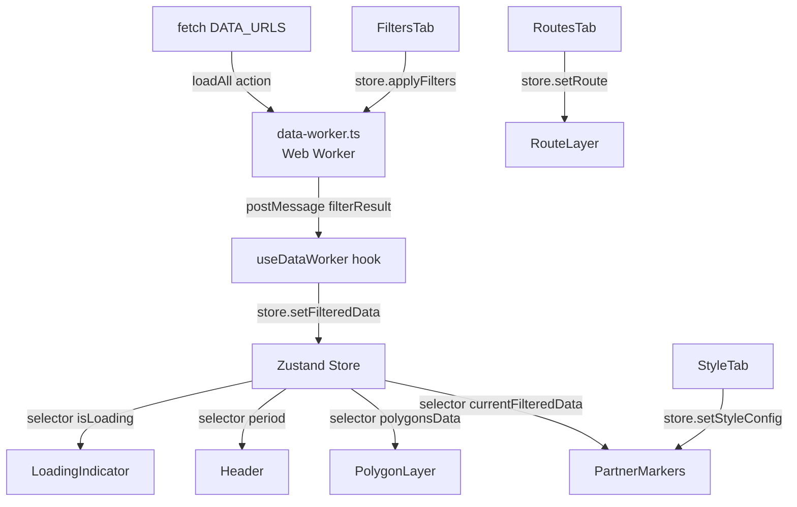
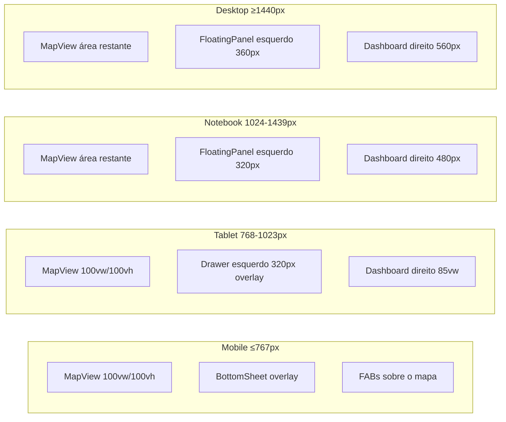

# Design Técnico — Migração React Responsiva do ATLAS

## Visão Geral

Este documento descreve a arquitetura técnica para a migração do frontend do ATLAS de HTML/CSS/JS vanilla para uma aplicação React moderna. A migração é do tipo "big bang": o `ATLAS.html` e todos os módulos JS são substituídos por uma aplicação React + Vite + TypeScript + Tailwind CSS + Zustand + react-leaflet.

O objetivo central é preservar 100% das funcionalidades existentes enquanto se adiciona responsividade total (mobile, tablet, notebook, desktop) e moderniza a base de código para facilitar manutenção futura.

### Decisões de Design Principais

| Decisão | Escolha | Justificativa |
|---|---|---|
| Build tool | Vite | HMR rápido, suporte nativo a Web Workers, code splitting automático |
| Estado global | Zustand | API mínima, seletores granulares evitam re-renders desnecessários, substitui o Proxy reativo de `state.js` |
| Mapa | react-leaflet v4 | Wrapper React oficial do Leaflet, compatível com leaflet-routing-machine |
| Estilização | Tailwind CSS + CSS Modules | Tailwind para layout/responsividade, CSS Modules para estilos específicos do Leaflet |
| Gráficos | react-chartjs-2 | Wrapper React do Chart.js já usado no dashboard atual |
| Virtualização | TanStack Virtual | Leve, headless, compatível com tabelas customizadas |
| PBT | Vitest + fast-check | fast-check é a biblioteca PBT padrão para TypeScript/JavaScript |

---

## Arquitetura

### Visão Geral da Estrutura

```
src/
├── main.tsx                    # Ponto de entrada, registro do SW
├── App.tsx                     # Layout raiz, roteamento de breakpoints
├── store/
│   ├── index.ts                # Store Zustand principal
│   ├── types.ts                # Interfaces TypeScript (Partner, DeliveryStation, etc.)
│   └── actions/
│       ├── dataActions.ts      # loadAll, applyFilters, resetFilters
│       └── mapActions.ts       # restyleMarkers, toggleLayer, etc.
├── workers/
│   └── data-worker.ts          # Web Worker (filtragem off-thread)
├── hooks/
│   ├── useBreakpoint.ts        # Detecta breakpoint atual
│   ├── useDataWorker.ts        # Abstração do Web Worker
│   └── useDebounce.ts          # Debounce genérico
├── components/
│   ├── layout/
│   │   ├── AppShell.tsx        # Header + área principal
│   │   ├── Header.tsx          # Cabeçalho responsivo
│   │   ├── BottomSheet.tsx     # Mobile: painel deslizante inferior
│   │   ├── Drawer.tsx          # Tablet: painel lateral overlay
│   │   └── FloatingPanel.tsx   # Notebook/Desktop: painel flutuante
│   ├── map/
│   │   ├── MapView.tsx         # Componente raiz do mapa
│   │   ├── PartnerMarkers.tsx  # Camada de marcadores de parceiros
│   │   ├── StationMarkers.tsx  # Camada de delivery stations
│   │   ├── PolygonLayer.tsx    # Camada de polígonos/territórios
│   │   ├── JurisdictionLayer.tsx
│   │   ├── OptimizationLayer.tsx
│   │   ├── HeatmapLayer.tsx
│   │   ├── RouteLayer.tsx      # leaflet-routing-machine
│   │   ├── MapLegend.tsx       # Legenda de cores
│   │   └── popups/
│   │       ├── PartnerPopup.tsx
│   │       ├── ComparisonPopup.tsx
│   │       └── SlotPopup.tsx
│   ├── controls/
│   │   ├── ControlPanel.tsx    # Container das abas de controle
│   │   ├── FiltersTab.tsx      # Aba de filtros
│   │   ├── StyleTab.tsx        # Aba de estilização do mapa
│   │   ├── AreaAnalysisTab.tsx # Aba de análise de área
│   │   └── RoutesTab.tsx       # Aba de rotas
│   ├── dashboard/
│   │   ├── Dashboard.tsx       # Container do dashboard gerencial
│   │   ├── KpiGrid.tsx         # Grid de KPI cards
│   │   ├── KpiCard.tsx
│   │   ├── ChartsSection.tsx
│   │   └── StationsTable.tsx   # Tabela virtualizada
│   └── ui/
│       ├── FAB.tsx             # Floating Action Button
│       ├── LoadingIndicator.tsx
│       ├── ErrorToast.tsx
│       └── Spinner.tsx
├── lib/
│   ├── config.ts               # DATA_URLS, MAP_CONFIG, COLOR_PALETTES, etc.
│   ├── models.ts               # Classes Partner, DeliveryStation, FilterState, etc.
│   ├── colorUtils.ts           # generateColorMap, getMarkerStyle
│   ├── popupUtils.ts           # getPopupContent e helpers de popup
│   ├── hcpUtils.ts             # Lógica HCP (clusters, sugestões)
│   └── routeUtils.ts           # Otimização de paradas, OSRM matrix
└── styles/
    ├── globals.css             # Reset, variáveis CSS, tema escuro
    └── leaflet-overrides.css   # Overrides específicos do Leaflet
```

### Diagrama de Fluxo de Dados



### Diagrama de Layout Responsivo



---

## Componentes e Interfaces

### AppShell

Componente raiz que detecta o breakpoint via `useBreakpoint` e renderiza o layout correto:

```tsx
// Lógica de seleção de layout
const breakpoint = useBreakpoint(); // 'mobile' | 'tablet' | 'notebook' | 'desktop'

if (breakpoint === 'mobile') return <MobileLayout />;
if (breakpoint === 'tablet') return <TabletLayout />;
return <DesktopLayout />; // notebook e desktop compartilham estrutura, diferem em larguras
```

### useBreakpoint

```ts
type Breakpoint = 'mobile' | 'tablet' | 'notebook' | 'desktop';

function useBreakpoint(): Breakpoint {
  // Usa window.matchMedia com listeners para reatividade
  // mobile: max-width: 767px
  // tablet: 768px–1023px
  // notebook: 1024px–1439px
  // desktop: min-width: 1440px
}
```

### MapView

Componente central. Usa `MapContainer` do react-leaflet com `ref` para acesso à instância Leaflet quando necessário (routing machine, measure).

```tsx
interface MapViewProps {
  className?: string;
}
// Renderiza MapContainer + todas as camadas como filhos
// Cada camada é um componente separado que usa useMap() internamente
```

### PartnerMarkers

```tsx
// Usa React.memo para evitar re-renders quando outros slices do store mudam
const PartnerMarkers = React.memo(() => {
  const data = useStore(s => s.currentFilteredData);
  const styleConfig = useStore(s => s.styleConfig);
  // Renderiza CircleMarker para cada partner
  // Usa useMemo para recalcular colorMap apenas quando data ou styleConfig mudam
});
```

### BottomSheet (Mobile)

```tsx
interface BottomSheetProps {
  isOpen: boolean;
  onClose: () => void;
  children: React.ReactNode;
  snapPoints?: number[]; // alturas em px, ex: [200, 400, window.innerHeight * 0.9]
}
// Implementa drag gesture via pointer events
// Anima com CSS transform: translateY()
```

### Drawer (Tablet)

```tsx
interface DrawerProps {
  isOpen: boolean;
  onClose: () => void;
  side: 'left' | 'right';
  width?: number; // px, default 320
  children: React.ReactNode;
}
// Overlay mode: position fixed, z-index sobre o mapa
// Animação: transform translateX
```

### FloatingPanel (Notebook/Desktop)

```tsx
interface FloatingPanelProps {
  title: string;
  defaultCollapsed?: boolean;
  width?: number; // px
  children: React.ReactNode;
}
// Posicionado absolutamente sobre o mapa
// Cabeçalho clicável para colapsar/expandir
```

---

## Modelos de Dados

### Tipos TypeScript (store/types.ts)

```ts
// Migração direta de models.js para TypeScript

export interface OptimizationData {
  radius_suggestion: number;
  cap_suggestion: number;
}

export type PartnerStatus =
  | 'Active' | 'Inactive' | 'Onboarding'
  | 'BG Checks' | 'Prospect' | 'Exited' | 'New';

export interface Partner {
  salesforce_id: string;
  store_id: string | null;
  name: string;
  status: PartnerStatus;
  lat: number | null;
  lon: number | null;
  zip_code: string | null;
  city: string | null;
  state: string | null;
  delivery_station: string;
  supply_run: string | null;
  radius: number;
  capacity: number;
  bucket: string | null;
  bucket_ade: string;
  jurisdiction_type: string | null;
  hub_delivey_initiatives: string | null;
  HCP_rate_card: string | null;
  HCP_host_partner: string | null;
  launch_date: string | null;
  exited_date: string | null;
  telefone: string | null;
  owner_id: string | null;
  decision_status: string | null;
  lead_source: string | null;
  tooltip: string;
  regiao: string;
  decision: string;
  reason: string;
  optimization: OptimizationData;
  ceps: string[];
  slot_id: string;
}

export interface DeliveryStation {
  nome: string;
  lat: number;
  lon: number;
}

export interface FilterState {
  selectedStatuses: string[] | 'all';
  selectedStations: string[] | 'all';
  selectedBuckets: string[] | 'all';
  initiativesFilter: string;
  jurisdictionFilter: string;
}

export interface StyleConfig {
  primaryField: string;   // campo para cor de preenchimento
  secondaryField: string; // campo para cor de borda
  showRadii: boolean;
  showPolygons: boolean;
  showJurisdictions: boolean;
  showOptimizationLayer: boolean;
  showHeatmap: boolean;
}

export interface RouteStop {
  store_id: string;
  name: string;
  lat: number;
  lon: number;
}

export interface HcpState {
  suggestionCache: Record<string, unknown>;
  usedStores: Record<string, Set<string>>;
  suggestionsActive: boolean;
}
```

### Store Zustand (store/index.ts)

```ts
interface AtlasStore {
  // --- Dados ---
  allMarkersData: Partner[];
  currentFilteredData: Partner[];
  deliveryStations: DeliveryStation[];
  polygonsData: GeoJSON.FeatureCollection | null;
  jurisdictionData: GeoJSON.FeatureCollection | null;
  optimizationData: GeoJSON.FeatureCollection | null;
  idealSupplyData: GeoJSON.Feature[] | null;
  heatmapData: GeoJSON.FeatureCollection | null;
  period: string | object;

  // --- UI ---
  isLoading: boolean;
  loadingMessage: string;
  error: string | null;
  styleConfig: StyleConfig;
  filterState: FilterState;
  route: RouteStop[];
  hcp: HcpState;

  // --- Actions ---
  loadAll: () => Promise<void>;
  applyFilters: (filters?: Partial<FilterState>) => void;
  resetFilters: () => void;
  setStyleConfig: (config: Partial<StyleConfig>) => void;
  setRoute: (stops: RouteStop[]) => void;
  clearRoute: () => void;
  setError: (msg: string | null) => void;
}
```

### Web Worker — Protocolo de Mensagens

```ts
// Mensagens enviadas para o worker
type WorkerInMessage =
  | { action: 'filter'; filters: FilterPayload }
  | { action: 'loadData'; urls: typeof DATA_URLS };

// Mensagens recebidas do worker
type WorkerOutMessage =
  | { action: 'filterResult'; filtered: Partner[] }
  | { action: 'dataLoaded'; payload: LoadedDataPayload }
  | { action: 'error'; message: string };
```

---

## Propriedades de Corretude

*Uma propriedade é uma característica ou comportamento que deve ser verdadeiro em todas as execuções válidas de um sistema — essencialmente, uma declaração formal sobre o que o sistema deve fazer. Propriedades servem como ponte entre especificações legíveis por humanos e garantias de corretude verificáveis por máquina.*

### Propriedade 1: Isolamento de re-render por seletor

*Para qualquer* propriedade do store Zustand, atualizar essa propriedade deve causar re-render apenas nos componentes que possuem um seletor ativo para aquela propriedade específica, e não nos demais.

**Valida: Requisito 2.3**

### Propriedade 2: Resiliência de action com falha

*Para qualquer* action do store que lança uma exceção durante sua execução, o estado do store após a falha deve ser idêntico ao estado imediatamente anterior à chamada da action.

**Valida: Requisito 2.5**

### Propriedade 3: Instância do mapa preservada na filtragem

*Para qualquer* atualização de `currentFilteredData` no store, a referência à instância do mapa Leaflet (`map._leaflet_id`) deve ser a mesma antes e depois da atualização.

**Valida: Requisito 3.3**

### Propriedade 4: Popup exibido para qualquer marcador clicado

*Para qualquer* `Partner` ou `DeliveryStation` com coordenadas válidas renderizado como marcador, simular um evento de clique deve resultar na exibição de um popup com o nome do parceiro/estação no conteúdo.

**Valida: Requisito 3.5**

### Propriedade 5: Store atualizado após postMessage do worker

*Para qualquer* payload de dados processado pelo DataWorker, após o worker enviar `{ action: 'filterResult', filtered }` via `postMessage`, o valor de `store.currentFilteredData` deve ser igual ao array `filtered` recebido.

**Valida: Requisito 4.2**

### Propriedade 6: Filtros aplicados corretamente

*Para qualquer* combinação de valores de `FilterState` e qualquer `allMarkersData`, todos os itens em `currentFilteredData` após `applyFilters` devem satisfazer simultaneamente todos os critérios ativos (status, station, bucket, initiatives, jurisdiction).

**Valida: Requisito 9.2**

### Propriedade 7: Limpar filtros restaura dados completos

*Para qualquer* estado de filtros ativo, chamar `resetFilters` deve resultar em `currentFilteredData` com exatamente os mesmos elementos que `allMarkersData` (round-trip de filtragem).

**Valida: Requisito 9.3**

### Propriedade 8: Opções dos selects refletem valores únicos dos dados

*Para qualquer* `allMarkersData` carregado, as opções disponíveis nos selects de Delivery Station e Carteira ADE devem ser exatamente o conjunto de valores únicos presentes nos dados (sem duplicatas, sem omissões).

**Valida: Requisito 9.4**

### Propriedade 9: Cores dos marcadores correspondem à estilização selecionada

*Para qualquer* seleção de campo de estilização primário e qualquer `currentFilteredData`, cada marcador renderizado deve ter a cor de preenchimento correspondente ao valor do campo selecionado no `colorMap` gerado.

**Valida: Requisito 10.2**

### Propriedade 10: Virtualização ativa para listas grandes

*Para qualquer* lista com N > 100 itens renderizada na tabela do Dashboard, o número de elementos `<tr>` presentes no DOM deve ser menor que N (apenas os itens visíveis são renderizados).

**Valida: Requisito 15.2**

---

## Tratamento de Erros

### Estratégia por Camada

**Store (actions)**
- Toda action assíncrona é envolvida em `try/catch`
- Em caso de erro: `store.setError(message)` + estado anterior preservado via immer/spread
- Erros são logados no console com prefixo `[AtlasStore]`

**Web Worker**
- Erros de fetch ou parsing enviam `{ action: 'error', message }` via `postMessage`
- O hook `useDataWorker` captura e chama `store.setError`
- A aplicação continua operando com os dados já carregados

**Componentes React**
- `ErrorBoundary` envolve `MapView` e `Dashboard` para capturar erros de renderização
- `ErrorToast` exibe mensagens não-bloqueantes no canto superior direito
- Estados de loading/erro/vazio são tratados consistentemente em todos os componentes assíncronos

**Leaflet / react-leaflet**
- Erros de tile são silenciosos (comportamento padrão do Leaflet)
- Erros do leaflet-routing-machine são capturados via evento `routingerror` e exibidos via `ErrorToast`

### Hierarquia de Severidade

| Nível | Exemplo | Comportamento |
|---|---|---|
| Fatal | Falha ao carregar `dados_mapa.json` | ErrorBoundary + mensagem de retry |
| Erro | Falha ao carregar camada secundária | ErrorToast não-bloqueante |
| Aviso | Dataset parcialmente inválido | Console warning + dados válidos usados |
| Info | Worker processando | LoadingIndicator no header |

---

## Estratégia de Testes

### Abordagem Dual

A estratégia combina testes de exemplo (casos concretos) com testes baseados em propriedades (cobertura ampla de inputs).

**Framework**: Vitest + React Testing Library + fast-check

**Configuração fast-check**: mínimo de 100 iterações por propriedade
```ts
fc.configureGlobal({ numRuns: 100 });
```

### Testes de Propriedade (fast-check)

Cada propriedade do documento deve ser implementada como um único teste de propriedade:

```ts
// Exemplo — Propriedade 6: Filtros aplicados corretamente
it('Feature: react-responsive-frontend, Property 6: filtros aplicados corretamente', () => {
  fc.assert(
    fc.property(
      fc.array(arbitraryPartner()),
      arbitraryFilterState(),
      (partners, filters) => {
        const result = applyFiltersLogic(partners, filters);
        return result.every(p => matchesFilters(p, filters));
      }
    )
  );
});
```

### Testes de Exemplo (Vitest + RTL)

- Configuração do projeto (Vite, TypeScript, Tailwind, PWA)
- Inicialização do mapa com `MAP_CONFIG` correto
- Presença de todos os campos de filtro no `ControlPanel`
- Comportamento de loading/erro do DataWorker
- Layout em breakpoints específicos (com `matchMedia` mockado)
- KPI cards do Dashboard com dados de exemplo
- Popup de comparação e popup de slot

### Testes de Integração

- Pontuação Lighthouse ≥ 80 (executado em CI com Playwright)
- Build de produção gera múltiplos chunks (code splitting)

### Cobertura Mínima

| Módulo | Tipo | Meta |
|---|---|---|
| `store/` | Propriedade + Exemplo | 90% |
| `lib/` (colorUtils, popupUtils, hcpUtils, routeUtils) | Propriedade + Exemplo | 85% |
| `workers/data-worker.ts` | Propriedade + Exemplo | 80% |
| `components/` | Exemplo (RTL) | 70% |
