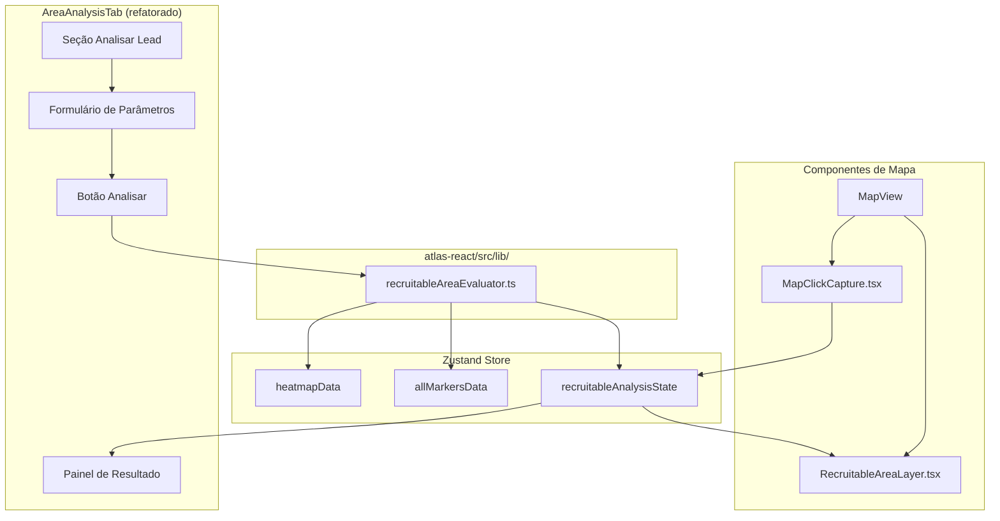

# Design Document — Recruitable Area Analysis

## Overview

A feature **Recruitable Area Analysis** adiciona à aba "Análise de Área" (`AreaAnalysisTab`) do ATLAS um módulo explícito de avaliação de viabilidade de recrutamento de parceiros logísticos last-mile.

O módulo — chamado `Recruitable_Area_Evaluator` — é executado inteiramente no frontend, sem chamadas de backend. Ele consome dados já carregados no store Zustand (`heatmapData`, `allMarkersData`, `optimizationData`) e produz uma classificação de viabilidade (Viável / Não Viável) baseada em demanda residual versus ADV mínimo configurado.

A feature transforma o `AreaAnalysisTab` existente: a análise atual de prospects por estado/decisão é preservada como sub-seção, e uma nova seção "Área Recrutável" é adicionada com formulário de parâmetros, integração com mapa (marcador + círculo + highlight de H3 cells) e painel de resultado.

### Decisões de Design

- **Cálculo no frontend**: todos os dados necessários já estão no store; evita round-trip de rede e mantém a análise responsiva.
- **@turf/turf para distância**: já é dependência do projeto; `turf.distance` calcula distância centroide→ponto em km com precisão suficiente para raios de 500–5000m.
- **h3-js não é necessário**: o centroide de cada H3 cell já está disponível como `geometry.coordinates` do GeoJSON (ponto ou centroide do polígono); turf é suficiente.
- **Cobertura ativa**: parceiros com status `Active` ou `Onboarding` cobrem um hex se seu ponto (lat/lon) está dentro do raio do parceiro em relação ao centroide do hex — ou, alternativamente, se o hex está dentro do raio do parceiro. Usaremos `turf.distance(partnerPoint, hexCentroid) <= partner.radius` para consistência com o modelo existente.
- **Comunicação mapa↔aba**: o mapa já usa `CustomEvent` (`atlas:open-tab`) para comunicação. Adicionaremos um evento `atlas:map-click-coords` para passar coordenadas de clique quando a aba "Área" está ativa. O store Zustand armazenará o estado de análise recrutável para que `MapView` possa renderizar as camadas visuais.
- **Estado no store**: o estado da análise recrutável (`RecruitableAnalysisState`) é adicionado ao store Zustand para permitir que componentes de mapa acessem os dados sem prop drilling.

---

## Architecture



### Fluxo de dados

1. Usuário configura parâmetros (ADV, raio, ponto central) no `AreaAnalysisTab`
2. Clique no mapa dispara `atlas:map-click-coords` → `AreaAnalysisTab` preenche lat/lon
3. Usuário aciona análise → `recruitableAreaEvaluator` é chamado com parâmetros + dados do store
4. Resultado é salvo em `recruitableAnalysisState` no store
5. `AreaAnalysisTab` lê o resultado e exibe o painel
6. `RecruitableAreaLayer` lê o estado do store e renderiza highlight de H3 cells + círculo

---

## Components and Interfaces

### Novos arquivos

| Arquivo | Responsabilidade |
|---|---|
| `src/lib/recruitableAreaEvaluator.ts` | Lógica pura de cálculo: filtragem de H3 cells, demanda total/residual, classificação |
| `src/components/map/RecruitableAreaLayer.tsx` | Camada Leaflet: círculo de raio + highlight de H3 cells |
| `src/components/map/MapClickCapture.tsx` | Hook interno do mapa para capturar cliques e emitir evento |

### Arquivos modificados

| Arquivo | Modificação |
|---|---|
| `src/store/types.ts` | Adicionar `RecruitableAnalysisState`, `RecruitableAnalysisResult`, `RecruitableAnalysisParams` |
| `src/store/index.ts` | Adicionar slice `recruitableAnalysis` com estado e actions |
| `src/components/controls/AreaAnalysisTab.tsx` | Adicionar seção "Área Recrutável" com formulário, integração com lead e painel de resultado |
| `src/components/map/MapView.tsx` | Adicionar `RecruitableAreaLayer` e `MapClickCapture` |

### Interface do Evaluator

```typescript
// src/lib/recruitableAreaEvaluator.ts

export interface EvaluatorInput {
  centerLat: number;
  centerLon: number;
  radiusMeters: number;
  minAdv: number;
  heatmapFeatures: GeoJSON.Feature[];   // features do heatmapData
  partners: Partner[];                   // allMarkersData
}

export interface EvaluatorResult {
  totalDemand: number;          // soma demand_daily de todas as células no raio
  residualDemand: number;       // soma demand_daily de células sem cobertura ativa
  minAdv: number;               // ADV mínimo configurado (espelhado para o resultado)
  gap: number;                  // residualDemand - minAdv (positivo = viável)
  viable: boolean;              // residualDemand >= minAdv
  reason: ReasonCode | null;    // motivo quando não viável
  selectedCells: GeoJSON.Feature[];     // células dentro do raio (para highlight)
  residualCells: GeoJSON.Feature[];     // células sem cobertura (subset de selectedCells)
}

export type ReasonCode =
  | 'INSUFFICIENT_RESIDUAL_DEMAND'
  | 'NO_HEATMAP_COVERAGE'
  | 'INSUFFICIENT_TOTAL_DEMAND';

export type EvaluatorError =
  | { type: 'MISSING_HEATMAP' }
  | { type: 'MISSING_CENTER' }
  | { type: 'INVALID_PARAMS'; field: string };

export function evaluateRecruitableArea(
  input: EvaluatorInput
): EvaluatorResult | EvaluatorError;
```

### Estado no Store

```typescript
// Adicionado em types.ts

export interface RecruitableAnalysisParams {
  centerLat: string;   // string para controle de input (pode ser vazio)
  centerLon: string;
  radiusMeters: number;
  minAdv: number;
  selectedLeadId: string | null;
}

export interface RecruitableAnalysisState {
  params: RecruitableAnalysisParams;
  result: EvaluatorResult | null;
  error: string | null;
  isStale: boolean;    // true quando parâmetros mudaram após última análise
}
```

### Actions no Store

```typescript
setRecruitableParams: (params: Partial<RecruitableAnalysisParams>) => void;
setRecruitableResult: (result: EvaluatorResult | null, error?: string | null) => void;
clearRecruitableAnalysis: () => void;  // limpa resultado + ponto central, preserva adv/raio
```

---

## Data Models

### H3 Cell (heatmap.geojson feature)

```typescript
// Estrutura esperada de cada feature do heatmapData
interface HeatmapFeatureProperties {
  demand_total: number;
  demand_daily: number;
  delivery_station?: string;
  bucket_ade?: string;
  territory_id?: string;
  // centroide disponível via feature.geometry (Point ou Polygon)
}
```

O centroide de cada H3 cell é extraído via:
- Se `feature.geometry.type === 'Point'`: usar `feature.geometry.coordinates` diretamente
- Se `feature.geometry.type === 'Polygon'`: usar `turf.centroid(feature).geometry.coordinates`

### Cobertura Ativa

Um hex é considerado **coberto** se existe pelo menos um parceiro com status `Active` ou `Onboarding` tal que:

```
turf.distance([partner.lon, partner.lat], hexCentroid, { units: 'meters' }) <= partner.radius
```

Parceiros sem coordenadas (`lat === null || lon === null`) são ignorados na cobertura.

### Lógica de Motivo (ReasonCode)

```
if (selectedCells.length === 0)         → 'NO_HEATMAP_COVERAGE'
else if (totalDemand < minAdv)          → 'INSUFFICIENT_TOTAL_DEMAND'
else                                    → 'INSUFFICIENT_RESIDUAL_DEMAND'
```

---

## Correctness Properties

*A property is a characteristic or behavior that should hold true across all valid executions of a system — essentially, a formal statement about what the system should do. Properties serve as the bridge between human-readable specifications and machine-verifiable correctness guarantees.*

### Property 1: Validação de campos numéricos positivos

*For any* valor inteiro positivo maior que zero fornecido para ADV mínimo ou raio de entrega, a função de validação deve aceitar o valor; e para qualquer valor menor ou igual a zero, não-numérico ou vazio, deve rejeitar o valor.

**Validates: Requirements 1.3, 1.4, 1.5**

### Property 2: Filtragem de células por raio

*For any* conjunto de H3 cells com centroides conhecidos, ponto central e raio, o conjunto de células selecionadas pelo evaluator deve ser exatamente o conjunto de células cujo centroide está a distância ≤ raio do ponto central — nem mais, nem menos.

**Validates: Requirements 3.1**

### Property 3: Demanda total é soma das células selecionadas

*For any* conjunto de H3 cells selecionadas dentro do raio, a demanda total calculada pelo evaluator deve ser igual à soma aritmética dos valores `demand_daily` de todas essas células.

**Validates: Requirements 3.2**

### Property 4: Demanda residual é soma das células não cobertas

*For any* conjunto de H3 cells selecionadas e qualquer conjunto de parceiros Active/Onboarding, a demanda residual calculada deve ser igual à soma de `demand_daily` das células que não possuem nenhum parceiro ativo cobrindo seu centroide.

**Validates: Requirements 3.3**

### Property 5: Classificação binária de viabilidade

*For any* par (demanda_residual, adv_minimo) com adv_minimo > 0, a classificação deve ser Viável se e somente se demanda_residual >= adv_minimo, e Não Viável caso contrário.

**Validates: Requirements 4.1, 4.2**

### Property 6: Estrutura completa do resultado

*For any* execução válida do evaluator (heatmap carregado, ponto central definido, parâmetros válidos), o resultado deve conter todos os campos obrigatórios: `totalDemand`, `residualDemand`, `minAdv`, `gap`, `viable`, `reason` (null quando viável, ReasonCode quando não viável), `selectedCells` e `residualCells`.

**Validates: Requirements 4.3, 4.4**

### Property 7: Preenchimento automático a partir de lead

*For any* lead com lat, lon e optimization.radius_suggestion e optimization.cap_suggestion definidos, ao selecionar o lead na seção "Analisar Lead", os campos centerLat, centerLon, radiusMeters e minAdv devem ser preenchidos com os valores exatos do lead.

**Validates: Requirements 6.2, 6.3**

### Property 8: Limpeza preserva configuração

*For any* estado de análise com ADV mínimo e raio configurados, após acionar "Limpar Análise", os valores de ADV mínimo e raio devem ser preservados enquanto o resultado, ponto central e lead selecionado são removidos.

**Validates: Requirements 8.2, 8.3**

### Property 9: Alteração de parâmetro invalida resultado

*For any* resultado de análise concluída, alterar qualquer parâmetro (ADV, raio, lat, lon) deve marcar o estado como `isStale = true`.

**Validates: Requirements 8.4**

---

## Error Handling

| Condição | Comportamento |
|---|---|
| `heatmapData === null` | Evaluator retorna `{ type: 'MISSING_HEATMAP' }`; UI exibe mensagem "Dados de demanda não carregados" |
| `centerLat` ou `centerLon` vazio | Evaluator retorna `{ type: 'MISSING_CENTER' }`; UI exibe mensagem "Ponto central obrigatório" |
| ADV ou raio ≤ 0 | Evaluator retorna `{ type: 'INVALID_PARAMS' }`; botão de análise desabilitado pela UI antes de chamar o evaluator |
| Nenhuma célula no raio | Evaluator retorna resultado válido com `totalDemand: 0`, `residualDemand: 0`, `viable: false`, `reason: 'NO_HEATMAP_COVERAGE'` |
| Lead sem coordenadas | UI exibe aviso inline na seção "Analisar Lead"; botão de análise permanece desabilitado |
| Parceiro sem lat/lon | Ignorado silenciosamente no cálculo de cobertura |

Erros de tipo `EvaluatorError` são distinguidos de `EvaluatorResult` via type guard:

```typescript
function isEvaluatorError(r: EvaluatorResult | EvaluatorError): r is EvaluatorError {
  return 'type' in r && !('viable' in r);
}
```

---

## Testing Strategy

### Abordagem dual

- **Testes unitários** (Vitest): exemplos específicos, edge cases, integração entre componentes
- **Testes de propriedade** (fast-check, já disponível como devDependency): propriedades universais do evaluator

### Testes de propriedade (fast-check)

O `recruitableAreaEvaluator` é uma função pura — ideal para PBT. Cada propriedade do design deve ter um teste correspondente com mínimo de 100 iterações.

Tag format: `// Feature: recruitable-area-analysis, Property N: <texto>`

```typescript
// Exemplo de estrutura de teste de propriedade
import fc from 'fast-check';
import { evaluateRecruitableArea } from '../lib/recruitableAreaEvaluator';

// Feature: recruitable-area-analysis, Property 5: Classificação binária de viabilidade
it('classificação é Viável sse residualDemand >= minAdv', () => {
  fc.assert(
    fc.property(
      fc.integer({ min: 0, max: 1000 }),  // residualDemand
      fc.integer({ min: 1, max: 500 }),   // minAdv
      (residual, minAdv) => {
        // ... construir input mínimo e verificar classificação
      }
    ),
    { numRuns: 100 }
  );
});
```

### Testes unitários (Vitest)

- `recruitableAreaEvaluator.test.ts`: edge cases (heatmap null, raio zero, sem células, lead sem coords)
- `AreaAnalysisTab.test.tsx`: renderização de campos padrão, exibição de resultado, botão limpar
- `RecruitableAreaLayer.test.tsx`: renderização condicional baseada no estado do store

### Testes de integração

- Verificar que clique no mapa preenche campos de lat/lon quando aba "Área" está ativa
- Verificar que highlight de H3 cells aparece no mapa após análise
- Verificar que limpeza remove elementos visuais do mapa
