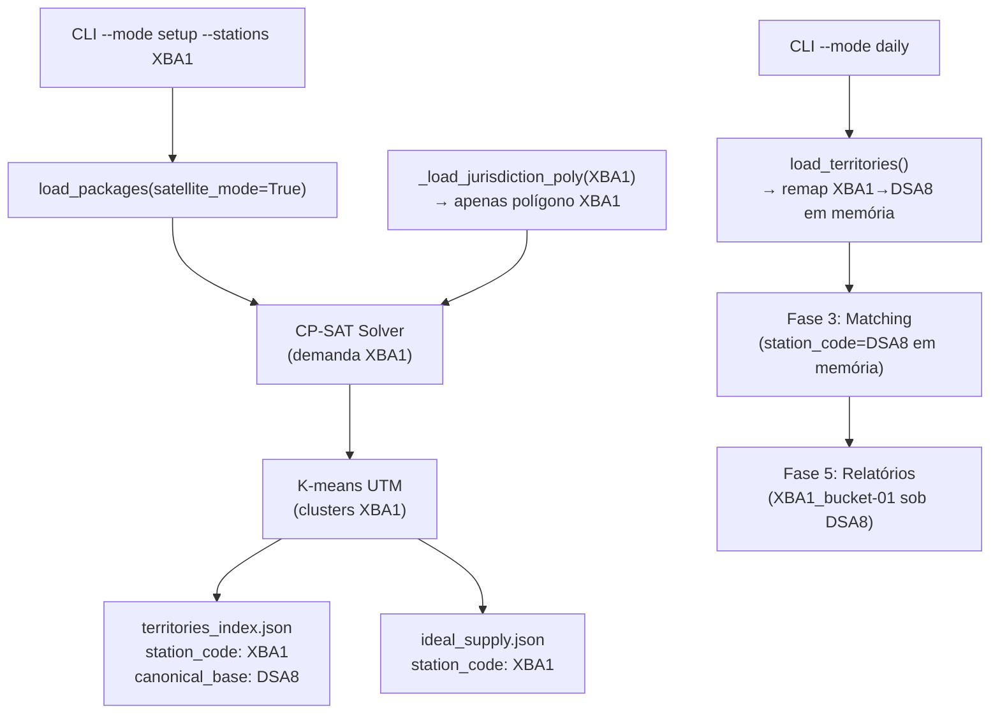

# Design Document — satellite-area-setup

## Visão Geral

Esta feature permite que áreas satélite (ex: `XBA1`, `XCS1`) sejam configuradas de forma independente pelo pipeline de setup, gerando seus próprios territórios e slots ideais, enquanto continuam sendo agregadas sob a base canônica durante o pipeline daily para matching, relatórios e outputs.

### Contexto atual

Hoje, `STATION_ALIASES` em `shared/config.py` mapeia satélites → base canônica (ex: `"XBA1": "DSA8"`). O pipeline de setup consolida os pacotes das satélites na base canônica **antes** de processar (passo 1b em `load_packages`), de modo que satélites nunca geram territórios próprios. O pipeline daily, por sua vez, faz o remap em memória via `load_territories` para que os territórios satélite apareçam como territórios da base canônica.

### Comportamento desejado

- **Setup**: `run_setup --stations XBA1 XCS1` gera territórios independentes para as satélites, usando apenas o polígono de jurisdição da própria satélite e preservando o `station_code` original.
- **Daily**: `run_daily` detecta automaticamente os territórios satélite no `territories_index.json` e os agrega sob a base canônica para matching, relatórios e outputs.
- **Retrocompatibilidade**: setup sem satélites funciona exatamente como hoje.

---

## Arquitetura

O design segue o princípio de **separação de responsabilidades por fase**:

- **Setup** é responsável por produzir artefatos com `station_code` = código original (satélite ou canônica).
- **Daily** é responsável por interpretar esses artefatos e fazer o remap em memória para a base canônica.
- **Disco** nunca é alterado pelo remap — apenas a representação em memória muda.



### Fluxo de dados — Setup para satélite

```
run_setup(stations=["XBA1"])
  └─ load_packages(satellite_mode=True, satellite_codes=["XBA1"])
       └─ NÃO aplica STATION_ALIASES para XBA1
       └─ demand_by_station["XBA1"] = {hex: count, ...}
  └─ _load_jurisdiction_poly("XBA1", jur_geojson)
       └─ retorna apenas o polígono de XBA1 (não une com DSA8)
  └─ CP-SAT solver para XBA1
  └─ K-means → territórios XBA1_bucket-01, XBA1_bucket-02, ...
  └─ territories_index.json:
       "XBA1_bucket-01": {
         "station_code": "XBA1",
         "canonical_base": "DSA8",
         ...
       }
  └─ ideal_supply.json:
       "XBA1_bucket-01": [{station_code: "XBA1", ...}]
```

### Fluxo de dados — Daily com satélite

```
run_daily(stations=["DSA8"])  # ou sem filtro
  └─ load_territories()
       └─ lê territories_index.json
       └─ para XBA1_bucket-01: station_code "XBA1" → "DSA8" (em memória)
  └─ Fase 3: matching com station_code="DSA8"
  └─ Fase 5: relatorio_executivo.json
       └─ DSA8.territories inclui XBA1_bucket-01
       └─ XBA1_bucket-01.satelliteOrigin = "XBA1"
```

---

## Componentes e Interfaces

### 1. `load_packages` — `backend/shared/load_packages.py`

**Mudança**: adicionar parâmetro `satellite_setup_stations: Optional[Set[str]] = None`.

Quando `satellite_setup_stations` é fornecido:
- O passo 1b (remap via `STATION_ALIASES`) é **suprimido** para os códigos listados.
- Os pacotes dessas estações permanecem com o `station_code` original no DataFrame.
- A atribuição por jurisdição (`_build_jurisdiction_index`) continua funcionando normalmente — o índice de jurisdição já mapeia satélites para canônicas, mas como o remap foi suprimido, os hexes dentro do polígono satélite serão atribuídos ao código satélite.

**Interface**:
```python
def load_packages(
    path: str = None,
    jurisdiction_geojson: Optional[Dict] = None,
    satellite_setup_stations: Optional[Set[str]] = None,
) -> PackageData:
    ...
```

**Lógica do passo 1b modificado**:
```python
# 1b. Remapear bases satélite → base canônica
# EXCETO quando rodando setup para a própria satélite
aliases = getattr(Config, "STATION_ALIASES", {})
if aliases and "station_code" in df.columns:
    # Filtrar aliases: não remap para estações em satellite_setup_stations
    effective_aliases = {
        k: v for k, v in aliases.items()
        if satellite_setup_stations is None or k not in satellite_setup_stations
    }
    if effective_aliases:
        df["station_code"] = df["station_code"].replace(effective_aliases)
```

**Mudança em `_build_jurisdiction_index`**: quando `satellite_setup_stations` é fornecido, indexar os polígonos satélite com o código satélite (não com a canônica), para que a resolução por jurisdição atribua hexes ao código satélite.

```python
def _build_jurisdiction_index(
    jur_geojson: Dict,
    satellite_setup_stations: Optional[Set[str]] = None,
) -> Dict[str, object]:
    ...
    for feature in jur_geojson.get("features", []):
        station = feature.get("properties", {}).get("delivery_station")
        if not station:
            continue
        # Se é satélite em modo setup, indexar com código satélite
        if satellite_setup_stations and station in satellite_setup_stations:
            canonical = station  # preservar código satélite
        else:
            canonical = STATION_ALIASES.get(station, station)
        ...
```

### 2. `_load_jurisdiction_poly` — `backend/vanilla/phase_setup.py`

**Mudança**: adicionar parâmetro `satellite_mode: bool = False`.

- **Modo normal** (atual): une o polígono da base canônica com os polígonos de todas as suas satélites.
- **Modo satélite** (`satellite_mode=True`): retorna **apenas** o polígono da própria satélite, sem unir com a canônica.

```python
def _load_jurisdiction_poly(
    station_code: str,
    jur_geojson: Dict,
    satellite_mode: bool = False,
):
    from shared.config import STATION_ALIASES
    
    if satellite_mode:
        # Modo satélite: usar apenas o polígono da própria satélite
        codes_to_include = {station_code}
    else:
        # Modo normal: base canônica + todas as suas satélites
        satellites = Config.get_satellites(station_code)
        codes_to_include = {station_code} | set(satellites)
    
    polys = []
    for f in jur_geojson.get("features", []):
        code = f.get("properties", {}).get("delivery_station")
        if code not in codes_to_include:
            continue
        ...
```

### 3. `run_setup` — `backend/vanilla/phase_setup.py`

**Mudança**: detectar quais estações em `target_sta` são satélites e passar os parâmetros corretos para `load_packages` e `_load_jurisdiction_poly`.

```python
def run_setup(
    pkg: PackageData,
    output_dir: str = None,
    stations: Optional[List[str]] = None,
    max_workers: int = 4,
    jurisdiction_path: str = None,
) -> Tuple[TerritoriesResult, IdealSupplyResult]:
    ...
    from shared.config import STATION_ALIASES
    
    # Identificar satélites no conjunto de estações a processar
    satellite_stations = {s for s in target_sta if s in STATION_ALIASES}
    
    # Para cada estação, usar satellite_mode se for satélite
    for station in target_sta:
        is_satellite = station in STATION_ALIASES
        jur_poly = _load_jurisdiction_poly(
            station, jur_geojson,
            satellite_mode=is_satellite,
        )
        ...
    
    # Ao construir territory_index, adicionar canonical_base para satélites
    for k, tid in k_to_tid.items():
        canonical_base = STATION_ALIASES.get(station)  # None se não for satélite
        territory_index[tid] = {
            "territory_id": tid,
            "station_code": station,
            "canonical_base": canonical_base,  # NOVO CAMPO
            "bdm_cluster":  bdm,
            ...
        }
```

**Nota sobre `load_packages`**: o `pkg` já é carregado pelo orquestrador antes de chamar `run_setup`. Para suportar o modo satélite, o orquestrador deve passar `satellite_setup_stations` ao chamar `load_packages`. Alternativamente, `run_setup` pode recarregar o `pkg` internamente quando detectar satélites. A abordagem recomendada é que o **orquestrador** passe `satellite_setup_stations` ao chamar `load_packages`, pois ele conhece as estações a processar.

### 4. `orchestrator.run_setup` — `backend/vanilla/orchestrator.py`

**Mudança**: passar `satellite_setup_stations` ao chamar `load_packages`.

```python
def run_setup(
    output_dir: str,
    stations: Optional[List[str]] = None,
    max_workers: int = 4,
) -> None:
    from shared.config import STATION_ALIASES
    
    jur_geojson = _load_jurisdiction_geojson()
    
    # Identificar satélites no conjunto de estações
    satellite_setup_stations = None
    if stations:
        satellite_setup_stations = {s for s in stations if s in STATION_ALIASES} or None
    
    pkg = load_packages(
        jurisdiction_geojson=jur_geojson,
        satellite_setup_stations=satellite_setup_stations,
    )
    
    territories, supply = _run_setup_new(
        pkg=pkg,
        output_dir=output_dir,
        stations=stations,
        max_workers=max_workers,
    )
    ...
```

### 5. `load_territories` — `backend/shared/models.py`

**Mudança**: ao fazer o remap em memória, usar o campo `canonical_base` do `territories_index.json` como fonte primária, com fallback para `STATION_ALIASES`.

```python
def load_territories(output_dir: str = None) -> "TerritoriesResult":
    ...
    # Remap em memória: satélite → canônica
    aliases = getattr(configuration, "STATION_ALIASES", {})
    n_remapped = 0
    if aliases:
        for meta in territory_index.values():
            original = meta.get("station_code", "")
            # Fonte primária: campo canonical_base (novo)
            canonical = meta.get("canonical_base")
            # Fallback: STATION_ALIASES (retrocompatibilidade)
            if canonical is None:
                canonical = aliases.get(original)
            if canonical:
                meta["station_code"] = canonical
                bdm_info = configuration.get_bdm_for_station(canonical)
                if bdm_info.get("region"):
                    meta["bdm_cluster"] = bdm_info["region"]
                n_remapped += 1
    ...
```

### 6. `orchestrator.run_daily` — `backend/vanilla/orchestrator.py`

**Mudança**: ao filtrar territórios por `--stations`, incluir territórios satélite cujas canônicas foram solicitadas.

```python
def run_daily(
    output_dir: str,
    stations: Optional[List[str]] = None,
    ...
) -> None:
    ...
    territories = load_territories(output_dir)
    supply      = load_ideal_supply(output_dir)
    
    if stations:
        from shared.config import STATION_ALIASES
        
        # Expandir filtro: incluir satélites cujas canônicas foram solicitadas
        # Ex: --stations DSA8 → incluir também XBA1_bucket-* (remapeado para DSA8)
        # Ex: --stations XBA1 → incluir XBA1_bucket-* (remapeado para DSA8)
        
        # Resolver canônicas solicitadas (direto ou via satélite)
        canonical_requested = set()
        for s in stations:
            canonical = STATION_ALIASES.get(s, s)
            canonical_requested.add(canonical)
        
        # Filtrar: manter territórios cujo station_code (já remapeado) está em canonical_requested
        all_tids = [
            tid for tid, meta in territories.territory_index.items()
            if meta["station_code"] in canonical_requested
        ]
        territories.hex_to_territory = {
            h: tid for h, tid in territories.hex_to_territory.items()
            if tid in all_tids
        }
    ...
```

### 7. `CLUSTER_PER_STATION` — `backend/shared/config.py` e `run_setup`

**Mudança**: suportar códigos satélite como chaves em `CLUSTER_PER_STATION`. Quando não configurado, derivar cluster count proporcional à demanda.

```python
# Em run_setup, ao determinar n_clusters para uma estação satélite:
n_clusters = Config.CLUSTER_PER_STATION.get(station)
if n_clusters is None and station in STATION_ALIASES:
    # Derivar proporcionalmente à demanda
    canonical = STATION_ALIASES[station]
    canonical_demand = sum(pkg.demand_map(canonical).values()) or 1
    satellite_demand = sum(pkg.demand_map(station).values())
    canonical_clusters = Config.CLUSTER_PER_STATION.get(canonical, 5)
    ratio = satellite_demand / (canonical_demand + satellite_demand)
    n_clusters = max(1, round(canonical_clusters * ratio))
    print(f"  [{station}] cluster count derivado: {n_clusters} "
          f"(ratio={ratio:.2f}, canônica={canonical_clusters})")
elif n_clusters is None:
    n_clusters = 5  # default para canônicas sem configuração
```

---

## Modelos de Dados

### `territories_index.json` — entrada de território satélite

```json
{
  "XBA1_bucket-01": {
    "territory_id": "XBA1_bucket-01",
    "station_code": "XBA1",
    "canonical_base": "DSA8",
    "bdm_cluster": "RJ/CW",
    "n_slots": 3,
    "daily_demand": 125.4,
    "centroid_lat": -12.91,
    "centroid_lon": -38.46,
    "created_at": "2025-01-15T10:30:00",
    "hex_ids": ["89a8d9a3fffffff", "89a8d9a37ffffff"]
  }
}
```

**Campo novo**: `canonical_base` (string | null)
- Presente e não-nulo para territórios satélite.
- Ausente ou `null` para territórios canônicos.
- Retrocompatibilidade: arquivos antigos sem este campo usam fallback via `STATION_ALIASES`.

### `ideal_supply.json` — slot de território satélite

```json
{
  "XBA1_bucket-01": [
    {
      "slot_id": "XBA1_bucket-01_S01",
      "station_code": "XBA1",
      "territory_id": "XBA1_bucket-01",
      "origin_hex": "89a8d9a3fffffff",
      "radius_s": 800,
      "capacity_s": 42,
      "lat": -12.91,
      "lon": -38.46,
      "allocations": [...],
      "matched_partner_id": null
    }
  ]
}
```

**Nota**: `station_code` permanece como código satélite no disco. O remap para canônica ocorre apenas em memória durante o daily.

### `TerritoriesResult` — em memória após `load_territories`

```python
# Após load_territories(), para território satélite:
territories.territory_index["XBA1_bucket-01"] = {
    "station_code": "DSA8",      # remapeado em memória
    "canonical_base": "DSA8",    # campo original preservado
    ...
}
# O territory_id permanece "XBA1_bucket-01" como chave do dict
```

### `relatorio_executivo.json` — estrutura de saída

```json
{
  "bases": [
    {
      "code": "DSA8",
      "satelliteAreas": ["XBA1"],
      "territories": [
        {
          "id": "DSA8_bucket-01",
          "satelliteOrigin": null,
          ...
        },
        {
          "id": "XBA1_bucket-01",
          "satelliteOrigin": "XBA1",
          ...
        }
      ]
    }
  ]
}
```

O campo `satelliteOrigin` já existe em `phase5_reports.py` (detectado via prefixo do `territory_id`). Com a nova feature, a detecção passa a usar o campo `canonical_base` do `territory_index` como fonte primária.

---

## Correctness Properties

*Uma propriedade é uma característica ou comportamento que deve ser verdadeiro em todas as execuções válidas de um sistema — essencialmente, uma declaração formal sobre o que o sistema deve fazer. Propriedades servem como ponte entre especificações legíveis por humanos e garantias de correção verificáveis por máquina.*

### Property 1: Isolamento de demanda satélite no setup

*Para qualquer* código satélite em `STATION_ALIASES`, quando `load_packages` é chamado com `satellite_setup_stations={satellite_code}`, todos os hexes em `demand_by_station[satellite_code]` devem ter seus centróides dentro do polígono de jurisdição da própria satélite (não da base canônica).

**Validates: Requirements 2.1, 2.2**

### Property 2: Preservação do station_code no disco

*Para qualquer* código satélite, após `run_setup` completar, todos os territórios em `territories_index.json` com prefixo `{satellite_code}_` devem ter `station_code` igual ao código satélite (não à base canônica), e todos os slots em `ideal_supply.json` para esses territórios devem ter `station_code` igual ao código satélite.

**Validates: Requirements 1.2, 1.3, 3.1, 3.4**

### Property 3: Campo canonical_base no territories_index

*Para qualquer* código satélite em `STATION_ALIASES`, após `run_setup`, todos os territórios gerados para esse satélite devem ter o campo `canonical_base` igual a `STATION_ALIASES[satellite_code]`.

**Validates: Requirements 3.2**

### Property 4: Round-trip de territories_index — remap em memória

*Para qualquer* `territories_index.json` contendo territórios satélite (com ou sem campo `canonical_base`), `load_territories` deve retornar um `TerritoriesResult` onde: (a) o conjunto de `territory_id` keys é idêntico ao do arquivo em disco, e (b) o `station_code` em memória de cada território satélite é a base canônica correspondente.

**Validates: Requirements 4.1, 6.2, 8.1, 8.3**

### Property 5: Filtro daily inclui satélites da canônica solicitada

*Para qualquer* base canônica `C` com satélites `{S1, S2, ...}`, quando `run_daily` é chamado com `--stations C`, o conjunto de territórios processados deve incluir todos os territórios cujo `station_code` original (no disco) é `C` ou qualquer `Si`.

**Validates: Requirements 4.2, 4.3**

### Property 6: Preservação do territory_id nos outputs

*Para qualquer* território satélite `XBA1_bucket-N`, após `run_daily`, todos os artefatos de saída (`relatorio_executivo.json`, `PARTNERS_PER_DS_BUCKET.csv`, `optimization_data.geojson`) devem referenciar o `territory_id` original `XBA1_bucket-N` sem renomeação.

**Validates: Requirements 4.5, 5.4, 5.5**

### Property 7: Agregação de métricas satélite sob a canônica no relatório

*Para qualquer* base canônica com territórios satélite, em `relatorio_executivo.json`: (a) os territórios satélite devem aparecer no array `territories` da base canônica (não como entrada separada), (b) cada território satélite deve ter `satelliteOrigin` igual ao código satélite, e (c) a soma das métricas de todos os territórios (canônicos + satélites) deve ser igual às métricas top-level da base.

**Validates: Requirements 5.1, 5.2, 5.3**

### Property 8: Retrocompatibilidade do setup canônico

*Para qualquer* conjunto de estações contendo apenas bases canônicas (nenhuma em `STATION_ALIASES`), `run_setup` deve produzir exatamente o mesmo resultado que produziria sem esta feature — incluindo a união dos polígonos satélite na jurisdição da canônica em `_load_jurisdiction_poly`.

**Validates: Requirements 6.1, 6.3**

### Property 9: Round-trip de ideal_supply — station_code preservado

*Para qualquer* `ideal_supply.json` contendo slots de territórios satélite, `load_ideal_supply` deve retornar um `IdealSupplyResult` onde o conjunto de `slot_id` keys é idêntico ao do arquivo em disco e o `station_code` de cada slot satélite é preservado como o código satélite (não remapeado).

**Validates: Requirements 8.2, 8.4**

---

## Tratamento de Erros

### Código satélite não encontrado em STATION_ALIASES

Quando `run_setup` recebe um código que não está em `STATION_ALIASES` nem em `DELIVERY_STATIONS`, o comportamento deve ser:
1. Logar um warning identificando o código não reconhecido.
2. Tratar o código como base canônica (comportamento atual).
3. Continuar o processamento normalmente.

```python
if station not in STATION_ALIASES and station not in known_canonical_codes:
    print(f"  WARN [{station}] Código não reconhecido em STATION_ALIASES "
          f"nem em DELIVERY_STATIONS — tratando como base canônica.")
```

### Polígono de jurisdição ausente para satélite

Se o `jurisdiction.geojson` não contiver um polígono para o código satélite:
1. `_load_jurisdiction_poly` retorna `None` (comportamento atual).
2. `run_setup` usa a bounding box dos slots como fallback (comportamento atual).
3. Logar warning específico indicando que a satélite não tem polígono próprio.

### territories_index.json sem campo canonical_base (retrocompatibilidade)

`load_territories` deve funcionar corretamente com arquivos antigos:
1. Verificar campo `canonical_base` primeiro.
2. Se ausente, fazer lookup em `STATION_ALIASES` pelo `station_code`.
3. Se não encontrado em nenhum dos dois, tratar como canônica (sem remap).

### Demanda zero para satélite

Se a satélite não tiver pacotes no CSV histórico:
1. `load_packages` retorna `demand_by_station` sem entrada para o código satélite.
2. `run_setup` loga warning `"WARN [XBA1] Sem demanda."` e pula a estação.
3. Nenhum território é gerado para a satélite nessa execução.

### Merge parcial com territories_index.json existente

Quando `--stations XBA1` é usado e já existe um `territories_index.json`:
- O merge deve preservar entradas de outras estações (canônicas e outras satélites).
- A lógica de merge atual usa `meta.get("station_code") not in stations` — isso funciona corretamente pois o `station_code` no disco é o código satélite.

---

## Estratégia de Testes

### Testes unitários

Cobrir casos específicos e condições de borda:

1. **`test_load_packages_satellite_mode`**: verificar que `satellite_setup_stations={"XBA1"}` suprime o remap de `XBA1` mas mantém o remap de outras satélites.
2. **`test_load_jurisdiction_poly_satellite_mode`**: verificar que `satellite_mode=True` retorna apenas o polígono da satélite, sem unir com a canônica.
3. **`test_load_jurisdiction_poly_canonical_mode`**: verificar que `satellite_mode=False` (padrão) une polígonos da canônica com suas satélites (retrocompatibilidade).
4. **`test_load_territories_canonical_base_field`**: verificar remap usando campo `canonical_base`.
5. **`test_load_territories_fallback_aliases`**: verificar remap via `STATION_ALIASES` quando `canonical_base` está ausente.
6. **`test_run_setup_unknown_code_warning`**: verificar que código desconhecido gera warning e é tratado como canônica.
7. **`test_cluster_count_derivation`**: verificar derivação proporcional de cluster count para satélite sem configuração.
8. **`test_daily_filter_expands_to_satellites`**: verificar que `--stations DSA8` inclui territórios `XBA1_*`.
9. **`test_daily_filter_satellite_code`**: verificar que `--stations XBA1` processa apenas territórios `XBA1_*`, remapeados para `DSA8`.

### Testes de propriedade (Hypothesis)

Usar a biblioteca **Hypothesis** (já presente no projeto, conforme `.hypothesis/` no workspace).

Cada teste de propriedade deve rodar mínimo **100 iterações** e ser anotado com:
```python
# Feature: satellite-area-setup, Property N: <texto da propriedade>
```

**Estratégia de geração**:
- Gerar `satellite_code` como elemento aleatório de `STATION_ALIASES.keys()`.
- Gerar `territory_index` como dicionário com chaves `{satellite_code}_bucket-{N}` e valores com campos variados.
- Gerar `demand_map` como dicionário `{hex_id: int}` com hexes dentro/fora do polígono.

**Testes de propriedade a implementar**:

```python
# Property 1: Isolamento de demanda
@given(satellite_code=st.sampled_from(list(STATION_ALIASES.keys())))
@settings(max_examples=100)
def test_property1_demand_isolation(satellite_code):
    # Feature: satellite-area-setup, Property 1: Isolamento de demanda satélite no setup
    ...

# Property 2: Preservação do station_code no disco
@given(satellite_code=st.sampled_from(list(STATION_ALIASES.keys())))
@settings(max_examples=100)
def test_property2_station_code_preserved_on_disk(satellite_code):
    # Feature: satellite-area-setup, Property 2: Preservação do station_code no disco
    ...

# Property 4: Round-trip territories_index
@given(territory_index=st.dictionaries(
    keys=st.text(min_size=3, max_size=20),
    values=st.fixed_dictionaries({
        "station_code": st.sampled_from(list(STATION_ALIASES.keys())),
        "canonical_base": st.none() | st.sampled_from(list(STATION_ALIASES.values())),
    }),
    min_size=1, max_size=20,
))
@settings(max_examples=100)
def test_property4_load_territories_roundtrip(territory_index):
    # Feature: satellite-area-setup, Property 4: Round-trip de territories_index
    ...
```

### Testes de integração

1. **`test_setup_then_daily_satellite`**: rodar setup para `XBA1`, depois daily para `DSA8`, verificar que o relatório executivo contém `XBA1_bucket-*` sob `DSA8`.
2. **`test_setup_canonical_unchanged`**: rodar setup para `DSA8` (sem satélites), verificar que o resultado é idêntico ao comportamento atual.
3. **`test_mixed_setup`**: rodar setup para `["DSA8", "XBA1"]`, verificar que cada um gera territórios independentes.

### Testes de fumaça (smoke tests)

1. **`test_cli_accepts_satellite_code`**: verificar que a CLI não lança exceção ao receber `--stations XBA1`.
2. **`test_cli_accepts_mixed_codes`**: verificar que a CLI não lança exceção ao receber `--stations DSA8 XBA1`.
