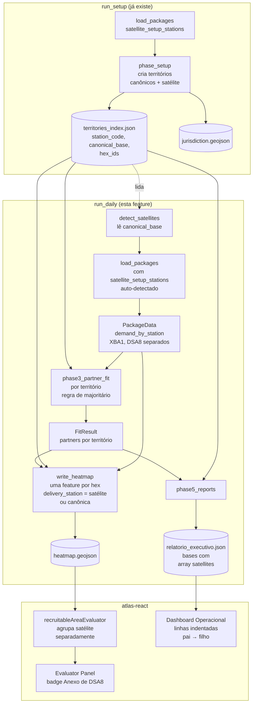

# Design Document

## Overview

Hoje, o `run_daily` remapeia todos os pacotes de áreas satélite (XBA1, PUM2, …) para a base canônica ainda no `load_packages`. Em seguida, duas rotinas em `phase_setup.py` (`patch_heatmap_satellite_stations` e `patch_heatmap_add_satellite_hexes`) tentam "recolar" a identidade satélite em cima do heatmap já escrito. O resultado é frágil: features órfãs, duplicatas canônica+satélite, hexes zerados, e carteira de parceiros da canônica misturada com a da satélite.

O design consolida o tratamento de satélites em **um único fluxo** no daily:

1. O `run_daily` detecta automaticamente, a partir do `territories_index.json`, quais códigos são satélite (têm `canonical_base` preenchido), e passa esse conjunto para `load_packages` via `satellite_setup_stations` — **reutilizando o mecanismo de bypass já existente** em `load_packages` (hoje usado apenas pelo `run_setup`).
2. A demanda, residual e cobertura de cada hex passam a ser calculadas na base correta (canônica ou satélite), pois `pkg.demand_by_station` já contém ambas como chaves distintas.
3. A geração do heatmap torna-se uma **única passagem** que itera sobre `territories_index.json`, escrevendo uma feature por hex com `delivery_station` igual ao `station_code` do território dono do hex (canônico ou satélite). Isso elimina a necessidade das duas funções `patch_heatmap_*`.
4. O `phase3_partner_fit` continua usando `TerritoriesResult`, que já tem territórios satélite como entidades de primeira classe. A única regra nova é o tratamento determinístico do caso em que um parceiro cobre hexes de canônica e satélite anexada simultaneamente.
5. No frontend, o `recruitableAreaEvaluator` para de colapsar satélites em canônicas via `DS_SATELLITES`. Satélites formam seu próprio grupo no cálculo de DS dominante, e o resultado expõe um novo campo `canonicalBase` para o componente de UI renderizar o badge "Anexo de DSA8".
6. O `relatorio_executivo.json` ganha, em cada entrada de base canônica, um array `satellites` com as bases filhas, permitindo que o dashboard operacional renderize uma hierarquia pai → filho com linhas indentadas e colapsáveis.

## Architecture

### Data flow (pós-mudança)



### Key changes by layer

| Camada | Hoje | Depois |
|---|---|---|
| `run_daily` orchestrator | Passa `None` para `satellite_setup_stations` | Auto-detecta via `territories_index` |
| `load_packages` | — (já suporta bypass) | (sem mudança — reutilizado) |
| `phase_setup.patch_heatmap_*` | Duas funções de patch pós-escrita | **Removidas** |
| `write_heatmap` | Gera heatmap canônico + patches | Uma passada canônica unificada |
| `phase3_partner_fit` | Já opera por território | Adiciona regra determinística para parceiro cruza-fronteira |
| `phase5_reports` | Array flat de bases | Bases canônicas ganham array `satellites` aninhado |
| Frontend `recruitableAreaEvaluator` | `resolveCanonical` colapsa satélites | Satélites são grupo próprio, `canonicalBase` no resultado |
| Frontend Dashboard | Linhas flat | Linhas indentadas colapsáveis por canônica |

## Components and Interfaces

### 1. `run_daily` — detecção automática de satélites (Req 1, Req 8)

**Localização:** `backend/vanilla/orchestrator.py::run_daily`

**Mudança:** Antes de chamar `load_packages`, inspecionar `territories.territory_index` e extrair o conjunto de códigos satélite.

```python
def _detect_satellite_stations(territories: TerritoriesResult) -> Set[str]:
    """
    Extrai o conjunto de códigos de Satellite_Station presentes no
    territories_index pela presença do campo canonical_base.

    Observação: TerritoriesResult.territory_index, após load_territories,
    tem station_code remapeado para a canônica em memória. Por isso
    usamos o campo canonical_base como sinalizador e extraímos o código
    satélite do prefixo do territory_id (ex: "XBA1_bucket-01" → "XBA1").
    """
    satellites: Set[str] = set()
    for tid, meta in territories.territory_index.items():
        if meta.get("canonical_base"):
            # tid sempre começa com o código satélite original
            sat_code = tid.split("_", 1)[0] if "_" in tid else None
            if sat_code:
                satellites.add(sat_code)
    return satellites
```

E na sequência de chamadas:

```python
satellite_stations = _detect_satellite_stations(territories)
if satellite_stations:
    print(f"  Satélites detectadas no índice: {sorted(satellite_stations)}")

with timer.phase("load_packages"):
    pkg = load_packages(
        jurisdiction_geojson=jur_geojson,
        satellite_setup_stations=satellite_stations or None,
    )
```

**Importante:** `load_territories` hoje já preserva o `canonical_base` no meta mesmo após o remap do `station_code`. O `territory_id` **nunca** é remapeado — permanece com o prefixo do código satélite original. Essa invariante é a base da detecção automática.

**Fallback:** Se `_detect_satellite_stations` retorna conjunto vazio (rede sem satélites ou instalação legada), `load_packages` roda com `satellite_setup_stations=None` — comportamento idêntico ao anterior à feature (Req 8.3).

### 2. `load_packages` — reuso do bypass existente (Req 1)

**Localização:** `backend/shared/load_packages.py::load_packages`

**Mudança:** Nenhuma. A função já aceita `satellite_setup_stations: Optional[Set[str]]` e, quando fornecido:
- Remove os códigos nesse conjunto do dict `effective_aliases` usado em `df["station_code"].replace(...)`.
- No índice de jurisdição, indexa os polígonos satélite com o próprio código satélite (não com a canônica).

Resultado: `pkg.demand_by_station` contém chaves separadas para cada satélite (ex: `"XBA1"`, `"DSA8"`), e `pkg.hex_to_base` mapeia cada hex para sua base correta. Isto satisfaz Req 1.2, 1.3, 1.4, 1.5.

### 3. Nova função `write_heatmap_unified` — substitui os dois patches (Req 2)

**Localização:** `backend/vanilla/phase5_reports.py` (ou módulo dedicado `backend/vanilla/heatmap_writer.py`).

**Assinatura:**

```python
def write_heatmap_unified(
    output_dir: Path,
    territories: TerritoriesResult,
    pkg: PackageData,
    fit: FitResult,
) -> Path:
    """
    Gera heatmap.geojson em uma única passagem.

    Invariantes garantidas:
    - Uma feature por hex_id (nunca duplicatas).
    - Toda feature tem territory_id ∈ territories.territory_index (zero órfãs).
    - delivery_station == station_code do território dono do hex:
        * canônico: code começa com 'D' (ex: DSA8)
        * satélite: code começa com 'X' ou 'P' (ex: XBA1, PUM2)
    """
```

**Algoritmo:**

```
features = []
for tid, meta in territories.territory_index.items():
    original_code = tid.split("_", 1)[0]     # código ORIGINAL (XBA1, DSA8, …)
    is_satellite  = bool(meta.get("canonical_base"))
    delivery_station = original_code          # canônica OU satélite, sempre original

    # Fonte de demanda: pkg.demand_by_station[original_code]
    # - Para canônica DSA8: apenas pacotes com station_code=DSA8 (porque satélites foram bypassed)
    # - Para satélite XBA1: apenas pacotes com station_code=XBA1 (porque bypassed)
    demand_map = pkg.demand_by_station.get(original_code, {})

    partners_for_tid = fit.territories[tid].partners if tid in fit.territories else []

    for hex_id in meta["hex_ids"]:
        demand_total = demand_map.get(hex_id, 0)
        allocated    = _allocated_by_partners(hex_id, partners_for_tid)
        residual     = max(0, demand_total - allocated)
        is_covered   = allocated > 0

        features.append({
            "type": "Feature",
            "geometry": _hex_to_polygon(hex_id),
            "properties": {
                "hex_id": hex_id,
                "territory_id": tid,
                "delivery_station": delivery_station,
                "canonical_base": meta.get("canonical_base"),  # None para canônicas
                "demand_total": demand_total,
                "demand_daily": demand_total / pkg.days,
                "demand_residual": residual / pkg.days,
                "is_covered": is_covered,
                "in_jurisdiction": True,   # territories_index só contém hexes dentro
                "covering_partners": [p.id for p in partners_for_tid if hex_id in p.hex_coverage],
                "ceps": sorted(pkg.hex_to_ceps.get(hex_id, [])),
            },
        })

return geojson({"type": "FeatureCollection", "features": features})
```

**Consequência:** Como iteramos sobre `territories_index` (fonte única da verdade), não há como gerar órfãs nem duplicatas. As funções `patch_heatmap_satellite_stations` e `patch_heatmap_add_satellite_hexes` são **removidas** de `phase_setup.py` e **removidas** das chamadas em `orchestrator.run_daily` (linhas 236 e 239). A invocação do novo writer passa a viver na Fase 5 (reports), logo após o `fit` estar disponível.

### 4. `phase3_partner_fit` — regra determinística para parceiro cruza-fronteira (Req 4)

**Localização:** `backend/vanilla/phase3_partner_fit.py::_get_territory_for_partner`

**Estado atual:** A função já atribui cada parceiro a um único território baseado em onde a maioria dos hexes cobertos pelo parceiro está. Com satélites passando a ter territórios próprios, o caso edge de um parceiro cujo raio de cobertura atravessa a fronteira canônica↔satélite passa a ser possível (embora premissa de negócio seja que satélites sejam geograficamente distantes).

**Regra explícita:**

```
dado: partner P com hex_coverage H = {h1, h2, …}
  for each h_i in H:
    find territory_i such that h_i ∈ territory_i.hex_ids
  grouped = Counter({station_code(territory_i) for each h_i})

  if grouped has both canonical C and any satellite(s) anchored to C:
    # Majoritário com tiebreak alfabético determinístico
    log.warning(
      f"Parceiro {P.id} cobre hexes de {C} e satélites anexadas "
      f"{list(sat_codes_of_C ∩ grouped.keys())}. "
      f"Atribuindo à estação com maioria: {winner}"
    )

  winner = station with MAX(grouped[station])
  # Tiebreak determinístico: ordem alfabética de station_code
  if empate:
    winner = sorted(tied_stations)[0]

  # Território dentro da winner-station: maior número de hexes cobertos
  return territory in winner-station with most hexes covered by P
```

**Por que majoritário com tiebreak alfabético:** Evita oscilações entre runs (requisito de idempotência — Req 5.4) e dá uma regra simples que o operador humano consegue prever. Garante determinismo ao longo de execuções. A regra é aplicada **apenas quando** as estações envolvidas são uma canônica e satélite(s) anexada(s) a ela; qualquer outra ambiguidade continua com a lógica atual (majoritário simples sem log de aviso).

### 5. Frontend `recruitableAreaEvaluator` — satélite mantém identidade (Req 6)

**Localização:** `atlas-react/src/lib/recruitableAreaEvaluator.ts`

**Mudança 1:** Remover `resolveCanonical()` e o dicionário `SATELLITE_TO_CANONICAL` construído a partir de `DS_SATELLITES`. Satélites passam a ser seu próprio grupo.

**Antes:**

```ts
return ds ? resolveCanonical(ds) : null;  // XSP7 → DSP5
```

**Depois:**

```ts
return ds ?? null;  // XSP7 permanece XSP7
```

**Mudança 2:** Adicionar um helper `canonicalBaseFor(ds)` que, dado um código de DS, retorna a canônica anexa **sem colapsar**, usado apenas para renderização do badge:

```ts
/**
 * Retorna a canônica de uma satélite (para exibição do badge "Anexo de …").
 * Para canônicas, retorna undefined.
 */
export function canonicalBaseFor(ds: string): string | undefined {
  return SATELLITE_TO_CANONICAL[ds];   // XSP7 → "DSP5"; DSP5 → undefined
}
```

**Mudança 3:** Estender `EvaluatorResult` (tipo em `atlas-react/src/store/types.ts`) com dois campos:

```ts
export interface EvaluatorResult {
  // ... campos existentes
  recommendedStation?: string;          // novo: preenchido com dominantStation
  canonicalBase?: string;               // novo: definido quando recommendedStation é satélite
}
```

Populados no final de `evaluateRecruitableArea`:

```ts
const recommendedStation = dominantStation ?? undefined;
const canonicalBase = recommendedStation
  ? canonicalBaseFor(recommendedStation)
  : undefined;

return {
  // ... resultado existente
  recommendedStation,
  canonicalBase,
  outOfJurisdictionStation,
};
```

**Mudança 4:** Ajustar o filtro "heatmap legado" em `stationForHex` para não usar `resolveCanonical` — o campo `delivery_station` no heatmap já virá correto do backend depois desta feature. Para compatibilidade com heatmaps antigos (feature gating via `in_jurisdiction`), manter fallback que consulta jurisdição, mas ainda sem colapsar: o polígono de jurisdição satélite já tem `delivery_station` = código satélite no GeoJSON fonte.

### 6. Dashboard operacional — hierarquia pai-filho (Req 7)

**Localização:** `atlas-react/src/components/ManagementDashboard/*` (componente consumidor de `relatorio_executivo.json`).

**Contrato:** o backend passa a emitir, para cada base canônica no array `bases`, um campo `satellites: BaseRow[]` com a lista de satélites anexadas. A entrada da satélite no array top-level `bases` continua existindo (para backward-compat de buscas diretas), mas ganha um campo `parentCanonical: string` que o frontend usa para suprimir a renderização top-level da satélite quando exibida dentro do grupo do pai.

**Frontend:**
- Estado local `expandedCanonicals: Set<string>` (padrão: todas expandidas; persistido em `localStorage`).
- Para cada canônica: renderiza a linha da canônica, depois (se expandida) as linhas de `satellites` com padding-left adicional (`pl-8`) e um ícone `└─`.
- Métricas da linha canônica **não somam** satélites (Req 7.3).
- Linha de total por conjunto canônica+satélites: gerada no próprio componente somando em tempo de render, com rótulo "Total {canonical} + satélites" (Req 7.4).
- Botão chevron na linha canônica alterna expansão (Req 7.5).

## Data Models

### `territories_index.json` (por território)

Sem novos campos — **valida** o formato atual.

```jsonc
{
  "XBA1_bucket-01": {
    "territory_id": "XBA1_bucket-01",
    "station_code": "XBA1",          // código ORIGINAL (satélite)
    "canonical_base": "DSA8",        // truthy ⇒ satélite
    "hex_ids": ["89a8d…", "89a9e…"], // fixo entre runs do daily (Req 5.2)
    "daily_demand": 125.4,
    "bdm_cluster": "DSA8_sul",
    "n_slots": 3,
    "partners": ["partner_abc", "partner_xyz"]   // recalculado todo daily
  },
  "DSA8_bucket-01": {
    "territory_id": "DSA8_bucket-01",
    "station_code": "DSA8",
    "canonical_base": null,          // canônica pura
    "hex_ids": [...],
    "daily_demand": 512.0,
    "partners": [...]
  }
}
```

**Invariantes:**
- `territory_id` nunca é remapeado — sempre começa com o código da estação original.
- `canonical_base` nunca é modificado no daily (Req 5.3).
- `hex_ids` nunca é modificado no daily (Req 5.2).
- `partners`, `daily_demand` são recomputados em cada daily (e devem ser determinísticos — Req 5.4).

### `heatmap.geojson` (properties por feature)

Campos **mantidos**, com escopo redefinido:

| Campo | Tipo | Valor após mudança |
|---|---|---|
| `hex_id` | string | H3 cell ID |
| `territory_id` | string | Sempre pertence a `territories_index` (Req 2.4) |
| `delivery_station` | string | Código ORIGINAL (canônica OU satélite) (Req 2.1, 2.2) |
| `canonical_base` | string \| null | **Novo**: preenchido com a canônica para hexes satélite |
| `demand_total` | int | Pacotes totais no período na estação dona |
| `demand_daily` | float | `demand_total / days` |
| `demand_residual` | float | `demand_daily` menos demanda absorvida por parceiros da mesma estação (Req 3.2) |
| `is_covered` | bool | True sse existe parceiro atribuído à mesma estação cobrindo este hex (Req 3.3) |
| `in_jurisdiction` | bool | Sempre `true` (Req 2.4 garante que só hexes "ancorados" entram) |
| `covering_partners` | string[] | IDs de parceiros da mesma estação que cobrem este hex |
| `ceps` | string[] | CEPs associados (via `pkg.hex_to_ceps`) |

**Campo removido do heatmap:** `demand_allocated` (nunca foi consumido por frontend, era residual dos patches).

### `relatorio_executivo.json` (aggregation changes)

**Antes (estrutura flat):**

```jsonc
{
  "generatedAt": "…",
  "bases": [
    { "code": "DSA8", "numTerritories": 10, … },
    { "code": "XBA1", "numTerritories":  2, … },   // satélite no mesmo nível
    { "code": "DRJ3", … },
    { "code": "PUM2", … }
  ]
}
```

**Depois (hierárquica):**

```jsonc
{
  "generatedAt": "…",
  "bases": [
    {
      "code": "DSA8",
      "parentCanonical": null,
      "numTerritories": 10,          // APENAS territórios DSA8 (Req 7.3)
      "dailyDemand": 512.0,          // APENAS pacotes station_code=DSA8
      "partners": { "active": 12, … },
      "satellites": [                // NOVO
        {
          "code": "XBA1",
          "parentCanonical": "DSA8",
          "numTerritories": 2,
          "dailyDemand": 125.4,      // APENAS pacotes station_code=XBA1
          "partners": { "active": 3, … },
          "territories": [ … ]
        }
      ],
      "territories": [ … ]            // territórios da canônica apenas
    },
    {
      "code": "XBA1",                 // mantido top-level para busca direta
      "parentCanonical": "DSA8",      // sinaliza ao frontend "já renderizado sob DSA8"
      …
    }
  ]
}
```

Notas de compatibilidade:
- A chave `satellites` é **aditiva**. Frontends antigos que não a conhecem continuam funcionando, vendo os satélites como entradas top-level (como hoje).
- `parentCanonical` é **novo** e, para canônicas, é `null`.

### Types changes (frontend)

**`atlas-react/src/lib/reportUtils.ts`:**

```ts
export interface BaseReport {
  code: string;
  parentCanonical?: string | null;   // NOVO
  satellites?: BaseReport[];         // NOVO
  // ... demais campos inalterados
}
```

**`atlas-react/src/store/types.ts`:**

```ts
export interface EvaluatorResult {
  // ... existentes
  recommendedStation?: string;       // NOVO
  canonicalBase?: string;            // NOVO (undefined quando recomendação é canônica)
}
```


## Correctness Properties

*A property is a characteristic or behavior that should hold true across all valid executions of a system — essentially, a formal statement about what the system should do. Properties serve as the bridge between human-readable specifications and machine-verifiable correctness guarantees.*

### Property 1: Automatic satellite detection

*For any* `territories_index` contendo uma mistura arbitrária de territórios canônicos e satélite, `_detect_satellite_stations(territories)` deve retornar exatamente o conjunto `{prefixo do territory_id | meta.canonical_base é truthy}`, e apenas esse conjunto.

**Validates: Requirements 1.1, 8.1, 8.2**

### Property 2: Satellite isolation and volume conservation

*For any* CSV de pacotes e qualquer conjunto `S` de códigos satélite passado como `satellite_setup_stations`:

- `pkg.demand_by_station[sat]` (para `sat ∈ S`) contém apenas pacotes cujo `station_code` original era `sat`.
- `pkg.demand_by_station[canonical]` (para canônica `C` com satélites `S_C ⊆ S`) contém apenas pacotes cujo `station_code` original era `C`, e nenhum pacote com origem em `S_C`.
- `sum(pkg.demand_by_station[c] + sum(pkg.demand_by_station[s] for s in S_c) for c in canonicals)` == número total de pacotes do CSV, excluídos os hexes descartados por ficarem fora de qualquer jurisdição.

**Validates: Requirements 1.2, 1.3, 1.4, 1.5, 3.1, 3.2, 3.3, 3.4**

### Property 3: Heatmap delivery_station consistency

*For any* `territories_index` e qualquer `pkg`, o heatmap gerado por `write_heatmap_unified(territories, pkg, fit)` satisfaz: para toda feature `f`, `f.properties.delivery_station == original_code(f.properties.territory_id)`, onde `original_code(tid)` é o prefixo de `tid` antes do primeiro `_`. Equivalentemente: features de território satélite têm `delivery_station == station_code satélite`, features de canônica têm `delivery_station == station_code canônico`.

**Validates: Requirements 2.1, 2.2**

### Property 4: Heatmap hex uniqueness

*For any* `territories_index` bem-formado (hexes disjuntos entre territórios, conforme invariante do setup), o heatmap gerado satisfaz `len({f.properties.hex_id for f in features}) == len(features)` — nenhum hex aparece em mais de uma feature.

**Validates: Requirements 2.3**

### Property 5: Heatmap has no orphan features

*For any* `territories_index` e heatmap gerado por `write_heatmap_unified`, toda feature tem `f.properties.territory_id in territories_index`.

**Validates: Requirements 2.4**

### Property 6: Partner purity preservation

*For any* conjunto de parceiros cuja cobertura `hex_coverage` está contida estritamente em territórios de uma única estação `X` (canônica ou satélite), após `phase3_partner_fit`, o parceiro está atribuído a um território com `station_code == X`. Consequentemente, para territórios `t1` e `t2` em estações diferentes cujas cargas de parceiros são puras, `t1.partners ∩ t2.partners == ∅`.

**Validates: Requirements 4.1, 4.2, 4.3**

### Property 7: Partner cross-station deterministic tiebreak

*For any* parceiro `P` cujo `hex_coverage` contém hexes em ambos uma canônica `C` e pelo menos uma satélite `S` anexada a `C`:
- A estação vencedora é `arg max over s in {C} ∪ S_candidates of count(hexes_covered_in_s)`.
- Em caso de empate, a estação vencedora é `min(tied_stations)` por ordem alfabética.
- O resultado é determinístico: dadas as mesmas entradas, duas execuções produzem o mesmo território atribuído.

**Validates: Requirements 4.4**

### Property 8: Territory structure preservation

*For any* `territories_index` de entrada com territórios `T`, após `run_daily`:
- O conjunto de `territory_id` no `territories_index` de saída é idêntico a `T`.
- Para todo `tid ∈ T`, `output[tid].hex_ids == input[tid].hex_ids` (mesma sequência, mesmos hexes).
- Para todo `tid ∈ T`, `output[tid].canonical_base == input[tid].canonical_base`.

**Validates: Requirements 5.1, 5.2, 5.3**

### Property 9: Daily idempotence

*For any* estado completo de entrada (pacotes CSV, partners, territories_index, jurisdições), executar `run_daily` uma vez produz estado `S1`; executar `run_daily` sobre `S1` (mesmos inputs externos) produz estado `S2`, e `S1 == S2` (mesmos valores de `demand`, `residual`, `is_covered`, mesma carteira de parceiros em cada território, mesmo conjunto de features no heatmap).

**Validates: Requirements 5.4**

### Property 10: Evaluator satellite recommendation

*For any* input do `evaluateRecruitableArea` onde o grupo dominante de hexes dentro do raio pertence a uma satélite `SAT` (cuja canônica é `CANON`), o resultado satisfaz:
- `result.recommendedStation == SAT` (nunca `CANON`).
- `result.canonicalBase == CANON`.

Simetricamente, quando o grupo dominante é uma canônica `CANON`, `result.recommendedStation == CANON` e `result.canonicalBase === undefined`.

**Validates: Requirements 6.1, 6.2, 6.4**

### Property 11: Evaluator group separation

*For any* heatmap contendo hexes em uma canônica `CANON` e em uma satélite `SAT` anexada a ela, dentro do mesmo raio do evaluator, o mapa `hexesByStation` interno contém `CANON` e `SAT` como chaves distintas — nunca é feito colapso via `STATION_ALIASES`.

**Validates: Requirements 6.3**

## Error Handling

### Backend

| Caso | Tratamento |
|---|---|
| `territories_index` inexistente | `load_territories` já aborta com `FileNotFoundError`; daily retorna código 1. Inalterado. |
| `territories_index` sem satélites | `_detect_satellite_stations` retorna `set()`; `load_packages` é chamado com `satellite_setup_stations=None`. Comportamento idêntico ao anterior à feature (Req 8.3). |
| Satélite sem pacotes históricos | `pkg.demand_by_station[sat]` é `{}`; heatmap gera features de hexes da satélite com `demand_total=0`, `is_covered=False`. Log `WARN: satélite {code} sem pacotes no período`. É esperado e não aborta o pipeline. |
| Parceiro cruza canônica↔satélite | Log `WARN: Parceiro {id} cobre hexes de {C} e {sats}; atribuído a {winner} por regra majoritário+tiebreak`. Execução continua. |
| Hex no `hex_ids` do índice mas fora de qualquer polígono de território corrente | Gera feature sem demanda histórica. Cenário raro e, se ocorrer, evidencia inconsistência entre setup e índice — registrado em log mas não aborta. |
| Duplicata de hex entre dois territórios no índice | Viola invariante do setup. `write_heatmap_unified` detecta via `seen: Set[str]` durante a iteração e aborta com mensagem explícita identificando os dois territórios — cria feature apenas do primeiro encontrado e loga `ERROR`. |

### Frontend

| Caso | Tratamento |
|---|---|
| `heatmap.geojson` gerado antes desta feature (legado) | `in_jurisdiction` ausente aciona fallback atual em `stationForHex` (booleanPointInPolygon). O `delivery_station` ali já contém o código da jurisdição — sem `resolveCanonical` isso preserva a identidade satélite naturalmente. |
| `relatorio_executivo.json` sem campo `satellites` (legado) | Dashboard mostra satélites como linhas top-level não aninhadas, como hoje. Nenhum crash. |
| `EvaluatorResult.canonicalBase` ausente | Badge "Anexo de…" não renderizado. Degradação silenciosa. |

## Testing Strategy

### Unit tests (Python — pytest)

| Alvo | Teste |
|---|---|
| `_detect_satellite_stations` | Casos: índice só com canônicas → `set()`; só com satélites → todos os prefixos; misto → apenas prefixos com `canonical_base` truthy. |
| `run_daily` com CLI sem `--stations` | Integração leve: setup mock retorna índice com satélite; verifica que `load_packages` é chamado com `satellite_setup_stations={"XBA1"}`. |
| `write_heatmap_unified` | Caso: índice com `DSA8_bucket-01` (3 hexes) + `XBA1_bucket-01` (2 hexes) + pkg com pacotes em ambas estações. Verifica: 5 features no output, cada uma com `delivery_station` correto, zero duplicatas, `territory_id` consistente. |
| Regra majoritário+tiebreak | Parceiro cobre 3 hexes em DSA8 e 1 em XBA1 → atribuído a DSA8. 2 em DSA8 e 2 em XBA1 → atribuído a DSA8 (alfabético). Log warning verificado por `caplog`. |
| Remoção de `patch_heatmap_*` | Test estático: `grep` em `orchestrator.py` confirma ausência das chamadas; import das funções em `phase_setup` é removido. |
| Idempotência (integração) | Roda `run_daily` duas vezes em fixtures; compara `territories_index.json` e `heatmap.geojson` com `assert_json_equal`. |

### Unit tests (TypeScript — vitest)

| Alvo | Teste |
|---|---|
| `evaluateRecruitableArea` com heatmap satélite | Input: 5 hexes em XBA1 todos dentro do raio. Esperado: `recommendedStation === "XBA1"`, `canonicalBase === "DSA8"`. |
| `evaluateRecruitableArea` com heatmap misto | 3 hexes XBA1 + 2 hexes DSA8 no raio. Esperado: dominant = XBA1, `recommendedStation === "XBA1"`. Contraste com o comportamento legado. |
| `canonicalBaseFor` | `"XSP7" → "DSP5"`, `"DSP5" → undefined`. |
| `ManagementDashboard` snapshot | Fixture `relatorio_executivo.json` com DSA8 e satélite XBA1 aninhada. Verifica DOM: linha DSA8 seguida de linha XBA1 com `pl-8`; chevron toggle. |

### Property-based tests

PBT é apropriado aqui porque todo o core logic (detecção de satélites, cálculo de demanda, geração de heatmap, regra de tiebreak, evaluator) é pura função com input/output claros, e a entrada tem espaço combinatório grande.

- **Python:** `hypothesis` (já em uso no projeto — ver `.hypothesis/examples/`).
- **TypeScript:** `fast-check`.

Cada teste roda **no mínimo 100 iterações** e é etiquetado com comentário referenciando o número da propriedade neste documento.

Formato do tag:

```python
# Feature: satellite-areas-daily-integration, Property 2:
# Satellite isolation and volume conservation
```

| # | Propriedade | Biblioteca | Camada | Escopo do gerador |
|---|---|---|---|---|
| 1 | Automatic satellite detection | Hypothesis | Python | `territories_index` com mistura aleatória de territórios canônicos (station_code começando com D) e satélite (começando com X/P, `canonical_base` truthy) |
| 2 | Satellite isolation + volume conservation | Hypothesis | Python | CSV de pacotes aleatório com `station_code` em `{canônicas ∪ satélites}`; testa com `load_packages(..., satellite_setup_stations=S)` para diferentes `S` |
| 3 | Heatmap delivery_station consistency | Hypothesis | Python | `territories_index` aleatório, `pkg` mock, chama `write_heatmap_unified` |
| 4 | Heatmap hex uniqueness | Hypothesis | Python | Igual ao 3; gerador garante hexes disjuntos entre territórios de entrada |
| 5 | Heatmap no orphans | Hypothesis | Python | Igual ao 3 |
| 6 | Partner purity preservation | Hypothesis | Python | Parceiros com `hex_coverage` gerado para caber dentro de UMA única estação |
| 7 | Partner cross-station tiebreak | Hypothesis | Python | Parceiros com cobertura cruzada canônica↔satélite; verifica determinismo executando `_get_territory_for_partner` duas vezes e `winner == majoritário`; em empate, `winner == min(alfabético)` |
| 8 | Territory structure preservation | Hypothesis | Python | Fixture mini-daily end-to-end; compara `set(territory_index.keys())` e `hex_ids` antes/depois |
| 9 | Daily idempotence | Hypothesis | Python | Roda `run_daily` duas vezes com inputs randomizados (pacotes gerados, partners fixos); compara outputs |
| 10 | Evaluator satellite recommendation | fast-check | TypeScript | Heatmap features com `delivery_station` aleatório em `{canônica, satélite}`; raio e centro gerados |
| 11 | Evaluator group separation | fast-check | TypeScript | Heatmap misto; inspeciona `selectedCells` e confirma que seleção NÃO colapsou satélite em canônica |

### Integration tests

Um teste end-to-end em `backend/tests/integration/test_daily_satellite_pipeline.py`:

1. Fixture: `territories_index.json` pré-setup com DSA8 + XBA1, pacotes CSV com entregas nos dois códigos.
2. Roda `run_daily` uma vez → captura `heatmap_1.geojson`, `territories_1.json`, `relatorio_1.json`.
3. Roda `run_daily` de novo (idempotência) → captura `heatmap_2`, `territories_2`, `relatorio_2`.
4. Asserções:
   - `heatmap_1 == heatmap_2` (sorted by hex_id).
   - Features com `territory_id` começando com `XBA1_` têm `delivery_station == "XBA1"`.
   - Features com `territory_id` começando com `DSA8_` têm `delivery_station == "DSA8"`.
   - Nenhum `hex_id` aparece duas vezes em `heatmap_1`.
   - `relatorio_executivo.bases` contém `DSA8` com `satellites: [{ code: "XBA1", … }]`.

## Migration and Deployment Plan

### Passo 1 — One-off de limpeza (já executado)

O script `scripts/cleanup_orphan_heatmap_features.py` foi rodado antes desta feature ser implementada para remover:
- (A) features órfãs zeradas (`territory_id` não existia mais no índice e `demand_total == 0`);
- (B) "fantasmas" injetados pelo `patch_heatmap_add_satellite_hexes` (features `is_covered=False` e `demand_total=0`);
- (C) duplicatas canônica+satélite do mesmo hex (canônica era descartada em favor da satélite);
- (D) duplicatas redundantes no mesmo `territory_id` (zerada descartada em favor da não-zerada).

Resultado: `heatmap.geojson` ficou com uma feature por hex e `territory_id` consistente com o índice. O backup foi salvo como `heatmap.geojson.bak_*`.

Esta etapa é pré-requisito para o primeiro `run_daily` com a nova feature — evita divergência entre o estado persistido e a nova lógica.

### Passo 2 — Deploy da feature

1. Merge da feature branch: atualiza `run_daily`, adiciona `_detect_satellite_stations`, adiciona `write_heatmap_unified`, remove `patch_heatmap_*` e as chamadas em `orchestrator.py`.
2. Deploy do frontend atualizado com `recruitableAreaEvaluator.ts` e novos campos de `EvaluatorResult`.

### Passo 3 — Primeira execução pós-deploy

O próximo `run_daily` normalmente agendado:
- Lê `territories_index.json` atual (já contém satélites com `canonical_base` preenchidos do setup passado);
- Detecta automaticamente `{XBA1, XCS1, …}` via `_detect_satellite_stations`;
- Chama `load_packages` com essas satélites → `pkg` tem volumes desagregados;
- Gera `heatmap.geojson` pela via unificada — satélites aparecem como DS próprios, sem patches;
- Emite `relatorio_executivo.json` com `satellites[]` aninhado sob canônicas.

### Mudanças visíveis para o usuário

- **No frontend (mapa):** clicar em um hex XBA1 passa a mostrar `delivery_station: XBA1` no popup e, no evaluator, `recommendedStation: "XBA1"` com badge "Anexo de DSA8". Antes: DS no popup ficava `DSA8` ou vazio, recommendedStation era `DSA8`.
- **No dashboard operacional:** satélites aparecem indentadas sob a canônica com chevron expand/collapse. A linha da canônica passa a mostrar métricas só da canônica (volume pode baixar em relação ao dia anterior — isto é correto e esperado).
- **Nos reports executivos:** total agregado por canônica ganha linha "Total DSA8 + satélites".

### Backward compatibility

- **Instalações sem satélites** (`territories_index` sem nenhum `canonical_base` truthy): comportamento idêntico ao pré-feature. Req 8.3.
- **Heatmap legado no frontend** (`in_jurisdiction` ausente): o evaluator ainda roda com o fallback por jurisdição — e, sem `resolveCanonical`, o `delivery_station` do polígono satélite é preservado (assumindo que os polígonos de jurisdição satélite já têm `delivery_station: "XBA1"` no GeoJSON fonte).
- **`relatorio_executivo.json` legado** sem `satellites[]`: dashboard degrada para layout flat sem crash.

## Out of Scope / Explicit Non-Goals

- **Criação de novos territórios satélite no `run_daily`.** O setup continua sendo o único responsável por definir `hex_ids`, `canonical_base` e a estrutura geográfica dos territórios. O daily apenas atualiza demanda e carteira.
- **Alteração de `STATION_ALIASES` em `backend/shared/config.py`.** Esse dicionário permanece a fonte da verdade para a relação satélite→canônica. A detecção automática no daily usa `canonical_base` do índice, mas o mapeamento subjacente ainda vem de `STATION_ALIASES`.
- **Tratamento especial de satélites sem pacotes históricos.** Se `pkg.demand_by_station["XBA1"] == {}`, o heatmap gera hexes com `demand_total=0` e `is_covered=False`, e um log `WARN` é emitido. Nenhuma fallback para pegar emprestado da canônica é implementado.
- **Regra de negócio para parceiros cruza-fronteira além de tiebreak alfabético.** A feature implementa apenas a regra determinística descrita (majoritário com alfabético no empate). Propostas mais complexas (pesar por `demand_residual`, considerar raio geográfico, etc.) ficam fora e podem ser uma feature futura.
- **Migração retroativa de `relatorio_executivo.json` anteriores.** O formato hierárquico (`satellites[]`) passa a ser gerado do próximo daily em diante. Histórico permanece no formato antigo; o frontend degrada graciosamente.
